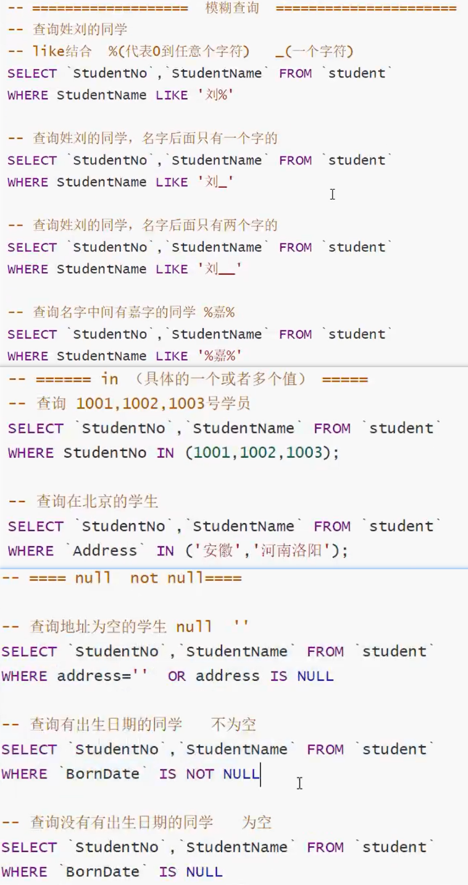

# MySQL数据库

## 介绍
```markdown
MySQL是一个`关系型数据库`管理系统，由瑞典MySQL AB 公司开发，目前属于 Oracle 旗下产品。MySQL 是最流行的关系型数据库管理系统之一，在 WEB 应用方面，MySQL是最好的 RDBMS (Relational Database Management System，关系数据库管理系统) 应用软件。
```
## 安装
[安装图解步骤] (https://blog.csdn.net/gegedsj/article/details/103807005)

## SQL

### 介绍
```markdown
结构化查询语言(Structured Query Language)简称SQL，是一种特殊目的的`编程`语言，是一种数据库查询和程序设计语言，用于存取数据以及查询、更新和管理关系数据库系统；同时也是数据库脚本文件的扩展名。
SQL就是`专门为关系型数据库`而设计出来的。
```
### 语句分类
```markdown
* 数据定义语言（DDL）：专门用于结构管理：代表指令`create和drop（alter）`

* 数据查询语言（DQL:Data Query Language）：专门用于查询数据：代表指令为`select/show`

* 数据操作语言（DML：Data Manipulation Language）:专门用于写数据：代表指令为`insert，update和delete`

* 事务处理语言（TP/cL）：专门用于事务安全处理：transaction

* 数据控制语言（DCL）：专门用于权限管理：代表指令为grant和revoke

```
## 数据库的基本操作

1. 服务的`开启`和`停止`

```markdown
启动: `net start mysql`
停止: `net stop mysql`
查看版本: `mysql --version`
```
2. 数据库的`连接`和`退出`
```markdown
* 连接:
  1. 本地数据库：`mysql -h localhost -u root -p123456`
  2. 远程数据库: `mysql -h 主机地址 -P端口 -u用户名 -p密码`
  **指定数据库 + -D 数据库名**

* 退出:
  语法: `exit`;
```
3. 数据库的`操作`
```markdown
`查`：show databases;
`创`：create database 数据库名字 charset 字符集名称;
`删`：drop database 数据库名字;
`用`: use 数据库名称;
```
## 数据类型
1. 数值

2. 字符串

3. 日期

## 约束
```markdown
1. 主键 `primary key` 
创建好表之后添加主键: `alter table 表名 add primary key(字段名) `  
删除主键：`alter table 表名 drop primary key`;
2. 自增 `auto_increment`
3. 唯一 `unique`
4. 非空 `not null` 表示列中不能有null
5. 默认 `default`
6. 描述 `comment` 
7. unsigned: 无符号的整数,不能为负数
8. zerofill: 0填充,不足的位数0补全占位
```
## 表的操作
1. 创
```markdown
1. create table 数据库名.表名(字段名 字段类型 约束...)ENGINE=INNODB DEFAULT CHARSET=utf8
```


2. 删
```markdown
1. drop table 表名
```
3. 查
```markdown
1. 显示数据库中的表: show tables;
2. 显示表的结构：desc 表的名字;
3. 查看表的创建过程: show create table 表名;
```
4. 改
```markdown
1. 改表名：alter table 旧表名 rename 新表名
2. 改字段名：alter table 表名 change 旧 新 字段类型
3. 改字段类型：alter table 表名 modify 字段名 字段类型

4. 添加字段：alter table 表名 add 字段名 字段类型
5. 删除字段：alter table 表名 drop 字段名
```
## 数据的操作
1. 添加
```sql
insert into 表名(字段1,字段2...要按顺序 可以不写 直接values) 
values (对应字段的数据), (多条数据用逗号隔开)
```
2. 删除
```sql
delete from 表名 where 删除条件
truncate table 表名 -- 清空表，自增会归零
```
3. 修改
```sql
update 表名 set 修改字段名 = 修改值 where 修改条件
update 表名 set 可以是多字段修改,逗号隔开 where 修改条件
```
4. 查
```sql
-- 语法:
select 查询列表 from 表名;
`查询列表可以是: 字段、表达式、常量、函数等`

`查询所有字段`:select * from 表名;
`查询多个字段`:select 字段名1,字段名2... from 表名;
`别名的使用`:
select 字段名 as '别名' from 表名 as 表别名
select concat("姓名:",字段名) as '别名' from 表名;
`去除重复`:select distinct 查询字段名 from 表名;
`查询系统版本`: select version();
`用来计算`: select 100*3-1 as 计算结果
`查询自增步长`:select @@auto_increment_increment --(变量)
```


* 条件查询:
```sql
select 查询列表 from 表名 where 筛选条件
```
**筛选条件**
```markdown
* 1.按条件表达式查询(条件运算符: > < >= <= !=(不等于, <>) =(等于,在mysql中 安全等于 <=> ) )
* 2.按逻辑表达式查询(逻辑运算符: not(!) and(&&) or(||))
* 3.模糊查询:
`like % 代表任意多个字符 包含0个字符; _ 代表单个字符`
```



* 链表查询:
```sql
-- 内连接
select 查询字段1,查询字段2 from 表1 inner join 表2 on 交叉条件
-- 左连接: 表1w为主 所有字段,表2中没有的字段null填充
select 查询字段1,查询字段2 from 表1 left join 表2 on 交叉条件

-- 右连接: 表2w为主 所有字段,表1中没有的字段null填充
select 查询字段1,查询字段2 from 表1 right join 表2 on 交叉条件
```
```sql
-- SELECT s.`studentno`,`studentname`,`subjectno`,`studentresult`
-- FROM student as s
-- INNER JOIN result as r
-- WHERE s.studentno=r.studentno

-- SELECT s.`studentno`,`studentname`,`subjectno`,`studentresult`
-- FROM student as s
-- LEFT JOIN result as r
-- ON s.studentno=r.studentno

-- SELECT s.`studentno`,`studentname`,`subjectno`,`studentresult`
-- FROM student as s
-- RIGHT JOIN result as r
-- ON s.studentno=r.studentno
```


* 自连接查询
```sql
-- 创建分类表

CREATE TABLE `category`(
`categoryid` INT(10) UNSIGNED NOT NULL auto_increment COMMENT '主题id',
`pid` INT(10) not NULL COMMENT '父id',
`categoryName` VARCHAR(50) NOT null COMMENT '主题名字',
PRIMARY KEY(`categoryid`)
)ENGINE=INNODB auto_increment=9 DEFAULT charset=utf8

-- 插入分类表数据
INSERT INTO `category` (categoryid,pid,categoryName)
VALUES(2,1,'信息技术'),
(3,1,'软件开发'),
(4,3,'数据库'),
(5,1,'美术设计'),
(6,3,'web开发'),
(7,5,'ps技术'),
(8,2,'办公信息');

-- 自连接查询分类表
SELECT f.`categoryName` AS '父栏目',z.`categoryName` AS 子栏目
FROM `category` AS f,`category` AS z
WHERE f.`categoryid` =  z.`pid`
```

* 排序查询:
```sql
select 查询列表 from 表 [where 筛选条件] order by 排序列表 [asc || desc]
-- 特点: asc: 升序(从小往大) 如果不写 代表升序
--       desc: 降序(从大往小)
--       排序列表 可以是一个字段 也可以是 多个
```
```sql
SELECT * FROM heros ORDER BY hp_start DESC;
SELECT * FROM heros WHERE role_main = '射手' ORDER BY hp_start DESC;
SELECT *, (hp_max + hp_growth + hp_start) AS '血量' FROM heros ORDER BY '血量' DESC;
-- 5.按照英雄名字的长短进行排序(根据函数来排序)length()
SELECT * FROM heros ORDER BY ENGTH(`name`) DESC;
```
* 分页排序
```sql
--                   n ：当前页 pageSize:页面大小 总页数:数据总量/页面大小
select 查询列表 from 表 limit (n-1)*pageSize,pageSize
```
* 子查询
```sql
-- 子查询
/*
问题: 查询课程为 高等数学-2 且 分数不小于 80的同学的学号和姓名

分析: 展示的学号姓名 ----》student表
			分数 ----》					result表
			课程高等数学-2 ----》subject 表

有里往外 课程高等数学-2 查出 分数 需要的 subjectno
					subjectno 作为 分数的其中一个条件
					分数 > 60 作为另一个条件
					最后 studentno 作为条件 展示student的学号和姓名
*/

SELECT `studentno`,`studentname`
FROM student 
WHERE studentno in (
	SELECT `studentno` FROM result WHERE `studentresult` > 60 AND `subjectno` = (
		SELECT `subjectno` FROM `subject` WHERE `subjectname` = '高等数学-2'
	)
)

-- 内连接实现同样的查询效果
SELECT s.`studentno`,`studentname`
FROM student AS s
INNER JOIN result AS r
ON s.`studentno` = r.`studentno`
INNER JOIN subject AS sub
ON r.`subjectno` = sub.`subjectno`
WHERE `subjectname` = '高等数学-2' AND `studentresult` > 60;

-- 内连接和子查询同时使用
SELECT s.`studentno`,`studentname`
FROM student AS s
INNER JOIN result AS r
ON s.`studentno` = r.`studentno`
WHERE `studentresult` > 60 AND `subjectno` = (
	SELECT `subjectno` FROM subject WHERE `subjectname` = '高等数学-2'
)

```
* 分组查询
```sql
-- 查询不同课程的平均分,最高分,最低分,平均分大于60
/*
分析:
		分数 ----》result表
		课程 ----》subject 表
		连表查询 使用聚合函数求各种分数（AVG：平均分|MAX： 最高分|MIN：最低分） 分组 HAVING 分组后的条件筛查
*/

SELECT `subjectname`,AVG(studentresult) AS 平均分,MAX(studentresult)AS 最高分,MIN(studentresult) AS 最低分
FROM result r
INNER JOIN `subject` sub
ON r.subjectno = sub.subjectno
GROUP BY r.subjectno -- 分组
HAVING 平均分 > 60;
```

* `随机取n条数据`

  ```sql
  SELECT * FROM 表 ORDER BY RAND() LIMIT n;
  ```

  

* `select查询小结：`


