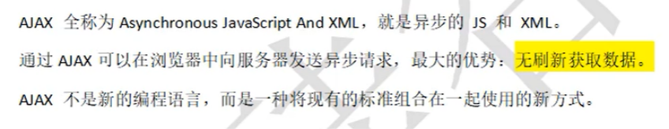
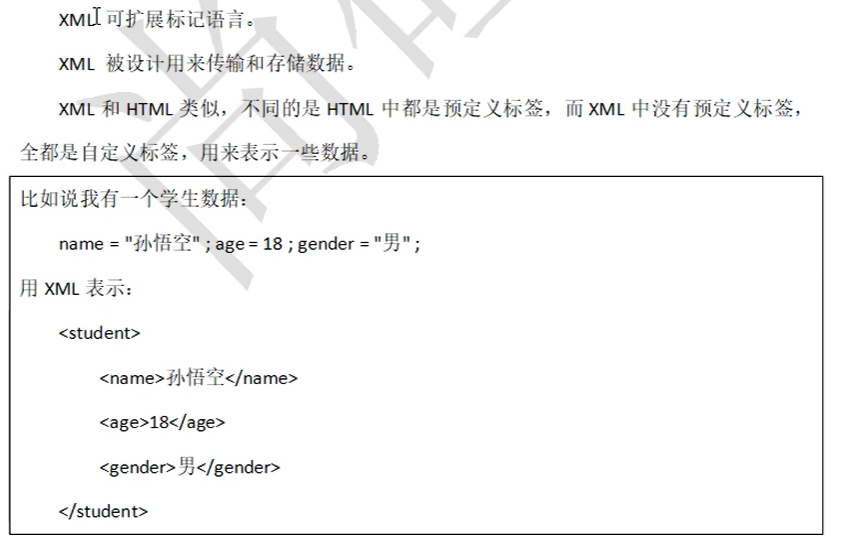
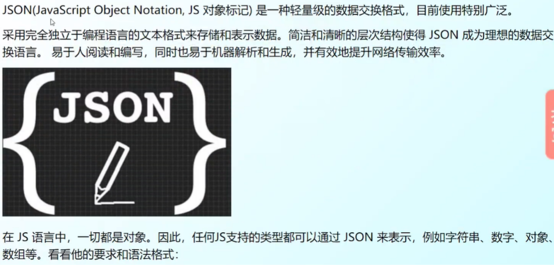

# AjAx

## ajax概述

* 注意: ajax默认遵循`同源策略`(浏览器的一种安全策略),所谓同源:`协议`、`域名`、`端口号`必须完全相同!

## 前后端数据交互


**如今我们都是用的是JSON**

```js
let jsObj = { name: '张三', age: 20, sex: '男' };
let jsonStr = '{ "name": "李四", "age": 25, "sex": "女" }'

// js对象转JSON字符串(键都会被双引号包裹，值是字符串类型的都是双引号包裹)
let resultStr = JSON.stringify(jsObj)
console.log(resultStr); //{"name":"张三","age":20,"sex":"男"}
// JSON字符串转js对象(值是字符串类型的都被单引号包裹)
let resultObj = JSON.parse(jsonStr)
console.log(resultObj); //{ name: '李四', age: 25, sex: '女' }
```

* 总结:  `js->JSON`用**stringify**;`JSON->js`用**parse**

## HTTP协议
1. 介绍
```markdown
HTTP(hypertext transport protocol)超文本传输协议,协议规定了浏览器和万维网服务器之间互相通信的规则。 
HTTP报文是面向文本的，报文中的每一个字段都是一些ASCII码串，各个字段的长度是不确定的。HTTP有两类报文：请求报文和响应报文。
```
2. 请求报文
* 组成: 请求行（request line）、请求头部（header）、空行和请求数据
<!--  -->

