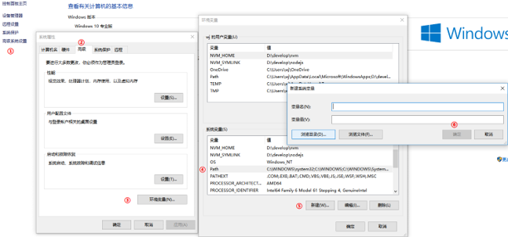

# Node 基础知识

## Node 介绍

```text
    Node是一个基于Chrome V8引擎的JavaScript代码运行环境。JavaScript的解析和执行是单线程的（主线程）,而浏览器、node是多线程,执行异步耗时任务。
    注意：在浏览器中全局对象是window，在Node中全局对象是global。
```
## Node的运行环境的搭建

```text
① 下载文件  https://nodejs.org/en/  （Download 12.16.3 LTS ,LTS代表稳定版）
② 查看版本 node -v
③ PATH环境变量 看下图(作用:能够让我们在终端执行相关的命令,快速启动应用程序)
```


* 代码只有在特定的环境下,才会被解析执行。服务器端运行环境中,没有浏览器这回事,所以Node.js中没有BOM和DOM的API。


## 模块
### 系统模块
* Node运行环境提供的API（模块化的方式进行开发的）

#### fs模块
1. 读文件
```js
// 读文件
// fs.readFile(绝对路径,编码格式,callback)

// 引入模块
const fs = require('fs');

fs.readFile(__dirname + '/read.txt', 'utf8', (err, data) => {
    if (err) return console.log(err.message);
    console.log(data);
})

// 文件信息
// fs.stat(绝对路径,编码格式,callback)
fs.stat(__dirname + '/read.txt', (err, stats) => {
    if (err) return console.log(err.message);
    console.log(stats.size); // 文件大小
    console.log(stats.birthtime); // 创建时间
})

// 文件夹下目录
fs.readdir(__dirname, (err, files) => {
    if (err) return console.log(err.message);
    console.log(files);
})
```
2. 写文件
```js
// 写文件操作
// fs.writeFile(路径,数据,callback)

const fs = require('fs');

let content = '<h3>来了老弟,我正在写文件!!!</h3>'
fs.writeFile(__dirname + '/index,html', content, err => {
    if (err) return console.log(err.message);
    console.log('文件写入成功!!!');
})

// fs.appendFile(路径,数据,callback)
fs.appendFile(__dirname + '/index,html', 666, (data, err) => {
    if (err) return console.log(`追加失败${err.message}`);
    console.log('追加成功!!!');
})
```
3. 创建文件夹 mkdir
```js
// 创建文件夹
// fs.mkdir(绝对路径,{ recursive: true },callback)

const fs = require('fs');
fs.mkdir(__dirname + '/wjj', { recursive: true }, (err, path) => {
    if (err != null) {
        console.log(err);
        return
    };
    console.log(path);
    console.log('文件夹创建成功!!!');
})
```
#### path模块
1. 属性和方法
```js
const path = require('path');

// 获取默认路径的分隔符
const separator = path.sep
console.log(separator);

// 获取路径的最后一部分不包含文件格式
const fileName = path.basename(__filename)
console.log(fileName);

// 获取文件的路径 
const fileSrc = path.dirname(__filename)
console.log(fileSrc);

// 获取文件扩展名
const expandedName = path.extname(__filename)
console.log(expandedName);
```
2. `path.join()`路径拼接
```js
const path = require('path')

// 参数时多个字符串
let newPath = path.join('E:', 'c', 'd', './a', '//w', 'x', '../z');
console.log(newPath); // E:\c\d\a\w\z  
// 注意: ../会吃掉上一层路径
```
### 第三方模块(包)的使用
0. 拉去他人所有的包 **npm install**
1. 装包 **npm install 包名**(默认最新版) 指定版本**npm install 包名@版本号**

2. 卸载包 **npm uninstall 包名**
3. 更新包 **npm update 包名**
4. 检查包是否过时 **npm outdated**
5. 查看安装的模块 **npm ls -g** -g代表:全局
6. 项目初始化时创建package.json文件 **npm init**

`nrm镜像的使用`
1. 全局安装nrm **npm install nrm -g**
2. 查询可用下载地址的列表 **nrm ls**
3. 切换下载地址 **nrm use 地址名称**

`nodemon的使用`: 解决了每次修改文件后都需重新执行js文件的繁琐
1. npm install nodemon -g 全局安装
2. nodemon 执行文件路径 即可

### 模块化
`为了解决文件之间的依赖关系,一种开发思想.Node.js使用了CommonJS规范`
**CommonJS规范:**同步加载模块,不适合在浏览器端使用
```txt
在模块中定义的成员都是模块私有的，global.xxx定义的属于全局成员，不推荐使用会造成全局变量污染。
在Node中,每一个JS文件都可以认为是一个模块,module就代表当前模块,
module.exports:向外暴露当前模块的成员,给别人使用
module.require:用来导入其他模块
```