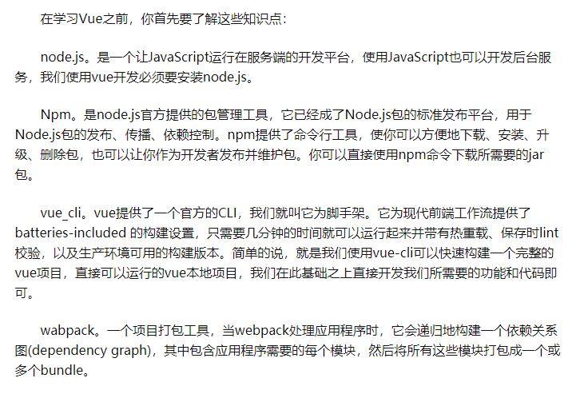
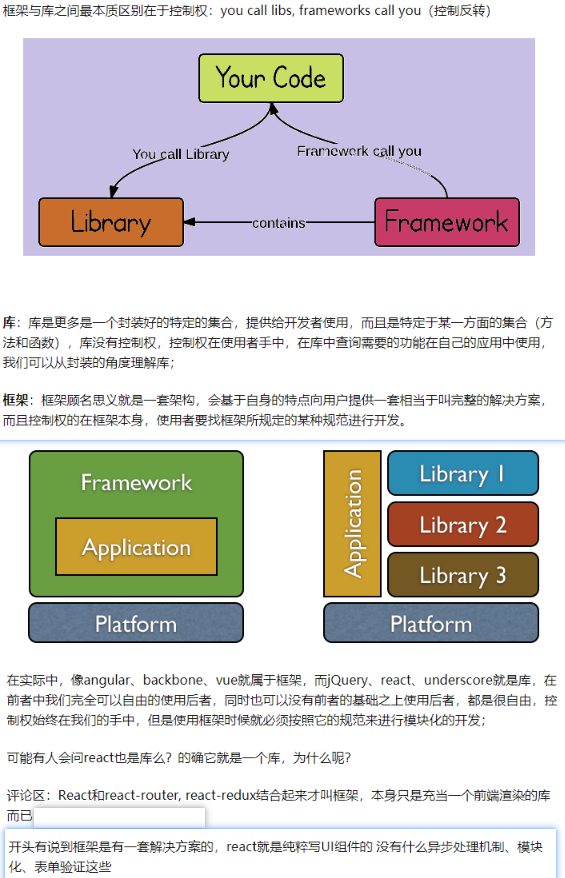
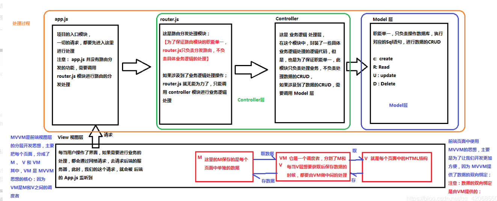
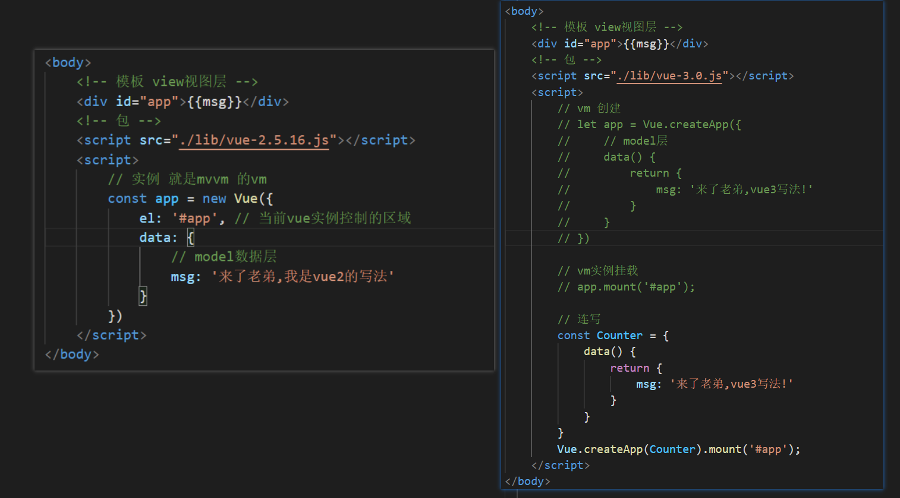

# Vue的学习之路
## 了解

## 库(librarys)和框架(frameworks)的区别

## MVVM(前台)和MVC(后台)理解

[百度链接](https://blog.csdn.net/qq_42068550/article/details/89480350)

## Vue
[vue中文官网] (https://cn.vuejs.org/v2/guide/)

* 概述:
一套构建用户界面的**渐进式**（没有多做职责之外的事,只提供了vue-cli生态中最核心的组件系统和双向数据绑定,就好像 vuex、vue-router都属于围绕vue.js开发的库。）框架，**只关注视图（页面）层的开发**，易于上手。

* vue2和vue3初体验对比

**解析步骤:** 
1. 代码由上向下读取,当vm实例被创建出来后立即执行控制区域(#app的div),并将数据依次渲染到视图上。
2. vm还有监听数据变化的职责,一旦data中的数据发生变化,视图层会重新渲染

