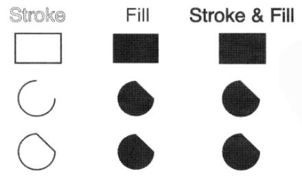
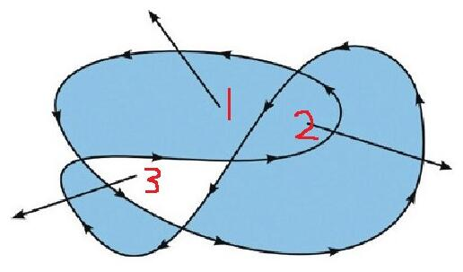

# Canvas的知识点

## 画布
```txt
1. canvas 元素默认宽高 300 * 150
2. 画布不能通过CSS样式来设置 , 通过canvas的标签属性设置
3. 画布坐标 2d （0，0）原点在左上角 横X轴  竖Y轴
4. 路径绘制的方式：描边( stroke() )、填充( fill() )、既描边又填充( stroke()&fill() )
5. 自动闭合路径 closePath()
6. 设置线条宽度 lineWidth
7. 开辟新路径 beginPath()
```

```html
<!-- 画布容器 -->
<canvas id="cas" width="600" height="400"></canvas>
```
```js
        // 获取画布
        var cas = document.getElementById('cas');
        // 获取绘图工具
        var ctx = cas.getContext('2d');

        /* 开始绘图 */

        // 指定绘制路径起点
        ctx.moveTo(100, 100) 
        // 直线
        ctx.lineTo(400, 100); 
        // 线条颜色
        ctx.strokeStyle = "blue";
        // 路径描边
        ctx.stroke(); 
```
## 填充路径规则：非零环绕




