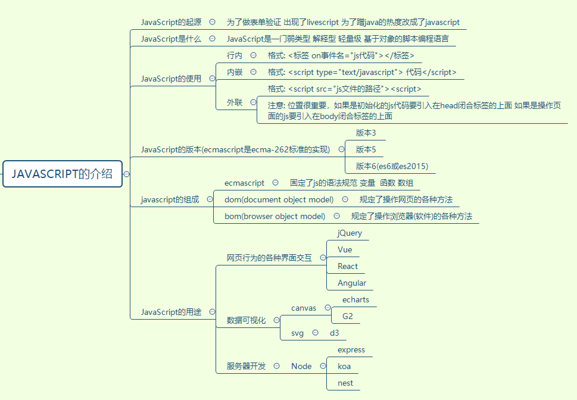
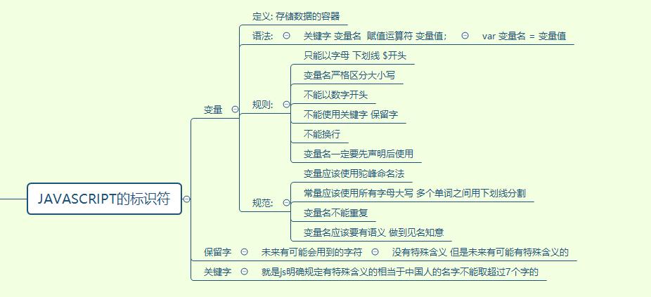
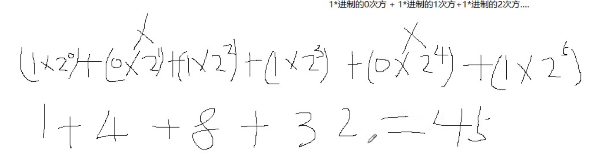
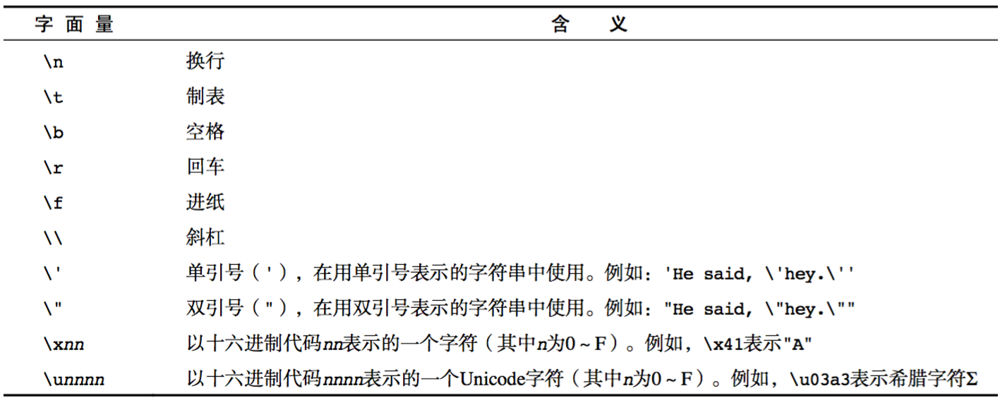

# JS知识点的总结

## JS的介绍

~~~reStructuredText
JavaScript是一种运行在客户端的脚本语言 ,JavaScript的解释器被称为JavaScript引擎，为浏览器的一部分，广泛用于客户端的脚本语言，最早是在HTML（标准通用标记语言下的一个应用）网页上使用，用来给HTML网页增加动态功能。
~~~

## JS的标识符

~~~js
var a = 10 , b = 15 , age = 18 , name = 'zs' ;
~~~

## JS的数据类型

1. 数据类型有哪些

~~~text
6种基本数据类型(undefined null number boolean string symbol) 1中引用数据类型 object
~~~

### Number类型

* 进制

  ~~~reStructuredText
  二进制：计算机的存储
  十六进制：CSS中表示的颜色
  十进制：数学的计算
  
  进制之间的转换：
  十进制转任何进制用辗转相除法，转几进制就除以几。例  20(十进制)--->10100(二进制)
  任意进制转换为十进制用:这个数字从右往左开始依次乘以进制值的n次方（n从0开始）最后求和即可。
  例：101101(二进制)--->45(十进制)
  ~~~

  

* 浮点数

  * 浮点数的精度问题

    ~~~reStructuredText
    浮点数
    	var n = 5e-324;   // 科学计数法  5乘以10的-324次方  
    浮点数值的最高精度是 17 位小数，但在进行算术计算时其精确度远远不如整数
       var result = 0.1 + 0.2;    // 结果不是 0.3，而是：0.30000000000000004
       console.log(0.07 * 100);
       不要判断两个浮点数是否相等
    ~~~

    **避免小数计算的精度问题：将要计算的内容进行倍数的扩大，在使用整数进行计算后，再除以对应倍数即可**

* 数值范围

  ~~~reStructuredText
  最小值：Number.MIN_VALUE，这个值为： 5e-324
  最大值：Number.MAX_VALUE，这个值为： 1.7976931348623157e+308
  无穷大：Infinity
  无穷小：-Infinity
  ~~~

* 数值判断

  * NaN：not a number，NaN 与任何值都不相等，包括他本身
  * isNaN进行检测是否为数字（**是数字返回false，不是数字返回true**）

### String类型

* 转义符

  ~~~reStructuredText
  在需要进行转义操作的字符前书写反斜线\
  可将具有特殊功能的字符转为普通字符，将普通转为不普通
  ~~~

  

* 字符窜的长度 length

  ~~~js
  var str = 'abc';
  console.log(str.length) //3
  ~~~

* 字符窜的拼接 +

  ~~~js
  var str1 = 'abc' , num = 3;
  console.log(str1+num) // abc3
  console.log(`小明今年${num}岁`) // 反引号的使用
  ~~~

### Boolean 类型

~~~js
true : 1 , false : 0
~~~

### Undefined

~~~js
未定义 代表意料之外的值 如果声明变量没有赋值 默认就是 undefined
~~~

### Null

~~~js
空指针 空对象 空  指的是未来有可能要要把这个变量赋值为对象 但是现在还没有这个对象就把这个变量赋值为 null 意思是意料之中的值 主要用来初始化对象
~~~

## 数据之间的转换

