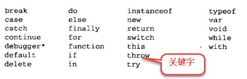

# JS知识点的总结

## JS的介绍

~~~reStructuredText
JavaScript是一种运行在客户端的脚本语言 ,JavaScript的解释器被称为JavaScript引擎，为浏览器的一部分，广泛用于客户端的脚本语言，最早是在HTML（标准通用标记语言下的一个应用）网页上使用，用来给HTML网页增加动态功能。
~~~

## JS的标识符

~~~js
var a = 10 , b = 15 , age = 18 , name = 'zs' ;
~~~

## JS的数据类型

1. 数据类型有哪些

~~~text
6种基本数据类型(undefined null number boolean string symbol) 1中引用数据类型 object
~~~

### Number类型

* 进制

  ~~~reStructuredText
  二进制：计算机的存储
  十六进制：CSS中表示的颜色
  十进制：数学的计算
  
  进制之间的转换：
  十进制转任何进制用辗转相除法，转几进制就除以几。例  20(十进制)--->10100(二进制)
  任意进制转换为十进制用:这个数字从右往左开始依次乘以进制值的n次方（n从0开始）最后求和即可。
  例：101101(二进制)--->45(十进制)
  ~~~

  

* 浮点数

  * 浮点数的精度问题

    ~~~reStructuredText
    浮点数
    	var n = 5e-324;   // 科学计数法  5乘以10的-324次方  
    浮点数值的最高精度是 17 位小数，但在进行算术计算时其精确度远远不如整数
       var result = 0.1 + 0.2;    // 结果不是 0.3，而是：0.30000000000000004
       console.log(0.07 * 100);
       不要判断两个浮点数是否相等
    ~~~

    **避免小数计算的精度问题：将要计算的内容进行倍数的扩大，在使用整数进行计算后，再除以对应倍数即可**

* 数值范围

  ~~~reStructuredText
  最小值：Number.MIN_VALUE，这个值为： 5e-324
  最大值：Number.MAX_VALUE，这个值为： 1.7976931348623157e+308
  无穷大：Infinity
  无穷小：-Infinity
  ~~~

* 数值判断

  * NaN：not a number，NaN 与任何值都不相等，包括他本身
  * isNaN进行检测是否为数字（**是数字返回false，不是数字返回true**）

### String类型

* 转义符

  ~~~reStructuredText
  在需要进行转义操作的字符前书写反斜线\
  可将具有特殊功能的字符转为普通字符，将普通转为不普通
  ~~~

  

* 字符窜的长度 length

  ~~~js
  var str = 'abc';
  console.log(str.length) //3
  ~~~

* 字符窜的拼接 +

  ~~~js
  var str1 = 'abc' , num = 3;
  console.log(str1+num) // abc3
  console.log(`小明今年${num}岁`) // 反引号的使用
  ~~~

### Boolean 类型

~~~js
true : 1 , false : 0
~~~

### Undefined

~~~js
未定义 代表意料之外的值 如果声明变量没有赋值 默认就是 undefined
~~~

### Null

~~~js
空指针 空对象 空  指的是未来有可能要要把这个变量赋值为对象 但是现在还没有这个对象就把这个变量赋值为 null 意思是意料之中的值 主要用来初始化对象
~~~

## 数据之间的转换

### 转换成字符串类型

~~~js
1.toString()
var num = 5;
console.log(num.toString());
2.String()
String()函数存在的意义：有些值没有toString()，这个时候可以使用String()。比如：undefined和null
~~~

### 转换成数值类型

~~~js
1.Number()
Number()可以把任意值转换成数值，如果要转换的字符串中有一个不是数值的字符，返回NaN
2.parseInt()
var num1 = parseInt("12.3abc");  // 返回12，如果第一个字符是数字会解析知道遇到非数字结束
var num2 = parseInt("abc123");   // 返回NaN，如果第一个字符不是数字或者符号就返回NaN
3.parseFloat()把字符串转换成浮点数,parseInt非常相似，不同之处在与parseFloat会解析第一个. 遇到第二个.或者非数字结束.如果解析的内容里只有整数，解析成整数.
~~~

### 转换成布尔类型

~~~js
Boolean()
0  ''(空字符串) null undefined NaN 会转换成false  其它都会转换成true;在有条件的语句中都是隐式类型转换.
~~~

### typeof的使用：通过typeof可以检测变量中值的类型

~~~js
var num = 12,str='zs',bool=false;
console.log(typeof num);// number
console.log(typeof (str));// string
console.log(typeof bool);// boolean
console.log(typeof null);// object
~~~

## 操作符

### 算术运算符

~~~js
+ - * / %
~~~

### 一元运算符:只有一个操作数的运算符

~~~js
++ --
++前置先自增后运算,后置先运算后自增
~~~

### 逻辑运算符(布尔运算符)

~~~js
&& 与 两个操作数同时为true，结果为true，否则都是false
|| 或 两个操作数有一个为true，结果为true，否则为false
!  非  取反
~~~

### 关系运算符(比较运算符)

~~~js
<  >  >=  <= == != === !==

==与===的区别：==只进行值得比较，===类型和值同时相等，则相等

var result = '55' == 55;  	// true
var result = '55' === 55; 	// false 值相等，类型不相等
var result = 55 === 55; 	// true
~~~

### 赋值运算符

~~~js
=   +=   -=   *=   /=   %=
~~~

### 运算符的优先级

~~~js
优先级从高到底
	1. ()  优先级最高
	2. 一元运算符  ++   --   !
	3. 算数运算符  先*  /  %   后 +   -
	4. 关系运算符  >   >=   <   <=
	5. 相等运算符   ==   !=    ===    !==
	6. 逻辑运算符 先&&   后||
	7. 赋值运算符
~~~

## 表达式和语句

### 表达式
> 一个表达式可以产生一个值，有可能是运算、函数调用、有可能是字面量。表达式可以放在任何需要值的地方。

### 语句
> 语句可以理解为一个行为，循环语句和判断语句就是典型的语句。一个程序有很多个语句组成，一般情况下;分割一个一个的语句

### 流程控制
> 程序的三种基本结构
1. 顺序结构:从上到下执行的代码就是顺序结构
2. 分支结构: 根据不同的情况，执行对应代码
~~~js
if语句语法:
if (/* 条件表达式 */) {
  // 执行语句
}

if (/* 条件表达式 */){
  // 成立执行语句
} else {
  // 否则执行语句
}

if (/* 条件1 */){
  // 成立执行语句
} else if (/* 条件2 */){
  // 成立执行语句
} else if (/* 条件3 */){
  // 成立执行语句
} else {
  // 最后默认执行语句
}

三元运算符:
表达式1 ? 表达式2 : 表达式3
是对if……else语句的一种简化写法

switch语句:
switch (expression) {
  case 常量1:
    语句;
    break;
  case 常量2:
    语句;
    break;
  case 常量3:
    语句;
    break;
  …
  case 常量n:
    语句;
    break;
  default:
    语句;
    break;
}

注意:
break可以省略，如果省略，代码会继续执行下一个case
switch 语句在比较值时使用的是全等操作符, 因此不会发生类型转换（例如，字符串'10' 不等于数值 10）
~~~
3. 循环结构: 重复做一件事情

~~~js
while语句:
// 当循环条件为true时，执行循环体，
// 当循环条件为false时，结束循环。
while (循环条件) {
  //循环体
}

列子:
// 计算1-100之间所有数的和
// 初始化变量
var i = 1;
var sum = 0;
// 判断条件
while (i <= 100) {
  // 循环体
  sum += i;
  // 自增
  i++;
}
console.log(sum);

do...while语句:
do {
  // 循环体;
} while (循环条件);

列子：
// 初始化变量
var i = 1;
var sum = 0;
do {
  sum += i;//循环体
  i++;//自增
} while (i <= 100);//循环条件

for语句：
// 执行顺序：1243  ----  243   -----243(直到循环条件变成false)
for (初始化表达式1; 判断表达式2; 自增表达式3) {
  // 循环体4
}

列子:
打印直角三角形
var start = '';
for (var i = 0; i < 10; i++) {
  for (var j = i; j < 10; j++) {
    start += '* ';
  }
  start += '\n';
}
console.log(start);

打印9*9乘法表
var str = '';
for (var i = 1; i <= 9; i++) {
  for (var j = i; j <=9; j++) {
    str += i + ' * ' + j + ' = ' + i * j + '\t';
  }
  str += '\n';
}
console.log(str);

continue和break关键字：

break:立即跳出整个循环，即循环结束，开始执行循环后面的内容（直接跳到大括号）
continue:立即跳出当前循环，继续下一次循环（跳到i++的地方）
~~~

## 数组

### 数组的概念

~~~text
所谓数组，就是将多个元素（通常是同一类型）按一定顺序排列放到一个集合中，那么这个集合我们就称之为数组。
~~~

### 数组的定义

~~~text
数组是一个有序的列表，可以在数组中存放任意的数据，并且数组的长度可以动态的调整。
数组的个数：可以通过长度属性length,数组的最后一个元素的索引值可使用arr.length-1来表示
~~~

### 数组的检测

~~~js
1.instanceof  返回布尔值
2.Array.isArray()  ie9以下不支持
3.Object.prototype.tostring.call()   // [Object Array]
~~~

### 数组的方法

~~~js
1.push()   向数组的最后添加元素,可修改原数组,返回值为添加元素后数组的新长度
2.pop()    从数组最后删除一个元素,可修改原数组,返回值为删掉的元素
3.unshift() 从数组的最前面添加元素
4.shift()   从数组的最前面删除一个元素
5.concat()  进行数组的连接,返回一个新数组
6.slice()   拷贝数组中的指定部分数据,不包含结束位置的元素,返回值以数组的形式返回拷贝后的结果
7.splice()  截取或替换数组中的某些指定元素
8.reverse() 数组的反转
9.sort()  arr.sort(function(a,b){return a-b;}) a-b代表升序 b-a代表降序
10.indexof() 检索元素的位置 返回索引的下标，无返回负一 
11.join()  数组转换成字符串，逗号分隔每一项,传入参数会将元素连接到一个字符串中
~~~

## 函数

### 需求：希望一段功能代码可重复执行,并且代码灵活性要高

### 声明方式

~~~js
function 函数名(){
  // 函数体
}

var fn = function() {
  // 函数体
}

特点：函数声明的时候，函数体并不会执行，只要当函数被调用的时候才会执行。

调用：
函数名();
~~~

### 参数

~~~text
1. 形式参数：在声明一个函数的时候，为了函数的功能更加灵活，有些值是固定不了的，对于这些固定不了的值。我们可以给函数设置参数。这个参数没有具体的值，仅仅起到一个占位置的作用，我们通常称之为形式参数，也叫形参。
2. 实际参数：如果函数在声明时，设置了形参，那么在函数调用的时候就需要传入对应的参数，我们把传入的参数叫做实际参数，也叫实参。
~~~
~~~js
var x = 5, y = 6;
fn(x,y); 
function fn(a, b) {
  console.log(a + b);
}
//x,y实参，有具体的值。函数执行的时候会把x,y复制一份给函数内部的a和b，函数内部的值是复制的新值，无法修改外部的x,y
~~~

### 返回值

~~~text
当函数执行完的时候，并不是所有时候都要把结果打印。我们期望函数给我一些反馈（比如计算的结果返回进行后续的运算），这个时候可以让函数返回一些东西。也就是返回值。函数通过return返回一个返回值
~~~

~~~js
//声明一个带返回值的函数
function 函数名(形参1, 形参2, 形参...){
  //函数体
  return 返回值;
}

//可以通过变量来接收这个返回值
var 变量 = 函数名(实参1, 实参2, 实参3);

注意：
 如果函数没有显示的使用 return语句 ，那么函数有默认的返回值：undefined
    如果函数使用 return语句，那么跟再return后面的值，就成了函数的返回值
    如果函数使用 return语句，但是return后面没有任何值，那么函数的返回值也是：undefined
    函数使用return语句后，这个函数会在执行完 return 语句之后停止并立即退出，也就是说return后面的所有其他代码都不会再执行。
~~~

## 对象

### 定义

~~~text
JavaScript的对象是无序属性的集合。
	其属性可以包含基本值、对象或函数。对象就是一组没有顺序的值。我们可以把JavaScript中的对象想象成键值对，其中值可以是数据和函数。
对象的行为和特征
	特征---属性
	行为---方法
~~~

### 创建方式

~~~js
字面量方式：
var obj = {
  name: 'zs',
  age: 18,
  sex: true,
  sayHi: function () {
    console.log(this.name);
  }
}; 

new Object()创建对象:
var person = new Object();
  person.name = 'lisi';
  person.age = 35;
  person.job = 'actor';
  person.sayHi = function(){
  console.log('Hello,everyBody');
}

工厂函数创建对象:
function createPerson(name, age, job) {
  var person = new Object();
  person.name = name;
  person.age = age;
  person.job = job;
  person.sayHi = function(){
    console.log('Hello,everyBody');
  }
  return person;
}
var p1 = createPerson('张三', 22, 'actor');

自定义构造函数:
function Person(name,age,job){
  this.name = name;
  this.age = age;
  this.job = job;
  this.sayHi = function(){
  	console.log('Hello,everyBody');
  }
}
var p1 = new Person('张三', 22, 'actor');
~~~

### 对象属性操作

~~~js
1.对象名.属性名
2.对象名['属性名']
3.for in 遍历对象
for(var key in obj) {
  console.log(key + "==" + obj[key]);
}
4.删除对象的属性
delete obj.name;
5.检测对象的属性是否存在  hasownproperty  返回布尔值
var o = new Object();
o.prop = 'exists';

function changeO() {
  o.newprop = o.prop;
  delete o.prop;
}

o.hasOwnProperty('prop');  // true
changeO();
o.hasOwnProperty('prop');  // false
~~~

