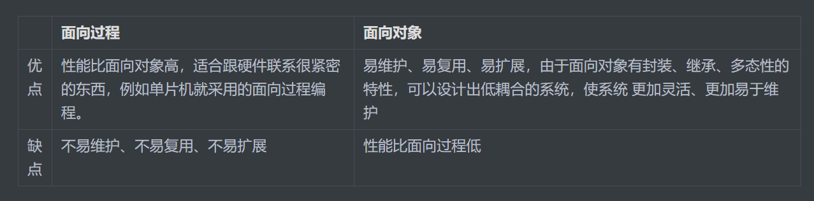

# 对象

## 1.定义
对象是由属性和方法组成的：是一个无序键值对的集合,指的是一个具体的事物

* 属性：事物的特征，在对象中用属性来表示（常用名词）
* 方法：事物的行为，在对象中用方法来表示（常用动词）

## 2.创建

### 字面量的方式
~~~js
var ldh = {
    name: '刘德华',
    age: 18
}
console.log(ldh);
~~~

### 系统函数的方式
~~~js
var obj = new Object();
obj.age = 12;
obj.name = '张三';
obj.gender = '男';
obj.sayHi = function () {
  console.log('大家好，我叫' + this.name + ',今年' + this.age);
};
~~~

### 工厂函数

~~~js
function createComputer() {
    let computer = new Object();
    computer.name = "计算机";
    computer.type = "台式机";
    computer.zuCheng = ["主机", "显示器", "鼠标", "键盘"];
    computer.playGames = function () {
        console.log("赶紧放个大招,你的剑圣是用来旅游的嘛");
    };
    computer.readBook = function () {
        console.log("霸道总裁爱上我");
    };
    return computer;
}
let zhangsan = createComputer();
console.log(zhangsan);
~~~

### 自定义构造函数
~~~js
  function Star(name, age) {
    this.name = name;
    this.age = age;
 }
var ldh = new Star('刘德华', 18)//实例化对象
console.log(ldh);	
~~~

# 类

* 在 ES6 中新增加了类的概念，可以使用 class 关键字声明一个类，之后以这个类来实例化对象。类抽象了对象的公共部分，它泛指某一大类（class）对象特指某一个，通过类实例化一个具体的对象

## 类的创建

~~~js
//步骤1 使用class关键字
class name {
  // class body
}     
//步骤2使用定义的类创建实例  注意new关键字
var xx = new name(); 
~~~

## 类创建添加属性和方法

~~~js
// 1. 创建类 class  创建一个类
class Star {
    // 类的共有属性放到 constructor 里面 constructor是 构造器或者构造函数
    constructor(uname, age) {
      this.uname = uname;
      this.age = age;
    }//------------------------------------------->注意,方法与方法之间不需要添加逗号
    sing(song) {
      console.log(this.uname + '唱' + song);
    }
}
// 2. 利用类创建对象 new
var ldh = new Star('刘德华', 18);
console.log(ldh); // Star {uname: "刘德华", age: 18}
ldh.sing('冰雨'); // 刘德华唱冰雨 
~~~

## 类的继承 

~~~js
// 父级
class Father {
      constructor(surname) {
        this.surname= surname;
      }
      say() {
        console.log('你的姓是' + this.surname);
       }
}

class Son extends Father{  // 这样子类就继承了父类的属性和方法
}
var damao= new Son('刘');
damao.say();      //结果为 你的姓是刘

重点：子类使用super关键字访问父类的方法
//定义了父类
class Father {
   constructor(x, y) {
   this.x = x;
   this.y = y;
   }
   sum() {
   console.log(this.x + this.y);
	}
 }
//子元素继承父类
    class Son extends Father {
   		 constructor(x, y) {
    		super(x, y); //使用super调用了父类中的构造函数
    	}
    }
    var son = new Son(1, 2);
    son.sum(); //结果为3
~~~