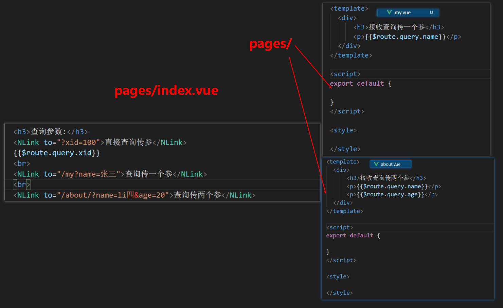

# Nuxt学习之路

## 概述
```txt
vue开发的SPA（单页应用）不利于搜索引擎的SEO优化。
Nuxt.js 是一个基于 Vue.js 的通用应用框架,它预设了利用 Vue.js 开发 服务端渲染（SSR, Server Side Render）的应用所需要的各种配置,同时也可以一键生成静态站点。通过对客户端/服务端基础架构的抽象组织,Nuxt.js 主要关注的是应用的 UI 渲染。
```
## 优点
* 自动代码分成
* 服务端渲染
* 强大的路由功能,支持异步数据
* ES6/ES7语法支持,打包和压缩JS和CSS
* HTML头部标签管理
* 本地开发支持热加载
* 集成ESLint
* 支持各种样式预处理器:SASS、LESS等

## 原理

1. 用户打开浏览器，输入网址请求到Node.js

2. 部署在Node.js的应用Nuxt.js接收浏览器请求，并请求服务端获取数据

3. Nuxt.js获取到数据后进行服务端渲染

4. Nuxt.js将html网页响应给浏览器

## 脚手架创建项目
1. 安装
```js
1.  yarn create nuxt-app <项目名> 
2.  npx create-nuxt-app <项目名>
```
2. 运行
```js
1. cd 项目目录
2. yarn dev / npm run dev

注意：

   开发时:
           yarn dev        npm run dev        --->开启开发服务器

   开发完：
   		   yarn build      npm run build      ---> 打包
	       yarn start      npm run start      ---> 开启正式服务器

           yarn generate   npm run generate   ---> 生成静态页
				特点：  1. 生成dist
                       2. 生成.html的页面
```
3. 目录介绍


## 布局
### 默认布局
* layouts/default.vue
```html
<template>
  <div>
    <header>默认布局组件头部</header>
    <NLink to="/">首页</NLink>
    <NLink to="/about">关于</NLink>
    <NLink to="/user">用户</NLink>
    <nuxt />
    <footer>默认布局组件底部</footer>
  </div>
</template>
```
### 自定义布局
```html
<!-- layouts下 -->
<template>
  <div>
      <nuxt />
      <p>自定义布局</p>
  </div>
</template>
<!-- pages下 使用自定义布局 -->
<template>
  <div>
      <h2>我是关于页</h2>
  </div>
</template>

<script>
export default {
    layout: 'custom'
}
</script>
```
**注意:**
```js
1. <nuxt /> 视图显示占位
2. <nuxt-link> = <n-link> = <NuxtLink> = <NLink> 就是a标签
3. 一但使用了自定义布局的页面,默认布局则不生效。
```
### 错误页面
* layouts/error.vue
```html
<template>
  <div>
    <h3>尊敬的用户,您访问的页面丢了</h3>
    <NLink to="/">首页</NLink>
  </div>
</template>
```
## 路由
* Nuxt.js 依据 pages 目录结构自动生成 vue-router 模块的路由配置。

1. 路由切换激活类名
```js
nuxt-link-active  //模糊匹配
nuxt-link-exact-active //精确匹配
```
2. 路由和文件的关系
    | 文件 | 对应路径 |
    |--------|------|
    | pages/index.vue | / | 
    | pages/about.vue | /about | 
    | pages/user/index.vue | /user | 
    | pages/user/details | /user/details | 
 

3. 动态路由
### 路径参数
 
### 查询参数
 

4. 嵌套路由
 

``总结:``
* 文件夹的层级就是路由的嵌套关系,一旦涉及参数传递单个_参数名.vue,多个文件夹名也要下划线开头。


