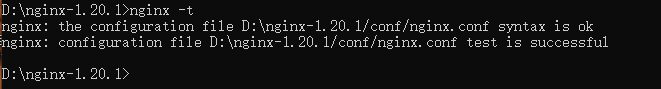
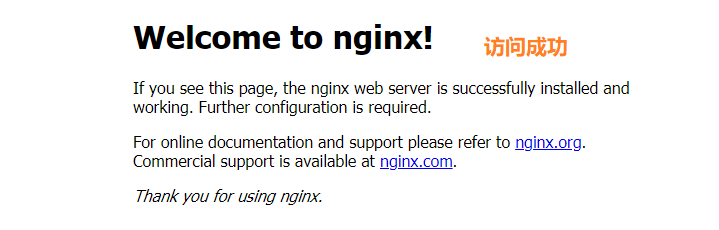

# 项目部署上线

* nginx:高效轻量的web的服务器
1. 下载
[链接](http://nginx.org/en/download.html)
2. 解压后,放到一个盘符
3. 配置nginx
    1. nginx -t  校验nginx配置是否正确
     
    2. 启动nginx(根目录下): `nginx -c  conf/nginx.conf`
    3. 访问默认网站(localhost:80)
     

* 部署上线