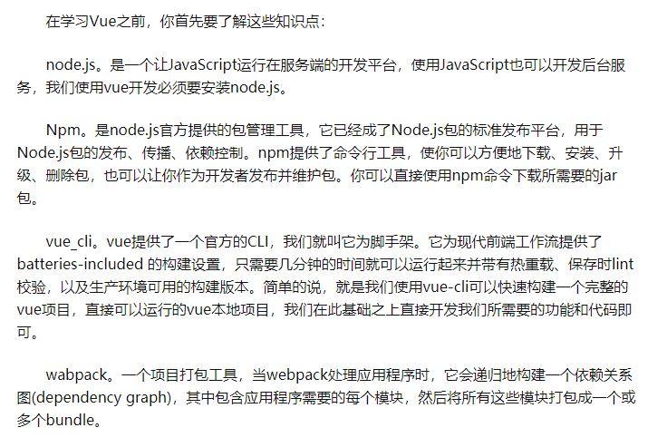
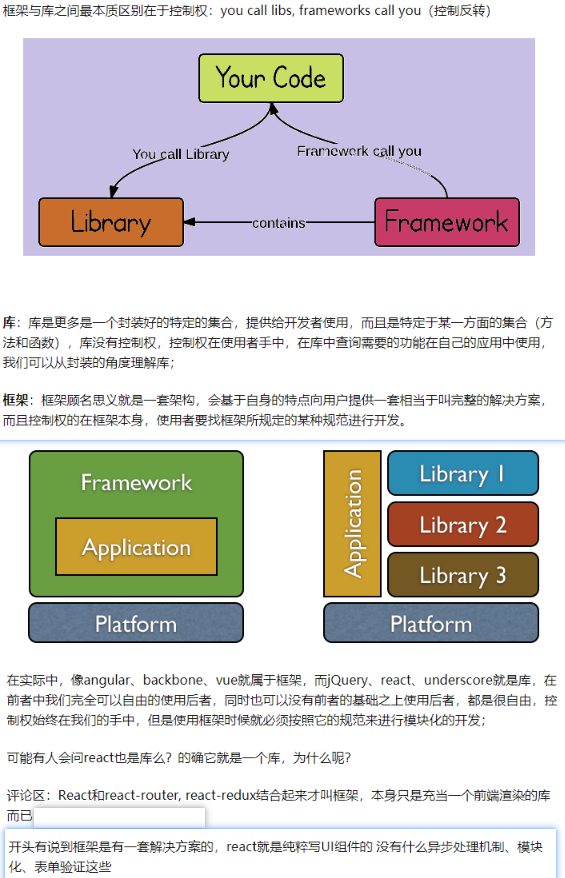
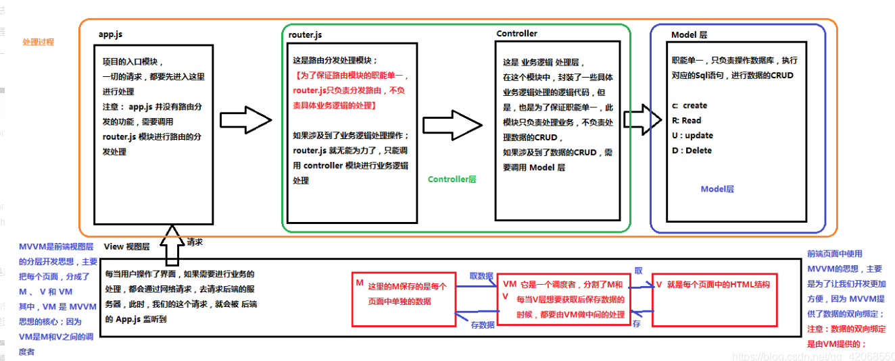
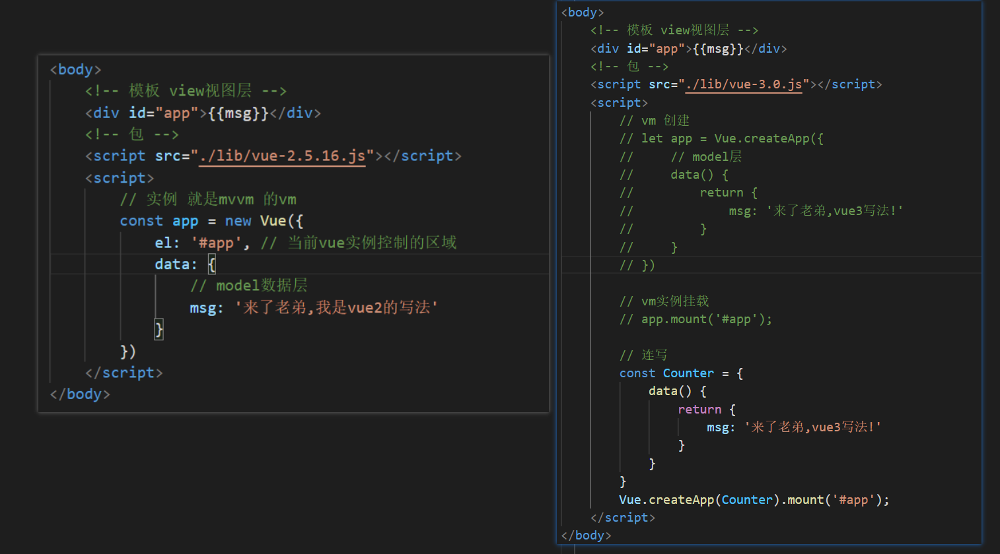
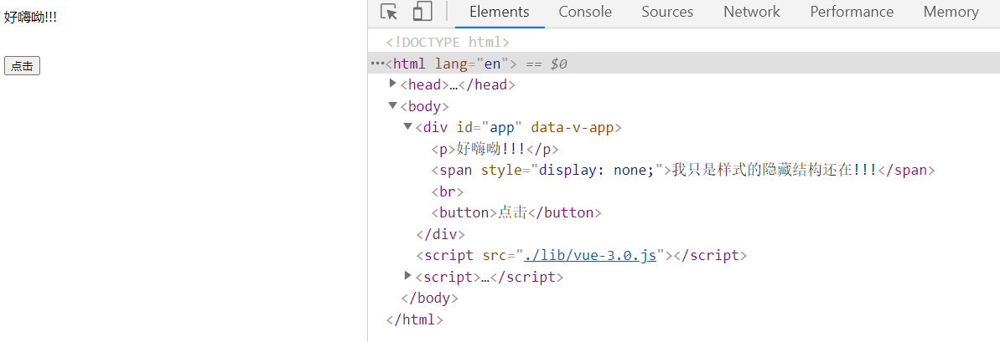
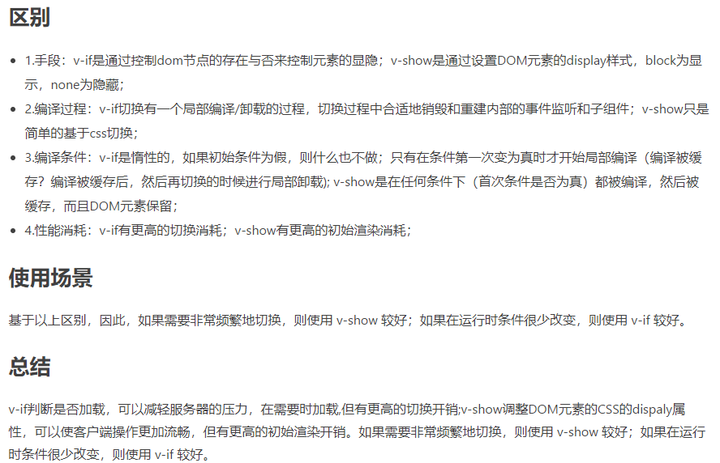

# Vue的学习之路
## 了解


## 库(librarys)和框架(frameworks)的区别


## MVVM(前台)和MVC(后台)理解

[百度链接](https://blog.csdn.net/qq_42068550/article/details/89480350)

## Vue
[vue中文官网] (https://cn.vuejs.org/v2/guide/)

* 概述:
一套构建用户界面的**渐进式**（没有多做职责之外的事,只提供了vue-cli生态中最核心的组件系统和双向数据绑定,就好像 vuex、vue-router都属于围绕vue.js开发的库。）框架，**只关注视图（页面）层的开发**，易于上手。

* vue2和vue3初体验对比


**解析步骤:** 
1. 代码由上向下读取,当vm实例被创建出来后立即执行控制区域(#app的div),并将数据依次渲染到视图上。
2. vm还有监听数据变化的职责,一旦data中的数据发生变化,视图层会重新渲染

### 指令

1. 插值表达式 **{{}}**、**v-text**、**v-html**
```html
<body>
    <div id="app">
        <h3>{{name}}</h3>
        <!-- v-text:纯文本;v-html:解析标签 -->
        <div v-text='msg'></div>
        <div v-html='msg'></div>
    </div>
    <script src="./lib/vue-2.5.16.js"></script>
    <script>
        const data = {
            name: '张三',
            msg: '<span style="color:red">来了老弟好嗨呦</span>'
        }
        const app = new Vue({
            el: '#app',
            data: data
        })
    </script>
</body>
```
2. **v-cloak** 解决{{}}闪烁的问题
    
    **注意**: 在使用过程中指令失效,原因是样式权重不够造成的.
    ```css
    [v-cloak]:{
        display:none !important;
    }
    ```
3. **v-if、v-else**
```html
<body>
    <div id="app">
        <h2 v-if='flag'>{{msg1}}</h2>
        <p v-else>{{msg2}}</p>
        <span v-show='flag'>我只是样式的隐藏结构还在!!!</span><br>
        <button @click='handleToggle'>点击</button>
    </div>
    <script src="./lib/vue-3.0.js"></script>
    <script>
        const vm = Vue.createApp({
            data() {
                return {
                    flag: false,
                    msg1: '来了老弟',
                    msg2: '好嗨呦!!!',
                }
            },
            methods: {
                handleToggle() {
                    this.flag = !this.flag;
                }
            }
        })
        vm.mount('#app')
    </script>
</body>
```



4. 属性绑定
```html
<head>
    <meta charset="UTF-8">
    <meta name="viewport" content="width=device-width, initial-scale=1.0">
    <title>Document</title>
    <style>
        .red {
            color: red;
        }
    </style>
</head>

<body>
    <!-- 属性绑定 v-bind 简写：：冒号即可 -->
    <div id="app">
        <a v-bind:class="lm" :href="lj">{{msg}}</a>
    </div>
    <script src="./lib/vue-3.0.js"></script>
    <script>
        const counter = {
            data() {
                return {
                    msg: '哈哈,来了老弟',
                    lm: 'red',
                    lj: 'http://www.baidu.com'
                }
            }
        }
        Vue.createApp(counter).mount('#app')
    </script>
</body>
```
5. 事件绑定
```html
<head>
    <meta charset="UTF-8">
    <meta name="viewport" content="width=device-width, initial-scale=1.0">
    <title>Document</title>
    <style>
        span {
            display: block;
            width: 200px;
            height: 30px;
            line-height: 30px;
            text-align: center;
            margin-bottom: 100px;
        }
    </style>

</head>

<body>
    <!-- 事件绑定 v-on 简写：@ -->
    <div id="app">
        <span v-on:click="djClick">点击有发现</span>
        <span v-on:dblclick="sjClick('张三')">双击有发现</span>
        <span @mouseover="ycMouseout">移入有发现</span>
    </div>
    <script src="./lib/vue-3.0.js"></script>
    <script>
        const counter = {
            data() {
                return {
                    name: '张三'
                }
            },
            methods: {
                djClick() {
                    alert('我被点击了');
                },
                sjClick(name) {
                    alert(`我的名字叫:${name}`);
                },
                ycMouseout: function() {
                    alert(`我的名字叫:${this.name}`)
                }
            }
        }
        Vue.createApp(counter).mount('#app')
    </script>
</body>
```
6. 列表渲染**v-for**
```html
<body>
    <div id="app">
        <ul>
            <li v-for="item in aActor" :key="item.id">
                {{item.name}}--{{item.age}}--{{item.fans}}
            </li>
        </ul>
    </div>
    <script src="./lib/vue-2.5.16.js"></script>
    <script>
        const app = new Vue({
            el: '#app',
            data: {
                // 遍历的数组对象
                aActor: [{
                    id: 1,
                    name: '岳云鹏',
                    age: 32,
                    fans: '1000w'
                }, {
                    id: 2,
                    name: '张云雷',
                    age: 34,
                    fans: '10w'
                }, {
                    id: 3,
                    name: '郭麒麟',
                    age: 20,
                    fans: '100w',
                    arrObj: [{
                        id: 31,
                        name: '郭哈哈',
                        age: 20,
                        fans: '100w',
                    }]
                }, {
                    name: '秦霄贤',
                    age: 23,
                    fans: '2000w'
                }]
            }
        })
    </script>
</body>
```
7. 数据的双向绑定**v-model**
```html
<body>
    <div id="app">
        <input type="text" v-model="inputVal">
        <p>{{inputVal}}</p>
    </div>
    <script src="./lib/vue-3.0.js"></script>
    <script>
        const counter = {
            data() {
                return {
                    inputVal: ''
                }
            }
        }
        Vue.createApp(counter).mount('#app')
    </script>
</body>
```
8. 自定义指令

### 修饰符
### 表单操作

