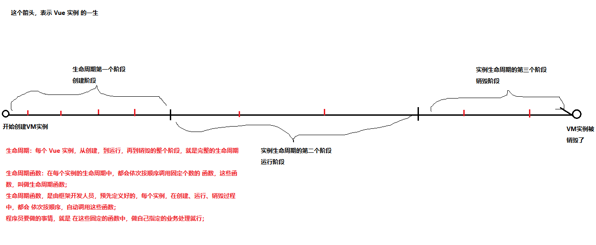
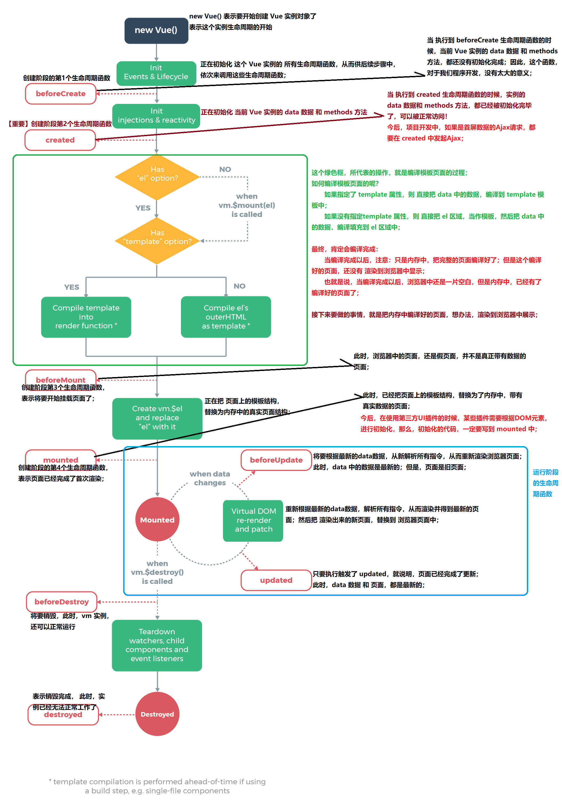

# Vue 一套构建用户界面的框架，**只关注视图（页面）层的开发**，易于上手

MVVM是**前端页面的分层开发思想**，主要关注于 **视图层** 分离，也就是说：MVVM把前端的视图层，分为了 三部分 Model, View,  ViewModel

+ Model 是 页面中，需要用到的数据
+ View 是页面中的HTML结构；
+ ViewModel 是 一个 中间的调度者,提供了双向数据绑定的概念；

## 指令

### 1. 插值表达式
注意：插值表达式只能用在元素的内容区域；不能用在元素的属性节点中;
```html
<body>
    <!-- 模板 -->
    <div id="app">
        <!--插值表达式  -->
        {{msg}}
    </div>
    <script src="./lib/vue-3.0.js"></script>
    <script>
        // 数据层
        // let mv = Vue.createApp({
        //     data(){

        //         return {
        //             msg:'哈哈'
        //         }

        //     }

        // })

        // // 控制层
        // mv.mount('#app');

        // 控制器
        const Counter = {
            
            data(){
                return {
                    msg:'Hello Vue'
                }
            }
        }

        Vue.createApp(Counter).mount('#app')
    </script>
</body>
```
### 2. `v-cloak`指令
解决插值表达式有闪烁的问题（`v-cloak` 指令来解决闪烁问题）

```html
    <!-- 失效时在样式权重最高即可 -->
    <!-- <style>
        [v-cloak] {
            display: none !important;
        }
    </style> -->
    <div id="app">
        <p v-cloak>{{msg}}</p>
    </div>
    <script src="./lib/vue-3.0.js"></script>
    <script>
        const counter = {
            data(){
                return {
                    msg:'哈哈,来了老弟'
                }
            }
        }
        Vue.createApp(counter).mount('#app')
    </script>
```
### 3. `v-html` 和 `v-text`

```html
<head>
    <meta charset="UTF-8">
    <meta name="viewport" content="width=device-width, initial-scale=1.0">
    <title>Document</title>
    <style>
        li {
            list-style: none;
        }
        li:first-child{
            color: red;
        }
        li:nth-child(2){
            color: yellow;
        }
        li:last-child{
            color: green;
        }
    </style>
</head>

<body>
    <!-- v-text不渲染标签  v-html -->
    <ul id="app">
        <li>{{msg}}</li>
        <li v-text="msg"></li> 
        <li v-html="msg"></li>
    </ul>
    <script src="./lib/vue-3.0.js"></script>
    <script>
        const Counter = {
            data() {
                return {
                    msg: '<span>哈哈来了老弟</span>'
                }
            }
        }
        Vue.createApp(Counter).mount('#app');
    </script>
</body>
```
### 4. `v-bind:` 属性绑定

```html
    <style>
        .red {
            color: yellow;
        }
    </style>
    <!-- 属性绑定 v-bind 简写：：冒号即可 -->
    <div id="app">
        <a v-bind:class="lm" :href="lj">{{msg}}</a>
    </div>
    <script src="./lib/vue-3.0.js"></script>
    <script>
        const counter = {
            data() {
                return {
                    msg: '哈哈,来了老弟',
                    lm: 'red',
                    lj:'http://www.baidu.com'
                }
            }
        }
        Vue.createApp(counter).mount('#app')
    </script>
```
### 5. `v-on:` 事件绑定

```html
    <style>
        span {
            display: block;
            width: 200px;
            height: 30px;
            line-height: 30px;
            text-align: center;
            margin-bottom: 100px;
        }
    </style>
    <!-- 属性绑定 v-on 简写：@ -->
    <div id="app">
        <span v-on:click="djClick">点击有发现</span>
        <span v-on:dblclick="sjClick('张三')">双击有发现</span>
        <span @mouseover="ycMouseout">移入有发现</span>
    </div>
    <script src="./lib/vue-3.0.js"></script>
    <script>
        const counter = {
            data() {
                return {
                    name: '张三'
                }
            },
            methods: {
                djClick() {
                    alert('我被点击了');
                },
                sjClick(name) {
                    alert(`我的名字叫:${name}`);
                },
                ycMouseout: function() {
                    alert(`我的名字叫:${this.name}`)
                }
            }
        }
        Vue.createApp(counter).mount('#app')
    </script>
```
### 6. `v-model` 数据双向绑定

```html
    <div id="app">
        <input type="text" v-model="msg">
        <p>{{msg}}</p>
    </div>
    <script src="./lib/vue-3.0.js"></script>
    <script>
        let mv = Vue.createApp({
            data() {
                return {
                    msg: '来了老弟好嗨呦！！！'
                }
            }
        }).mount('#app');
    </script>
```
* 案例
```html
    <div id="app">
        <input type="number" class="num1" v-model="num1">
        <span>+</span>
        <input type="number" class="num2" v-model="num2">
        <button @click='getSum'>=</button>
        <input type="number" disabled class="sum" :value="sum">
    </div>
    <script src="./lib/vue-3.0.js"></script>
    <script>
        let vm = Vue.createApp({
            data() {
                return {
                    num1: '',
                    num2: '',
                    sum: null
                }
            },
            methods: {
                getSum() {
                    this.sum = parseFloat(this.num1) + parseFloat(this.num2);
                }
            }
        }).mount('#app');
    </script>
```
```html
<!-- 为元素绑定类名 -->
    <div id="app">
        <div :class="['kai', flag? 'guan' : '']">
        <!-- <div :class="{'kai':true , 'guan':flag}"> -->
            <button @click='toggle'>开/关</button>
            <P>来了老弟,好嗨呦的历史卡卡；两款都是拉萨扩大；看了看看懂刷卡；阿</P>
        </div>
    </div>
    <script src="./lib/vue-3.0.js"></script>
    <script>
        let vm = Vue.createApp({
            data() {
                return {
                    flag: true
                }
            },
            methods: {
                toggle() {
                    this.flag = !this.flag;
                }
            }
        }).mount('#app')
    </script>
```
### `v-for` 遍历

```html
    <div id="app">
        <ul>
            <!-- <li v-for="item in aStar">{{item}}</li> -->
            <!-- <li v-for="item in aActor">{{item.name}}今年{{item.age}}岁,粉丝量{{item.fans}}</li> -->
        </ul>
    </div>
    <script src="./lib/vue-3.0.js"></script>
    <script>
        let vm = Vue.createApp({
            data() {
                return {
                    aStar: ["于文文", "佟丽娅", "杨幂", "高圆圆", "马思纯", "马冬梅", "张元乙", "袁华"],
                    aActor: [{
                        id: 1,
                        name: '岳云鹏',
                        age: 32,
                        fans: '1000w'
                    }, {
                        id: 2,
                        name: '张云雷',
                        age: 34,
                        fans: '10w'
                    }, {
                        id: 3,
                        name: '郭麒麟',
                        age: 20,
                        fans: '100w',
                    }, {
                        name: '秦霄贤',
                        age: 23,
                        fans: '2000w'
                    }]

                }
            }
        }).mount('#app');
    </script>
```
### `v-if` `v-else-if` `v-else` 判断 `v-show` 显示

```html
    <div id="app">
        <button @click="add">点击添加</button>
        <!-- <span v-if="flag">{{msg}}</span>
        <h5 v-else-if="flag">哈哈哈</h5>
        <h3 v-else>好嗨呦!</h3> -->
        <span v-show="flag">{{msg}}</span>
    </div>
    <script src="./lib/vue-3.0.js"></script>
    <script>
        let vm = Vue.createApp({
            data() {
                return {
                    msg: '来了老弟',
                    flag: true
                }
            },
            methods: {
                add() {
                    this.flag = !this.flag
                }
            }
        }).mount('#app');
    </script>
```
## 修饰符

### `事件修饰符`
```html
<head>
    <meta charset="UTF-8">
    <meta name="viewport" content="width=device-width, initial-scale=1.0">
    <title>Document</title>
    <style>
        .father {
            width: 500px;
            height: 500px;
            background-color: #ccc;
        }
        
        .son {
            width: 200px;
            height: 200px;
            background-color: red;
        }
    </style>
</head>

<body>
    <div id="app">

        <div class="father" @click="father">
            <!-- stop阻止冒泡 -->
            <div class="son" @click.stop="son"></div>
        </div>
        <!-- 事件只触发一次 -->
        <button @click.once="jyc">只触发一次</button>
        <!-- prevent 阻止浏览器的默认行为 -->
        <a href="http://www.baidu.com" @click.prevent>百度</a>
    </div>
    <script src="./lib/vue-3.0.js"></script>
    <script>
        let xm = Vue.createApp({
            data() {
                return {

                }
            },
            methods: {
                father() {
                    console.log('我被father点击了');
                },
                son() {
                    console.log('我被son点击了');
                },
                jyc() {
                    console.log('我只能被点击一次');
                }
            }
        }).mount('#app');
    </script>
</body>

```
### `按键修饰符`
```html
<div id="app">
        <label for="">姓名</label><input type="text" v-model="username">
        <!-- 按键修饰符 enter -->
        <label for="">年龄</label><input type="text" v-model="age" @keyup.enter="jshao">
    </div>
    <script src="./lib/vue-3.0.js"></script>
    <script>
        let vm = Vue.createApp({
            data() {
                return {
                    username: '',
                    age: ''
                }
            },
            methods: {
                jshao() {
                    alert(`我的名字叫${this.username},今年${this.age}岁`);
                    this.username = this.age = '';
                }
            }
        }).mount('#app');
    </script>
```
## `表单`
### `表单的操作`
```html
<head>
    <meta charset="UTF-8">
    <meta name="viewport" content="width=device-width, initial-scale=1.0">
    <title>Document</title>
    <style>
        form div {
            height: 40px;
            line-height: 40px;
        }
        
        form div:nth-child(4) {
            height: auto;
        }
        
        form div span:first-child {
            display: inline-block;
            width: 100px;
        }
    </style>
</head>

<body>
    <div id="app">
        <!-- submit有一个默认行为 自动提交表单 -->
        <form action="http://itcast.cn">
            <div>
                <span>姓名：</span>
                <span>
          <input type="text" v-model="uname">
        </span>
            </div>
            <div>
                <span>性别：</span>
                <span>
          <input type="radio" id="male" value="1" v-model="gender">
          <label for="male">男</label>
          <input type="radio" id="female" value="2" v-model="gender">
          <label for="female">女</label>
        </span>
            </div>
            <div>
                <span>爱好：</span>
                <input type="checkbox" id="ball" value="1" v-model="aiHao">
                <label for="ball">篮球</label>
                <input type="checkbox" id="sing" value="2" v-model="aiHao">
                <label for="sing">唱歌</label>
                <input type="checkbox" id="code" value="3" v-model="aiHao">
                <label for="code">写代码</label>
            </div>
            <div>
                <span>职业：</span>
                <select multiple v-model="jobs">
          <option value="0">请选择职业...</option>
          <option value="1">教师</option>
          <option value="2">软件工程师</option>
          <option value="3">律师</option>
        </select>
            </div>
            <div>
                <span>个人简介：</span>
                <textarea v-model="jieShao"></textarea>
            </div>
            <div>
                <input type="submit" @click.prevent="fFa" value="提交">
            </div>
        </form>
    </div>
    <script src="./lib/vue-3.0.js"></script>

    <script>
        let vm = Vue.createApp({
            data() {
                return {
                    uname: '',
                    gender: '',
                    aiHao: [],
                    jobs: [],
                    jieShao: ''
                }
            },
            methods: {
                fFa() {
                    console.log(this.uname);
                    console.log(this.gender);
                    console.log(this.aiHao);
                    console.log(this.jobs);
                    console.log(this.jieShao);
                }
            }
        }).mount('#app')
    </script>
</body>
```
### `表单域修饰符用法`
```html
<div id="app">
        <!-- 如果想自动将用户的输入值转为数值类型，可以给 v-model 添加 number 修饰符 -->
        <!-- <input type="text" v-model.number="age"> -->
        <input type="text" v-model.trim.lazy="str">
        <br>
        <br>
        <br>
        <br>
        <br>
        <br>
        <br>
        <!-- <p>{{str}}</p> -->
        <button @click='handleInput'>点击</button>
    </div>

    <script src="./lib/vue-3.0.js"></script>
    <script>
        let app = Vue.createApp({
            data() {
                return {
                    age: '',
                    str: ''
                }
            },
            methods: {
                handleInput() {
                    // console.log(this.age + 1);
                    console.log(this.str);
                }
            }
        }).mount('#app')
    </script>
```
## `自定义指令`
### `全局`
```html
    <div id="app">
        <input type="text" v-zidy>
    </div>

    <script src="./lib/vue-3.0.js"></script>
    <script>
        let vm = Vue.createApp({});
        vm.directive('zidy', {
            mounted(el) {
                el.focus();
                el.value = '范志伟'
            }
        })
        vm.mount('#app');
    </script>
```
### `传参`
```html
<div id="app">
        <input type="text" v-zidy="obj" v-model="obj" @blur="cha">
    </div>
    <script src="./lib/vue-3.0.js "></script>
    <script>
        let vm = Vue.createApp({
            data() {
                return {
                    obj: {
                        name: '张三',
                        color: 'yellow'
                    }
                }
            },
            methods: {
                cha() {
                    console.log(this.obj);
                }
            }
        });
        vm.directive('zidy', {
            // 页面加载初时加载完成mounted
            mounted(el, binding) {
                console.log(binding);
                el.value = binding.value.name;
                el.style.backgroundColor = binding.value.color
            }
        })
        vm.mount('#app');
    </script>
```
### `局部指令`
```html
 <div id="app">
        <input type="text" v-zidy="color">
    </div>
    <script src="./lib/vue-3.0.js"></script>
    <script>
        let vm = Vue.createApp({
            data() {
                return {
                    color: 'red'
                }
            },
            methods: {},
            directives: {
                zidy: {
                    mounted(el, binding) {
                        console.log(binding);
                        // 获取焦点
                        el.focus();
                        el.style.backgroundColor = binding.value
                    }
                }
            }
        }).mount('#app');
    </script>
```
## `计算属性`
### `计算属性的基本使用`
```html
 <div id="app">
        <input type="number" v-model.number="num1"> <span>+</span> <input type="number" v-model.number="num2"><span>=</span><input type="number" v-model.number="sum" disabled>
    </div>
    <script src="./lib/vue-3.0.js"></script>
    <script>
        let vm = Vue.createApp({
            data() {
                return {
                    num1: '',
                    num2: ''
                }
            },
            computed: {
                // 这个实际就是get方法
                sum: function() {
                    return this.num1 + this.num2;
                }
            }
        }).mount('#app')
    </script>
```
### `计算属性setter`
```html
<div id="app">
        <input type="text" v-model.trim="xing"><input type="text" v-model.trim="ming"><input type="text" v-model.trim="name">
    </div>
    <script src="./lib/vue-3.0.js"></script>
    <script>
        let vm = Vue.createApp({
            data() {
                return {
                    xing: '',
                    ming: ''
                }
            },
            computed: {
                name: {
                    // 获取
                    get() {
                        return this.xing + ' ' + this.ming;
                    },
                    set(val) {
                        let arr = val.split(' ');
                        this.xing = arr[0];
                        this.ming = arr[1];
                    }
                }

            }
        }).mount('#app')
```
## `侦听器`
```html
<div id="app">
        <input type="text" v-model.trim="xing"><input type="text" v-model.trim="ming">
        <p>{{name}}</p>
    </div>
    <script src="./lib/vue-3.0.js"></script>
    <script>
        let vm = Vue.createApp({
            data() {
                return {
                    xing: '张',
                    ming: '三',
                    name: ''
                }
            },
            //  侦听器
            watch: {
                // 监听的data某个数据
                xing(newValue, oldValue) {
                    this.name = newValue + this.ming;
                }
            }
        }).mount('#app')
    </script>
```
```html
<!-- 案例 ：用户名校验 -->
<head>
    <meta charset="UTF-8">
    <meta name="viewport" content="width=device-width, initial-scale=1.0">
    <title>Document</title>
    <style>
        [v-cloak] {
            display: none !important;
        }
    </style>
</head>

<body>
    <div id="app">
        <span>用户名:</span> <input type="text" v-model.lazy="name">
        <span v-cloak>{{tsyu}}</span>
    </div>
    <script src="./lib/vue-3.0.js"></script>
    <script>
        let vm = Vue.createApp({
            data() {
                return {
                    name: '',
                    tsyu: ''
                }
            },
            methods: {
                yanzheng(name) {
                    setTimeout(() => {
                        if (name == '张三') {
                            this.tsyu = '用户名已存在!!!'
                        } else {
                            this.tsyu = '用户名可以使用。'
                        }
                    }, 2000)
                }
            },
            watch: {
                name(val) {
                    this.yanzheng(val);
                    this.tsyu = '验证中,请等待...'
                }
            }
        });
        vm.mount('#app');
    </script>
</body>

```
## `Vue实例生命周期`



```html
<div id="app">
    <div>{{msg}}</div>
    <button @click='update'>更新</button>
    <button @click='destroy'>销毁</button>
  </div>
  <script type="text/javascript" src="./lib/vue-3.0.0.js"></script>
  <script type="text/javascript">
    /*
      Vue3.x实例的生命周期
    */
    var vm = Vue.createApp({
      data() {
        return {
          msg: '生命周期'
        }
      },
      methods: {
        update: function () {
          this.msg = 'hello';
        },
        destroy: function () {
          console.log(this);
          // this.$forceUpdate();

          this.$unmounted();
        }
      },
      // 可以在钩子函数 created、beforeMount、mounted 中进行调用，因为在这三个钩子函数中，data 已经创建，可以将服务端端返回的数据进行赋值。

      // 但是推荐在 created 钩子函数中调用异步请求，因为在 created 钩子函数中调用异步请求有以下优点：

      // 能更快获取到服务端数据，减少页面loading 时间；
      // ssr不支持 beforeMount 、mounted 钩子函数，所以放在 created 中有助于一致性；

      // 在实例初始化之后,数据观测和事件配置之前被调用 此时data和methods以及页面的DOM结构都没有初始化 什么都做不了
      ① beforeCreate: function () {
        console.log('beforeCreate');
      },
      // // 在实例创建完成后被立即调用 此时data和methods已经可以使用 但是页面还没有被渲染出来
      ② created: function () {
        console.log('created');
      },
      // 代替了一和二setup
      // setup: function () {
      //    console.log('created');
      //  },
      // 在挂载开始之前被调用 此时页面上还看不到真是数据 只是一个模板而已
      ③ beforeMount: function () {
         console.log('beforeMount');
      },
      // el被新创建的vm.$el替换,并挂载到实例上去之后调用该钩子.数据已经真是渲染到页面上 在这个钩子函数里面我们可以使用一些第三方的插件

      // 在钩子函数 mounted 被调用前，Vue 已经将编译好的模板挂载到页面上，所以在 mounted 中可以访问操作 DOM。
      ④ mounted: function () {
         console.log('mounted');
       },
      // 数据更新时调用,发生在虚拟DOM打补丁之前.页面上数据还是旧的
      ⑤ beforeUpdate: function () {
        console.log('beforeUpdate');
      },
      // 由于数据更新导致的虚拟DOM重新渲染和打补丁,在这之后会调用该钩子,页面上的数据已经替换成最新的了
      ⑥ updated: function () {
        console.log('updated');
      },
      // 实例销毁之前调用
      ⑦ beforeUnmount: function () {
        console.log('beforeDestroy');
      },
      // 实例销毁之后调用
      ⑧ unmounted: function () {
        console.log('destroyed');
      }
    }).mount('#app')
  </script>
```
## `组件`
### `定义全局组件`
```html
<head>
    <meta charset="UTF-8">
    <meta name="viewport" content="width=device-width, initial-scale=1.0">
    <title>Document</title>
    <style>
        #app {
            width: 500px;
            height: 500px;
            background: yellow;
        }
        
        div {
            width: 300px;
            height: 300px;
            background: red;
        }
    </style>
</head>

<body>
    <div id="app">
        {{age}}
        <zujian></zujian>
    </div>
    <script src="./lib/vue-3.0.js"></script>
    <script>
        // 注意  组件命名  使用短横线的方式  驼峰命名只能使用在字符窜模板中template  模板写在一个根元素当中
        let vm = Vue.createApp({
            data() {
                return {
                    age: 18
                }
            }
        });
        vm.component('zujian', {
            data() {
                return {
                    name: '张三'
                }
            },
            template: `<div>{{name}}</div>`
        })
        vm.mount('#app');
    </script>
</body>
```
### `定义局部组件`
```html
<body>
    <div id="app">
        <jbzj></jbzj>
        <qjzj></qjzj>
    </div>
    <script src="./lib/vue-3.0.js"></script>
    <script>
        // 局部组件
        let jubu = {
            data() {
                return {
                    msg: '我是局部组件'
                }
            },
            template: `<div>{{msg}}</div>`
        };
        let vm = Vue.createApp({
            components: {
                jbzj: jubu
            }
        });

        // 全局组件
        vm.component('qjzj', {
            data() {
                return {
                    msg: '我是全局组件'
                }
            },
            template: `<div>{{msg}}</div>`
        })
        vm.mount('#app');
    </script>
</body>
```
## `组件之间的传值`
### `父传子`
```html
<head>
    <meta charset="UTF-8">
    <meta name="viewport" content="width=device-width, initial-scale=1.0">
    <title>Document</title>
    <style>
        .father {
            width: 400px;
            height: 400px;
            border: 4px solid #cccccc;
        }
        
        .son {
            width: 200px;
            height: 200px;
            border: 2px solid red;
        }
    </style>
</head>

<body>
    <div id="app">
        <father></father>
    </div>
    <script src="./lib/vue-3.0.js"></script>
    <script>
        let vm = Vue.createApp({});
        // 父组件
        vm.component('father', {
            data() {
                return {
                    jieshao: '我的名字叫张三'
                }
            },
            template: `<div class="father"><son :chanz="jieshao"></son></div>`
        });
        // 子组件
        vm.component('son', {
            props: ["chanz"],
            template: `<div class="son">{{chanz}}</div>`
        })
        vm.mount('#app');
    </script>
</body>
```
### `子传父`
```html
<head>
    <meta charset="UTF-8">
    <meta name="viewport" content="width=device-width, initial-scale=1.0">
    <title>Document</title>
    <style>
        .father {
            width: 400px;
            height: 400px;
            border: 4px solid #cccccc;
        }
        
        .son {
            width: 200px;
            height: 200px;
            border: 2px solid red;
        }
    </style>
</head>

<body>
    <div id="app">
        <father></father>
    </div>
    <script src="./lib/vue-3.0.js"></script>
    <script>
        let vm = Vue.createApp({});
        // 父组件
        vm.component('father', {
            data() {
                return {

                }
            },
            methods: {
                jShao(val) {
                    console.log(`我叫${val}`);
                }
            },
            template: `<div class="father"><son @father="jShao"></son></div>`
        });
        // 子组件
        vm.component('son', {
            data() {
                return {
                    name: '张三'
                }
            },
            // $emit('father', name) 参数① 自定义事件名   参数②数据
            template: `<div class="son" @click="$emit('father',name)"></div>`
        })
        vm.mount('#app');
    </script>
</body>
```
### `兄弟间的传值`
```html
<head>
    <meta charset="UTF-8">
    <meta name="viewport" content="width=device-width, initial-scale=1.0">
    <title>Document</title>
    <style>
        .gg,
        .cdd {
            float: left;
            width: 400px;
            height: 400px;
            border: 2px solid #cccccc;
        }
        
        .cdd {
            float: right;
            border-color: red;
        }
    </style>
</head>

<body>
    <div id="app">
        <gg></gg>
        <cdd></cdd>
    </div>
    <script src="./lib/vue-3.0.js"></script>
    <script src="./lib/mitt-2.1.0.js"></script>
    <script>
        let vm = Vue.createApp({});
        // 声明mitt
        const emitter = mitt();
        // 哥哥组件
        vm.component('gg', {
                data() {
                    return {
                        age: ''
                    }
                },
                methods: {
                    GG() {
                        emitter.emit('czhi', {
                            name: '张三'
                        })
                    }
                },
                mounted() {
                    emitter.on('cz', e => {
                        this.age = e
                    })
                },
                template: '<div class="gg" @click="GG">我是哥哥组件<h3>我今年:{{age}}岁</h3></div>'
            })
            // 弟弟组件
        vm.component('cdd', {
            data() {
                return {
                    jshao: ''
                }
            },
            methods: {
                CDD() {
                    emitter.emit('cz', 18)
                }
            },
            mounted() {
                emitter.on('czhi', e => {
                    this.jshao = e.name
                })
            },
            template: '<div class="cdd" @click="CDD">我是弟弟组件<h3>我叫:{{jshao}}</h3></div>'
        })
        vm.mount('#app');
    </script>
</body>
```