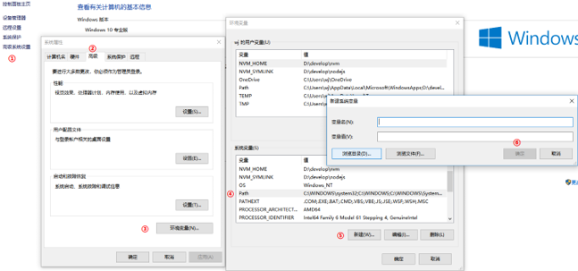

# Node 基础知识

## Node 介绍

```text
    Node是一个基于Chrome V8引擎的JavaScript代码运行环境。
    注意：在浏览器中全局对象是window，在Node中全局对象是global。
```
## Node的运行环境的搭建

```text
① 下载文件  https://nodejs.org/en/  （Download 12.16.3 LTS ,LTS代表稳定版）
② 查看版本 node -v
③ PATH环境变量 看下图
```


## 模块化

```js
// Node.js规定一个JavaScript文件就是一个模块，模块内部定义的变量和函数默认情况下在外部无法得到

//模块成员导出：
let num = 10;
module.exports = {
    num : num
}
// 模块成员导入
let a = require('./dc.js');
console.log(a.num);
```
## 系统模块

### fs模块

```js
// 导入fs
const fs = require('fs');
// 读取文件
fs.readFile('./哈哈.txt', 'utf8', function(err, data) {
    if (err != null) {
        console.log(err);
        return;
    }
    console.log(data);
    console.log('文件读取成功了');
})
// 写入文件内容
const sj = '<h1>来了老弟，好嗨呦！！！</h1>';
fs.writeFile('./index.html', sj, function(err) {
    if (err != null) {
        console.log(err);
        return;
    }
    console.log('文件写成功了');
})
// 创建文件夹
fs.mkdir('./哈哈哈', { recursive: true }, function(err) {
    if(err != null){
        console.log(err);
        return;
    }
    console.log('成功');
})
```
### path 模块

```js
// 导入path
const path = require('path');
// 拼接路径
const ImgLj = path.join('img','2.png');
console.log(ImgLj);

// 绝对路径
const fs = require('fs');
const path = require('path');
// 获取绝对路径  __dirname
const lj = path.join(__dirname,'哈哈.txt');
fs.readFile(lj,'utf8',function (err,data) {
    console.log(data);
})
```
### 第三方模块

```js
// 获取第三方模块
npm install 模块名称
// 卸载
npm uninstall package 模块名称
```
## 包的管理

```js
// 创建package.json
npm init

{
  "name": "item",
  "version": "1.0.0",
  "description": "",
  "main": "index.js", // 入口文件
  "dependencies": {
    "jquery": "^3.5.1"
  }, // 项目依赖  就是开发中需要的包  线上也需要的包
  "devDependencies": {
    "less": "^3.11.1"
  },// 开发时的依赖 就是开发中需要的包 线上不需要的包
  "scripts": {
    "test": "echo \"Error: no test specified\" && exit 1"
  },
  "author": "",
  "license": "ISC"
}
npm install 包名  --save-dev  // 安装开发时的依赖包
```
```text
package-lock.json 的作用：
锁定包的版本，确保再次下载时不会因为包版本不同而产生问题
加快下载速度，因为该文件中已经记录了项目所依赖第三方包的树状结构和包的下载地址，重新安装时只需下载即可，不需要做额外的工作
```
## 模块的加载机制

```js
// 当模块拥有路径但没有后缀时
 1.require方法根据模块路径查找模块，如果是完整路径，直接引入模块
 2.如果模块后缀省略，先找同名JS文件再找同名JS文件夹
 3.如果找到了同名文件夹，找文件夹中的index.js
 4.如果文件夹中没有index.js就会去当前文件夹中的package.json文件中查找main选项中的入口文件
 5.如果找指定的入口文件不存在或者没有指定入口文件就会报错，模块没有被找到 // Cannot find module './moduleB'
// 当模块没有路径且没有后缀时
 1.Node会假设它是系统模块
 2.Node会去node_modules文件夹中
 3.首先看是否有该名字的JS文件
 4.再看是否有该名字的文件夹
 5.如果是文件夹看里面是否有index.js
 6.如果没有index.js查看该文件夹中的package.json中的main选项确定模块入口文件
 7.否则找不到报错
```
## 服务器

###  C/S架构与B/S架构

```text
B/S架构: Browser(浏览器) <-- -->Server(服务器)，这种软件都是通过浏览器访问一个网站使用，服务器提供数据存储等服务
优点: 部署方便(不用安装)，可维护性强
缺点: 用户体验不好，不能针对每个用户的不同特点进行设置
C/S架构: Client(客户端)  <-- -->Server(服务器)，这种软件通过安装一个软件到电脑，然后使用，服务器提供数据存储等服务
优点: 用户体验好
缺点: 部署不方便(需要安装)，可维护性弱
```
### 请求响应的流程

```text
1.用户打开浏览器
2.地址栏输入我们需要访问的网站地址(URL)
3.浏览器通过DNS服务器 获取即将访问的网站的IP地址
4.浏览器发起一个对这个IP地址的请求
5.服务端监听指定的 端口 的服务器软件接收到这个请求，进行相应的处理
6.服务端将处理完的结果返回给客户端浏览器(响应)
7.浏览器将服务端返回的结果呈现到界面上
```
### node的内置模块Http

```js
// 1.引入http模块
const http = require('http');
// 2.调用方法创建服务器
let server = http.createServer();
// 3.启动服务器，指定服务器要监听的端口号
// 共有三个参数:
// 3.1 第一个参数，指定监听的端口号
// 3.2 第二个参数是服务器的IP地址，默认是本地回环地址，本机IP: 127.0.0.1 对应的域名:localhost
// 3.3 第三个参数是当服务器启动成功后，要执行的回调函数
server.listen(3000, () => {
    console.log('the server is running at http://127.0.0.1:3000');
})
// 4.监听客户端的请求，并处理请求，最后把处理的结果通过网络再响应回客户端浏览器
// 给服务器对象注册一个请求事件，每当有新的客户端请求我们服务器的时候，都会触发这个事件
// req: request的缩写，每当有请求过来的时候，都可以拿这次请求的request对象
// res: response的缩写,可以将服务器端的数据通过这个对象的一些方法返回给浏览器客户端
server.on('request', function (req, res) {
    console.log('有新的请求过来了...');
    res.write('ok'); // 向客户端发送一些数据内容
    res.end(); // 表示服务器端对客户端的数据已经发送完毕了，客户端可以接收并显示了,
               //如果只发送一次的话，可以直接使用res.end('111111');
})
```
## http请求和响应处理

### GET方式数据的发送
```html
<!DOCTYPE html>
<html lang="en">
<head>
    <meta charset="UTF-8">
    <meta name="viewport" content="width=device-width, initial-scale=1.0">
    <title>Document</title>
</head>
<body>
    <!-- action 用户输入的内容让谁去处理 -->
    <!-- method 使用什么提交方式 -->
    <form action="http://localhost" method="GET">
        <input type="text" name="username" id="">
        <input type="password" name="password" id="">
        <input type="submit" value="登录">
    </form>
</body>
</html>
```
```js
// 1.引入http模块
const http = require('http');
const url = require('url');

// 2.使用http模块创建服务
let app = http.createServer();

// 3.监听浏览器的request事件 处理请求并响应内容
app.on('request', (req, res)=>{
    // 为了解决乱码
    res.writeHead(200, {
        'Content-Type': 'text/html;charset=utf8'
    })

// 为了拿到对象形式的前端用户写的数据
  let params = url.parse(req.url, true);

    if (params.query.username =='tom'&&  params.query.password =='123456') {
        res.write('欢迎您'+params.query.username)
    } else {
        res.write("账号或密码错误,请您去注册")
    }
    res.end();
})

// 4.监听指定的端口 启动服务
app.listen(80, ()=>{
    // http://127.0.0.1
    console.log("请访问: http://localhost")
})
```
### POST方式数据的发送
```html
<!DOCTYPE html>
<html lang="en">
<head>
    <meta charset="UTF-8">
    <meta name="viewport" content="width=device-width, initial-scale=1.0">
    <title>Document</title>
</head>
<body>
    <!-- action 用户输入的内容让谁去处理 -->
    <!-- method 使用什么提交方式 -->
    <form action="http://localhost" method="POST">
        <input type="text" name="username" id="">
        <input type="password" name="password" id="">
        <input type="submit" value="登录">
    </form>
</body>
</html>
```
```js
// 1.引入http模块
const http = require('http');
const querystring = require('querystring');

// 2.使用http模块创建服务
let app = http.createServer();

// 3.监听浏览器的request事件 处理请求并响应内容
// req 代表请求对象
// res 代表响应对象
app.on('request', (req, res)=>{
    // 为了解决乱码
    res.writeHead(200, {
        'Content-Type': 'text/html;charset=utf8'
    })
    let postData ='';
    // data事件-->监听数据传输事件
    req.on('data', (chunk)=>{
        postData +=chunk;
    })
    // end事件
    req.on('end', ()=>{
        let finalData = querystring.parse(postData);
    })
})

// 4.监听指定的端口 启动服务
app.listen(3000, ()=>{
    // http://127.0.0.1
    console.log("请访问: http://localhost:3000")
})
```
### 路由

```js
// 1.引入http模块
const http = require('http');
const url = require('url');

// 2.使用http模块创建服务
let app = http.createServer();

// 3.监听浏览器的request事件 处理请求并响应内容
// req 代表请求对象
// res 代表响应对象
app.on('request', (req, res)=>{
       // 为了解决乱码
       res.writeHead(200, {
        'Content-Type': 'text/html;charset=utf8'
    })
    // console.log(req.url);
    // 当url中掺杂参数 的时候 必须使用pathname来做
    let pathname = url.parse(req.url).pathname;
    console.log(pathname);
    // 首页
    if (pathname == '/'||pathname== '/index') {
        res.end("首页"); 
    }
    // 列表页
    if (pathname == '/list') {
        res.end("列表页"); 
    }
    // 文章页
    if (pathname == '/article') {
        res.end("文章页"); 
    }
    // 登录页面
    if (pathname == '/login') {
        res.end("登录页面"); 
    }
})

// 4.监听指定的端口 启动服务
app.listen(80, ()=>{
    // http://127.0.0.1
    console.log("请访问: http://localhost")
})
```
## 静态目录
```js
// 需求
/* 浏览器地址栏 http://localhost:80/public/default.html?a=1&b=tom
响应的是 /public/default.html
如果输入错误 那么返回 找不到该文件 */

// 代码：
// 1.1 引入http模块
const http = require('http');
// 1.2 引入url模块
const url = require('url');
// 1.3 引入path
const path = require('path');
// 1.4 引入fs模块
const fs = require('fs');
// 1.5 引入mime模块 --作用: 识别 并分析 文件的MIME类型
const mime = require('mime');
// 2.使用http模块提供的方法创建服务
const app = http.createServer();

// 3.监听客户端的request事件 处理请求并响应内容
app.on('request', (req, res)=>{
    // 3.1 获取地址栏中的url
    // console.log(req.url)  /public/default.html?a=1&b=tom
    let pathname = url.parse(req.url).pathname;
    // console.log(pathname); /public/default.html
    let absolutePath = path.join(__dirname,pathname);
    // console.log(absolutePath); E:\FullStack\day80-Node基础\code\static\public\default.html
    fs.readFile(absolutePath, (err, data) =>{
        // 如果路径错误 返回Not Found
        if (err != null) {
            res.writeHead(404, {
                'Content-Type': 'text/plain;charset=utf8'
            })
            res.end("Not Found");
            return;
        }

        let type = mime.getType(absolutePath);
        // 如果路径正确 返回内容
        res.writeHead(200, {
            'Content-Type': type
        })
        res.end(data);
    })

})
// 4.指定端口 启动服务
app.listen(80, ()=>{
    console.log("请打开 http://localhost")
})
```
## Express介绍 -- Node的服务框架

### 简化服务的创建

```js
// 1.引入框架模块
const express = require('express');
// 2.使用框架模块创建服务
const app = express();

// 3.请求的时候 返回数据(中间件)
app.use((req, res) =>{
    res.send("你好");
})

// 4.指定服务端口号 并启动服务
app.listen(80, ()=>{
    console.log("服务启动: http://localhost")
})
```
### 简化前面的GET或POST请求

```js
// get请求
/ 1.引入框架模块
const express = require('express');
// 2.使用框架模块创建服务
const app = express();

// 3.请求的时候 返回数据(中间件)
app.get('/', (req, res) =>{
    res.send("这是首页")
})

app.get('/index', (req, res) =>{
    res.send("这是首页")
})

app.get('/list', (req, res) =>{
    res.send("这是列表页")
})

// 4.指定服务端口号 并启动服务
app.listen(80, ()=>{
    console.log("服务启动: http://localhost")
})
```
```js
// POST
// 1.引入框架模块
const express = require('express');
// 2.使用框架模块创建服务
const app = express();

// 使用express的中间件
app.use(express.urlencoded())

app.post('/login', (req, res) =>{
    console.log(req.body);
    res.send("这是表单发起的ajax请求")
})

// 4.指定服务端口号 并启动服务
app.listen(80, ()=>{
    console.log("服务启动: http://localhost")
})
```
### 简化静态目录

```js
// 1.引入框架模块
const express = require('express');
// 2.使用框架模块创建服务
const app = express();

// 想让哪个文件夹作为静态目录,那么就在第一个参数中写文件夹的名字 添加/  后面的写文件夹的名字

app.use('/public', express.static('public')); //这句话是重点

// 4.指定服务端口号 并启动服务
app.listen(80, ()=>{
    console.log("服务启动: http://localhost")
})
```
