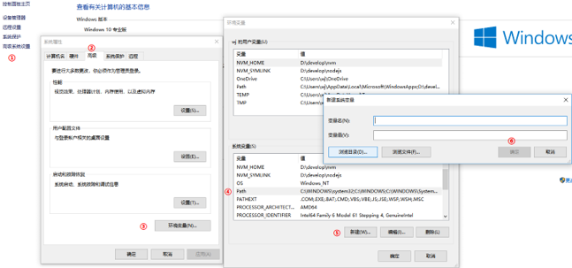
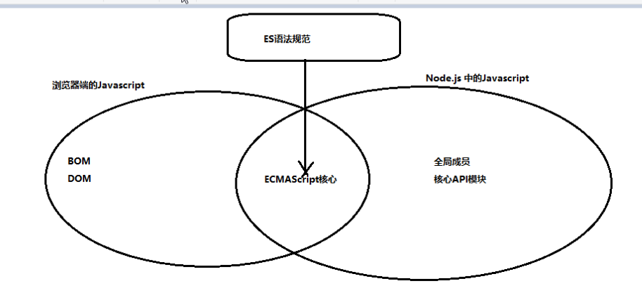

# Node 基础知识

## Node 介绍

```text
    Node是一个基于Chrome V8引擎的JavaScript代码运行环境。
    注意：在浏览器中全局对象是window，在Node中全局对象是global。
```
## Node的运行环境的搭建

```text
① 下载文件  https://nodejs.org/en/  （Download 12.16.3 LTS ,LTS代表稳定版）
② 查看版本 node -v
③ PATH环境变量 看下图(作用:能够让我们在终端执行相关的命令,快速启动应用程序)
```


* 代码只有在特定的环境下,才会被解析执行。服务器端运行环境中,没有浏览器这回事,所以Node.js中没有BOM和DOM的API。


