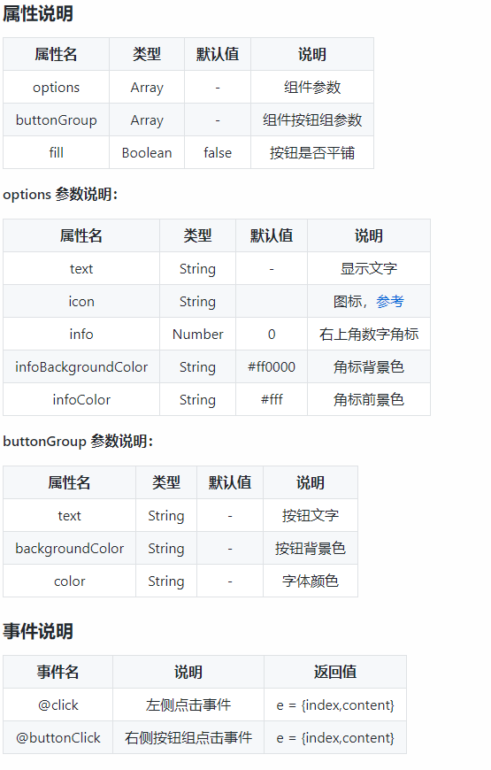

# uniApp知识点

## 介绍

```txt
uni-app 是一个使用 Vue.js 开发所有前端应用的框架。开发者编写一套代码，可发布到 iOS、Android、H5、以及各种小程序（微信/支付宝/百度/头条/QQ/钉钉/淘宝）、快应用等多个平台。
``` 
[百度] (https://uniapp.dcloud.io/)

## 使用 uniapp 开发小程序 需要配置网络请求

```js
// 封装uni的网络请求(https://www.npmjs.com/package/@escook/request-miniprogram)
// 1.导入包
import { $http } from '@escook/request-miniprogram'
// 2.把包挂载到uni这个顶级对象上
uni.$http = $http;
// 3.设置基准地址
$http.baseUrl = 'https://www.uinav.com';
// 4.设置请求拦截器(在请求之前 提示 数据正在加载中)
$http.beforeRequest = function (options) {
  // do somethimg...
	uni.showLoading({
	    title: '加载中...'
	});
}

// 5.设置响应拦截器(让提示消失)
$http.afterRequest = function () {
  setTimeout(function () {
      uni.hideLoading();
  }, 2000);
}
```
## 项目搭建（采用封包）
```txt
把 tabBar 相关的 4 个页面放到主包中，其它页面（例如：商品详情页、商品列表页）放到分包中。

在项目根目录中，创建分包的根目录，命名为 subpkg
在 pages.json 中，和 pages 节点平级的位置声明 subPackages 节点，用来定义分包相关的结构：
"subPackages":[
    {
      "root": "subpkg",// 切记要和根目录同名
      "pages":  [ ]
    }
 ]
在 subpkg 目录上鼠标右键，点击 新建页面 选项，并填写页面的相关信息
```
## sass的使用

## 项目中知识点的使用 (采用vue语法进行开发)

### 轮播图
```txt
  1. 结构  swiper > swiper-item
  2. 控制轮播图的属性
    autoplay 》自动播放
    indicator-dots 》指示器(小圆点)
    circular 》无缝衔接
```
### 两栏布局 滚动实现
```txt
  1. 结构  scroll-view 
  2. 滚动方向的属性 scroll-y(竖直滚动)
  3. 数组的形式添加类名 :class="['scroll-left-item', i == active ? 'active':'']"
  4. 获取视口的高度  uni.getSystemInfoSync().windowHeight
  5. 切换分类项  内容展示自动回到顶部
    5.1 定义初始值滚动条距离顶部的距离   scrollTop: 0
    5.2 <scroll-view class="right-scroll-view" scroll-y :scroll-top="scrollTop"></scroll-view>
    5.3 在定义好的切换方法中  // 让 scrollTop 的值在 0 与 1 之间切换   this.scrollTop = this.scrollTop === 0 ? 1 : 0
  
  6. 页面跳转的形式 
    uni.switchTab tabBar页面  uni.navigateTo 应用中的页面
```
### 组件的使用
```txt
  1. 组件的创建及使用
    1.1 在项目根目录的 components 目录上 创建组件 my-xxx 的形式
    1.2 页面中 直接使用  <my-xxx></my-xxx>
    1.3 组件中通过  props  来接收外部的值
        列：
        props: {
            // 背景颜色
        bgcolor: {
        type: String,
        default: '#C00000'
        }
      }

    2 组件中定义点击事件 @click 触发外界 绑定的 click 事件处理函数
      this.$emit('click')

    3 搜索组件吸顶效果 （样式实现）
      .search-box {
        // 设置定位效果为“吸顶”
        position: sticky;
        // 吸顶的“位置”
        top: 0;
        // 提高层级，防止被轮播图覆盖
        z-index: 999;
}
```
### 搜索实现
```txt
1.搜索历史记录持久化存储到本地
uni.setStorageSync('kw', JSON.stringify(数据))  JSON.parse(uni.getStorageSync('kw') || '[]') uni.clearStorageSync('kw');

2. 搜索框的防抖处理 (定时器控制发起请求)
// 清除 timer 对应的延时器
  clearTimeout(this.timer)
  // 重新启动一个延时器，并把 timerId 赋值给 this.timer
  this.timer = setTimeout(() => {
    // 如果 500 毫秒内，没有触发新的输入事件，则为搜索关键词赋值
    this.kw = e.value
    console.log(this.kw)
  }, 500)

3. es6 Set的使用
[基本用法]{https://blog.csdn.net/qq_41846861/article/details/89056345}
```
[实现方式]{https://www.escook.cn/docs-uni-shop/mds/5.search.html#_5-1-1-%E8%87%AA%E5%AE%9A%E4%B9%89-my-search-%E7%BB%84%E4%BB%B6}

### 上拉加载和下拉刷新
```txt
  上拉：json相关页面配置 "onReachBottomDistance": 150 
        触底的事件 onReachBottom 当前页面加一 重新请求数据
        新旧数据拼接
        定义请求数据状态 未请求 isloading: false 
        请求数据的方法中 先开启  请求结束 关闭  接着在onReachBottom中判断请求状态 true 直接return下面代码不在执行
        判断是否还有下一页数据 pagenum * pagesize >= total

  下拉：json相关页面配置 "enablePullDownRefresh": true,	"backgroundColor": "#F8F8F8",
        下拉刷新事件 onPullDownRefresh 将相关数据重置
        并通过传参的形式 this.getGoodsList(() => uni.stopPullDownRefresh()) 重新发起请求
        请求方法中 getGoodsList(cb) { // 在关闭节流下面 判断 cb && cb();}
```
```vue 
<script>
	export default {
		data() {
			return {
				// 请求参数对象
				queryObj: {
					// 查询关键字
					query: "",
					// 商品分类id
					cid: "",
					// 页码值
					pagenum: 1,
					// 每页显示的条数
					pagesize: 10
				},
				// 商品列表数据
				goodsList: [],
				// 数据总量
				total: 0,
				// 2.3 请求数据状态 未请求
				isloading: false
			};
		},
		onLoad(options) {
			// 1.1获取相关页面传来的参数
			this.queryObj.cid = options.cid || "";
			this.queryObj.query = options.query || "";

      // 获取首屏数据
			this.getGoodsList();
		},
		// 2. 上拉加载
		onReachBottom() {
			// 2.7 判断是否还有下一页数据
			if (this.queryObj.pagenum * this.queryObj.pagesize >= this.total) return uni.$toast('我也是有底线的');
			// 2.6 判断请求状态
			if (this.isloading) return;

			// 2.1重新获取数据 让当前页面 +1
			this.queryObj.pagenum += 1;
			this.getGoodsList();
		},
		// 3.下拉刷新
		onPullDownRefresh() {
			// 3.1 重置关键数据
			this.queryObj.pagenum = 1
			this.total = 0
			this.isloading = false
			this.goodsList = []

			// 3.2 重新发起请求
			this.getGoodsList(() => uni.stopPullDownRefresh())
		},
		methods: {
			// 1.2请求获取数据
			async getGoodsList(cb) {
				// 2.4 开启节流阀
				this.isloading = true;
				const {
					data: res
				} = await uni.$http.get("goods/search", this.queryObj);
				// console.log(res);
				// 2.5 关闭节流阀
				this.isloading = false;
				// 3.3只要数据请求完毕，就立即按需调用 cb 回调函数
				cb && cb();

				if (res.meta.status !== 200) return uni.$toast();

				// 2.2 新旧数据拼接
				this.goodsList = [...this.goodsList, ...res.message.goods]
				this.total = res.message.total;
			},
			// 1.3跳转到商品详情页面
			gotoDetail(item) {
				uni.navigateTo({
					url: '/subpkg/goods_detail/goods_detail?goods_id=' + item.goods_id
				})
			}
		}
	}
</script>

```
## vuex的使用
1. 项目根目录下创建store文件夹(采用模块化管理数据)
```js
// 1. 导入 Vue 和 Vuex
import Vue from 'vue'
import Vuex from 'vuex'
// 导入购物车的 vuex 模块
import cartStore from './cartStore.js'	
// 2. 将 Vuex 安装为 Vue 的插件
Vue.use(Vuex)

// 3. 创建 Store 的实例对象
const store = new Vuex.Store({
  // TODO：挂载 store 模块
  modules: {
	  m_cart: cartStore
  },
})

// 4. 向外共享 Store 的实例对象
export default store
```
2. main.js 入口文件中 
```js
// 导入store实例对象
import store from './store/index.js'
const app = new Vue({
	...App,
	// 将store 挂载到Vue实例上
	store
})
app.$mount()
```
3. 模块文件中
```js
export default {
  // 为当前模块开启命名空间
  namespaced: true,
  state:{},
  // 同步方法
  mutations:{
	// 通过this.commit 来调用其他的方法
	this.commit('m_cart/saveToStorage');
  },
  // 异步方法
  actions: {},
  // 模块的计算属性
  getters: {},
}
```
4. 在需要的页面
```js
// 映射方式使用模块中的方法
import {mapMutations,mapGetters} from "vuex";
methods: {...mapMutations('m_cart', ['addToCart']),}
computed: {...mapGetters('m_cart', ['total'])}
```
## vue中mixins(混入)的使用
```txt
1. 在根目录下创建 mixins 文件夹
// 导出一个 mixin 对象export default {}

2. 在需要的页面使用
// 导入自己封装的 mixin 模块
import badgeMix from '@/mixins/tabbar-badge.js'

export default {
  // 将 badgeMix 混入到当前的页面中进行使用
  mixins: [badgeMix],
  // 省略其它代码...
}
```
[文档链接]{https://cn.vuejs.org/v2/guide/mixins.html}

## vue2中 watch 页面**初次加载完毕**后立即调用
```js
watch: {
   // 定义 total 侦听器，指向一个配置对象
   total: {
      // handler 属性用来定义侦听器的 function 处理函数
      handler(newVal) {
         const findResult = this.options.find(x => x.text === '购物车')
         if (findResult) {
            findResult.info = newVal
         }
      },
      // immediate 属性用来声明此侦听器，是否在页面初次加载完毕后立即调用
      immediate: true
   }
}
```

## uni-app 的插件使用

### **uni-icons**
```html
<uni-icons type="contact" size="30"></uni-icons>
```

[图标类型] (https://hellouniapp.dcloud.net.cn/pages/extUI/icons/icons) 

### **uni-search-bar**
```html
<uni-search-bar @confirm="search" @input="input" ></uni-search-bar>
```
```js
// 自动获取光标
// components -> uni-search-bar -> uni-search-bar.vue 下
data() {
  return {
    show: true,
    showSync: true,
    searchVal: ""
  }
}
```


### **uni-tag**
```html
<uni-tag text="标签"></uni-tag>
```


### **uni-goods-nav** 商品导航
```html
<!-- fill 控制右侧按钮的样式  按钮是否平铺 -->
<!-- options 左侧按钮的配置项 -->
<!-- buttonGroup 右侧按钮的配置项 -->
<!-- click 左侧按钮的点击事件处理函数 -->
<!-- buttonClick 右侧按钮的点击事件处理函数 -->
<uni-goods-nav :fill="true" :options="options" :buttonGroup="buttonGroup" @click="onClick"
				@buttonClick="buttonClick" />
```

[官网使用]{https://ext.dcloud.net.cn/plugin?id=865}

### uni-number-box **控制商品数量++ --**
```html
<uni-number-box></uni-number-box>
<uni-number-box :min="0" :max="9"></uni-number-box>
<uni-number-box @change="bindChange"></uni-number-box>
```
```js
// 该插件的不足之处手动修改
// 1. NumberBox 数据不合法的问题
_onBlur(event) {
  // 官方的代码没有进行数值转换，用户输入的 value 值可能是非法字符：
  // let value = event.detail.value;

  // 将用户输入的内容转化为整数
  let value = parseInt(event.detail.value);

  if (!value) {
    // 如果转化之后的结果为 NaN，则给定默认值为 1
    this.inputValue = 1;
    return;
  }

  // 省略其它代码...
}
// 2. 完善 NumberBox 的 inputValue 侦听器
inputValue(newVal, oldVal) {
  // 官方提供的 if 判断条件，在用户每次输入内容时，都会调用 this.$emit("change", newVal)
  // if (+newVal !== +oldVal) {

  // 新旧内容不同 && 新值内容合法 && 新值中不包含小数点
  if (+newVal !== +oldVal && Number(newVal) && String(newVal).indexOf('.') === -1) {
    this.$emit("change", newVal);
  }
}
```


##  uni-app 的API使用
### uni.previewImage(OBJECT) **图片预览**
```txt
1. 通过给图片绑定点击事件来触发
2. js代码
preview(i) {
				// 调用 uni.previewImage() 方法预览图片
				uni.previewImage({
					// 预览时，默认显示图片的索引
					current: i,
					// 所有图片 url 地址的数组
					urls: this.goodsInfo.pics.map(x => x.pics_big)
				})
			},
```


### uni.setTabBarBadge(OBJECT) **tabBar某一项的右上角添加文本**


### uni.showToast(OBJECT) **显示消息提示框**
```js
// 直接在入口文件main中 封装为全局提示
uni.$toast = function(title = "获取数据失败", duration = 1500) {
	uni.showToast({
		title: title,
		duration: duration,
		icon: 'none'
	});
}
```


