# 微信开发知识点总结

## 微信开发:

微信是一个生态圈，包括即时通信、移动支付、社交媒体、游戏娱乐等多个领域，彼此之间紧密联系、互为支撑形成了一个强大的微信帝国。日常交流中所提到的微信更多是指的**即时通信**和**移动支付**，而我们即将学习的**微信小程序属于社交媒体的组成部分**。微信还对外开放了很多的接口与能力，程序员基于这些功能和接口进行的开发，叫做微信开发。

## 认识小程序

```txt
小程序的特点： 体积小、方便获取与传播;
小程序的理念： 用完即走
小程序适合的业务场景: 外卖、打车、代驾、共享单车等
小程序和传统手机 `App` 的区别:
    1. 开发原理不同
        App ： 基于手机操作系统提供的 API 进行开发
        小程序：基于微信提供的 API 进行开发 
    2. 运行方式不同
        App：  直接安装并运行在手机操作系统之上
        小程序：必须基于手机微信才能安装和运行
```
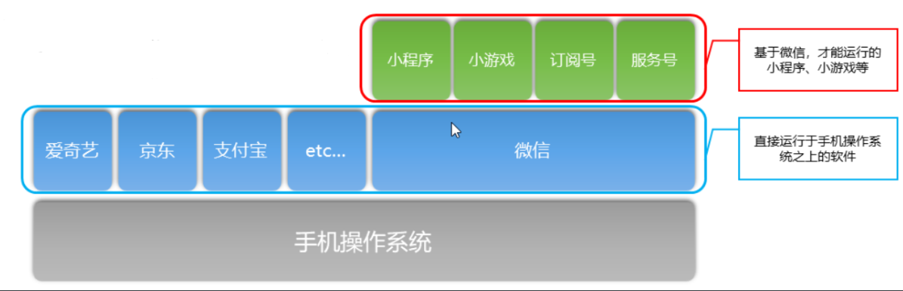

### `API` 的三种分类
```txt
API :应用程序编程接口，是一些预先定义的函数，目的是提供应用程序与开发人员基于某软件或硬件得以访问一组例程的能力
```
1. 事件监听 `API`: 以 `on` 开头的 `API` 用来监听某个事件是否触发.
2. 同步 `API`: 以 `Sync` 结尾的 `API` 都是同步 `API`.
3. 异步 `API`: 通常需要指定回调函数接受调用的结果,小程序中，大多数的 `API` 都是异步 `API`.

### 小程序项目的结构
```js
├── pages ······································ 【目录】存放所有的小程序页面
│   │── index ···································· 【目录】index 页面
│   │   ├── index.wxml ······························· 【文件】 index 页面的结构
│   │   ├── index.js ································· 【文件】 index 页面的逻辑
│   │   ├── index.json ······························· 【文件】 index 页面的配置
│   │   └── index.wxss ······························· 【文件】 index 页面的样式
│   └── logs ····································· 【目录】 logs 页面
│       ├── logs.wxml ································ 【文件】 logs 页面的结构
│       └── logs.js ·································· 【文件】 logs 页面的逻辑
└── utils ······································ 【目录】 存放小程序中用到的工具函数
├── app.js ····································· 【文件】 小程序逻辑
├── app.json ··································· 【文件】 小程序的公共配置
├── app.wxss ··································· 【文件】小程序公共样式表
├── project.config.json ························ 【文件】 开发工具配置文件
```
说明：
* `app.js` 是小程序的入口文件，运行小程序，第一个被运行的就是 `app.js`
* `app.json` 是小程序的全局配置文件，对小程序每个页面生效 
* `app.wxss` 是小程序的全局样式文件，对小程序每个页面生效

注意：
- 对于小程序运行而言，`app.js` 和 `app.json` 是必不可少的
- 对于小程序页面而言， `.js` 和 `.html` 文件是必不可少的
 
## 小程序的配置文件

### 全局配置文件 app.json

[链接] (https://developers.weixin.qq.com/miniprogram/dev/reference/configuration/app.html)
```txt
1. pages: 页面路径列表,保存即可创建出自己想要的页面文件，第一个便是调试器展示的页面。
2. window：全局的默认窗口表现 
    "navigationBarBackgroundColor": "#0094ff", 顶部导航背景颜色
    "navigationBarTitleText": "我爱曹喜娟", 顶部导航文本
    "navigationBarTextStyle":"white", 顶部导航字体颜色 仅支持 black / white

    "enablePullDownRefresh":true 开启下拉刷新
    "backgroundTextStyle":"dark", 下拉刷新三个小点的样式 仅支持 dark / light
    "backgroundColor":"#000", 下拉刷新的背景颜色
3. tabBar:  
    list 接受一个数组，只能配置最少 2 个、最多 5 个 tab
    color、selectedColor、backgroundColor 仅支持十六进制颜色
    position tabBar 的位置，仅支持 bottom / top
    borderStyle 仅支持 black / white
```

### 页面配置文件 page.json (与全局配置相识)
[链接] (https://developers.weixin.qq.com/miniprogram/dev/reference/configuration/page.html)

### sitemap配置 ：页面索引优化，是否允许被微信索引
[链接] (https://developers.weixin.qq.com/miniprogram/dev/reference/configuration/sitemap.html)

## 模板语法

### 数据绑定和渲染

```wxml
<text>相当于span 标签 行内元素</text>
<view>相当于div 标签 块级元素</view>

<view>我叫{{name}},今年{{age}}岁</view>
<text>{{jshao}}</text>

<!-- 循环的是一个普通数组的话 wx:key = "*this" 这样解除警告 复杂的数组 写为一值 如id
    只有一层循环 可省略（wx:for-item="item" wx:for-index="index"）
 -->
<text wx:for="{{ahao}}" wx:for-item="item" wx:for-index="index" wx:key = "*this">
索引： {{index}} -- 值：{{item}} 
</text>
```
```js
Page({
    data:{
        name:"范志伟",
        age:25,
        jshao:"看到了萨拉健康减肥了加分的考生的理解",
        ahao:["daja","大马甲","啦啦啦"],
        ischeck:false
    },
})
```
```wxml
<block></block> :该标签只占位置 循环出来只显示数据
```
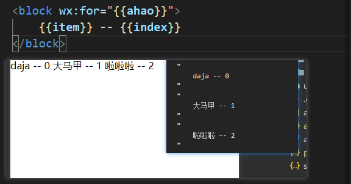

### 条件渲染
 
```wxml
1. wx:if="{{布尔值}}"
2. wx:if 、wx:elif 、wx:else
3. hidden 属性控制显示隐藏
```
### 事件绑定

#### 双向绑定(bindinput事件)

```wxml
    输入框标签一定要闭合 设置值 用this.setData
```
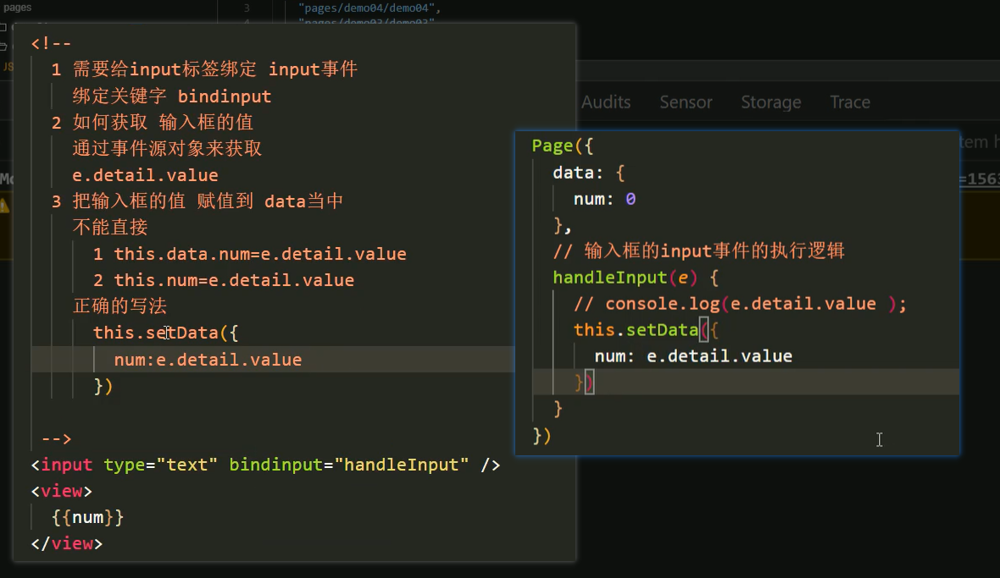

#### 按钮点击事件bindtap

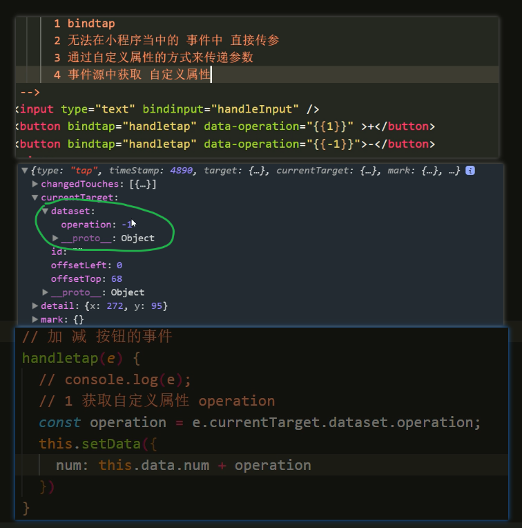

## 样式 wxss 

### 单位 rpx

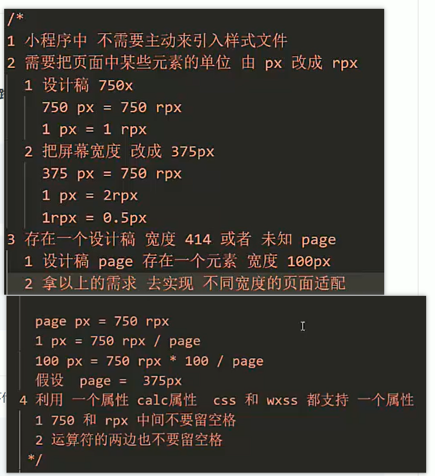

### 样式导入 （使用@import导入外联样式,只支持相对路径）

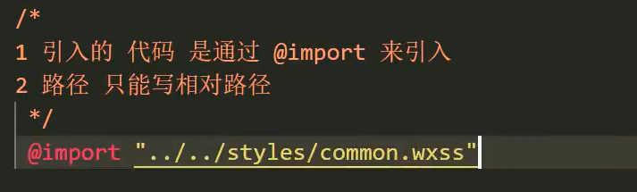

### 选择器

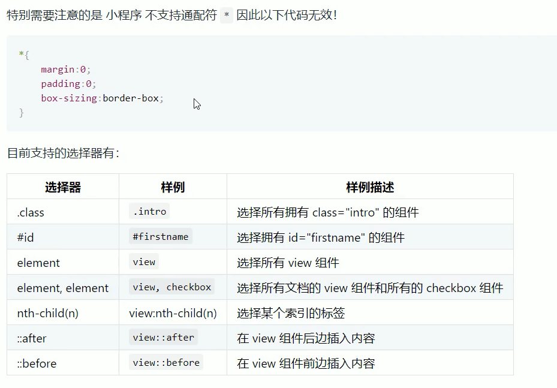

### 小程序Less的使用

1. 安装 Easy LESS 插件
2. 在 vs code的设置中 添加配置
```js
"less.compile" : {
    "outExt" : ".wxss"
}
```
3. 代码使用less支持直接微信小程序的样式导入方式 只支持相对路径 语法直接是less语法

## 组件
[链接] (https://developers.weixin.qq.com/miniprogram/dev/component/cover-image.html)

1. view 代替div
2. text 代替span 文本标签 只能嵌套自己 有长按文字复制功能
```wxml
selectable:控制文本是否可以复制
decode：对文本进行解码 如：&nbsp
```
3. image
```wxml
src：指定要加载的图片路径 默认宽高 320*240
mode: 决定图片内容的适配
lazy-load: 图片懒加载
```
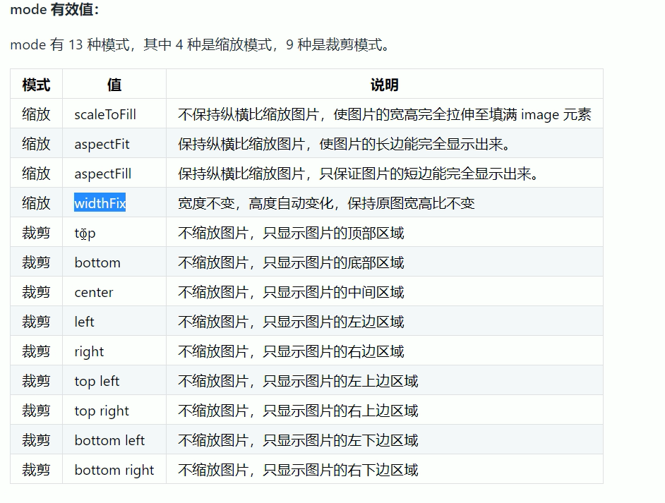

4. swiper 轮播图
```wxml
默认：宽100% 高 150 image 320*240 无法实现内容撑开

按照原图来定 swiper 容器的宽高
swiper 高 = s宽 * y高 / y高
```
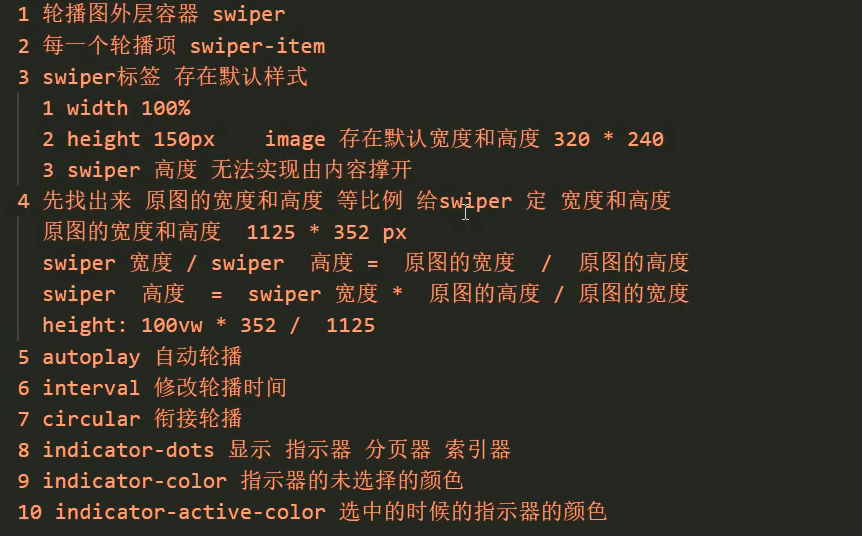

5. navigator 超链接 (块级元素)

```wxml
url:跳转的页面路径
target：可跳转 当前小程序和其他小程序（self自己 miniProgram其他小程序）
open-type：跳转方式
```
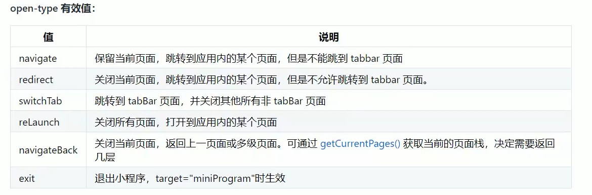

6. rich-text 相当于html 可解析标签字符串
[链接] (https://developers.weixin.qq.com/miniprogram/dev/component/rich-text.html)

7. 按钮 button
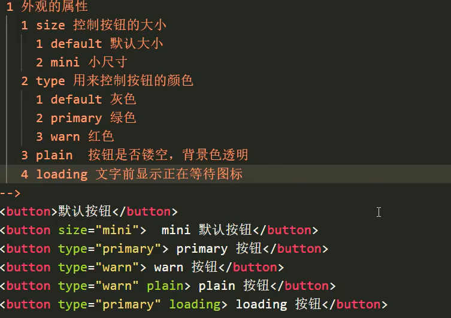
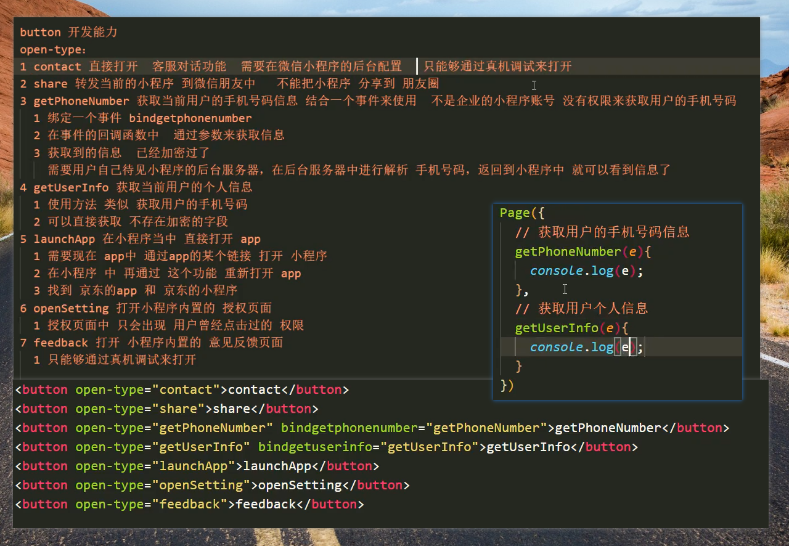

8. icon 字体图标
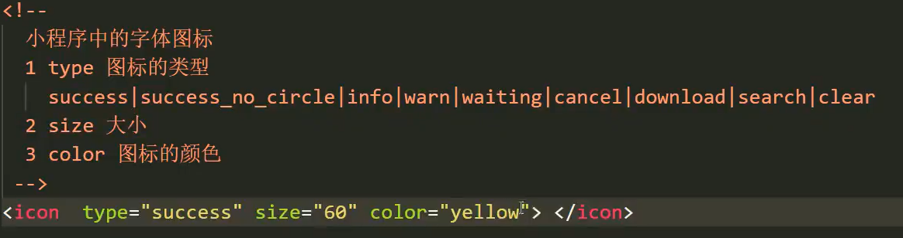

9. radio 单选
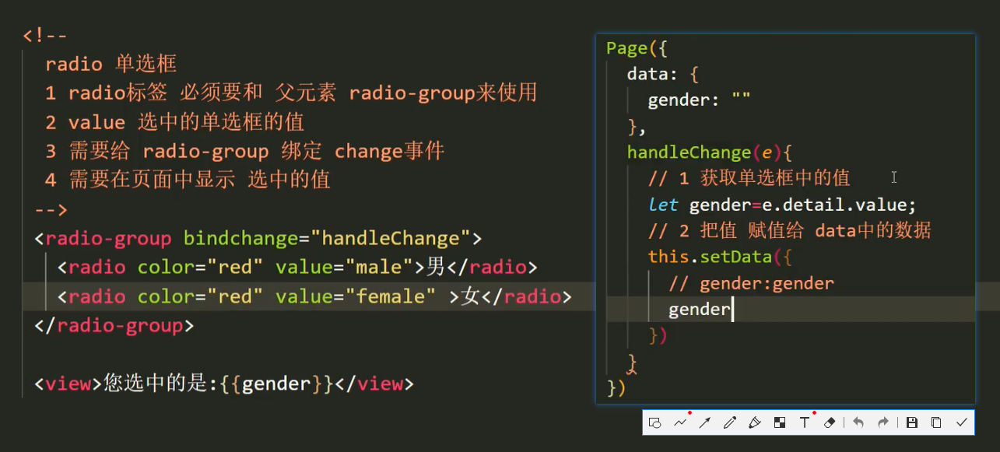

10. checkbox 多选
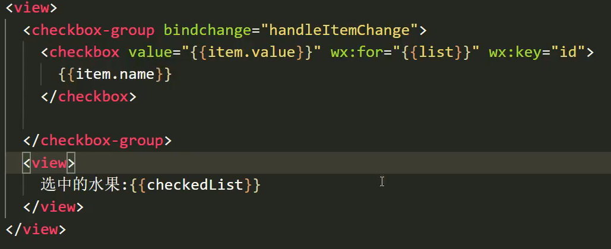

## 自定义组件

1. 在根目录下 创建 components 文件夹 并右键 创建组件
2. 声明组件： 在需要的页面下的 json 文件中 设置
```js
{
    "usingComponents": {
        "组件名": "组件的相对路径"
    }
}
```
3. 使用组件 在需要的页面下的 wxml 文件中 使用
```wxml
<组件名></组件名>
```
## 组件之间的传值

### 父传子
```wxml
使用的页面为父组件 通过属性的方式传值
组件的js文件 进行接收 wxml文件直接使用
```
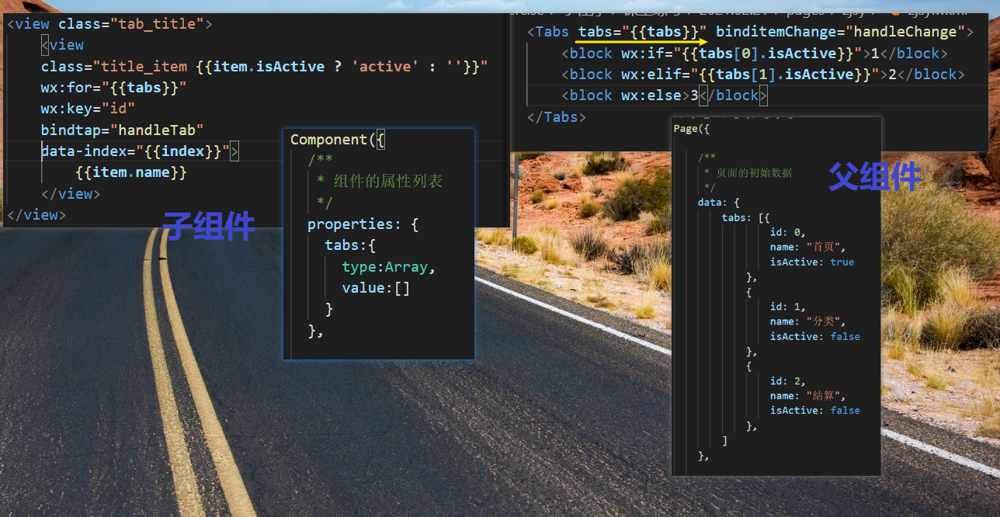

### 子传父
```wxml
组件 的 js 通过 this.triggerEvent("自定义事件",传递的值)
使用组件的页面 wxml 通过绑定事件 bind的方式 函数进行接收
```
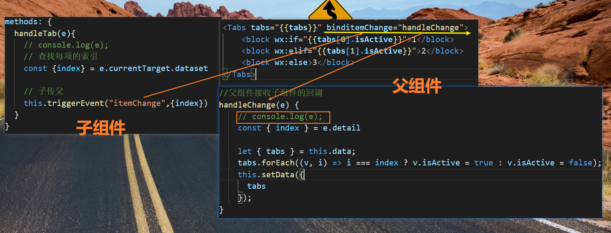

## 组件的生命周期
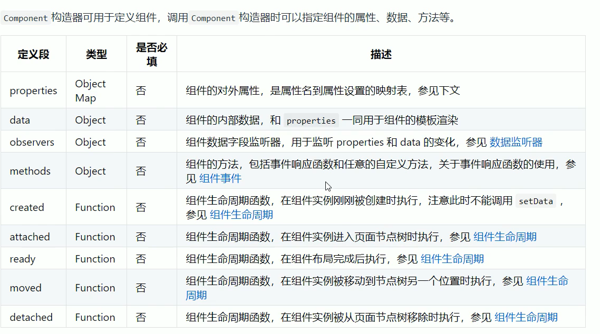

## 小程序的生命周期

### 应用生命周期 app.js (入口文件)

1. onLaunch : 应用第一次启动就会触发  场景：用来获取个人信息
2. onShow ：应用被用户看到时就会触发 场景：对应用的数据或页面效果 重置
3. onHide ：应用隐藏就会触发        场景： 暂停或清楚定时器
4. onError ：应用代码发生了报错的时候触发   场景：收集用户的错误信息，通过异步请求 将错误信息发给后台
5. onPageNotFound : 页面找不到触发(指应用第一次启动 找不到入口页面触发)
                    场景 ：通过js的方式来重新跳转页面
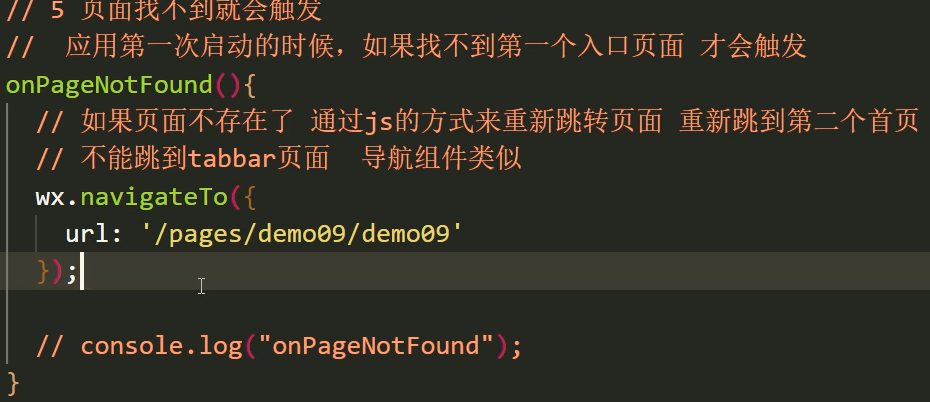

### 页面生命周期

1. onLoad ：发送异步请求来初始化页面数据
2. onShow ：页面显示
3. onReady ：页面初次渲染完成
4. onHide ：页面隐藏
5. onUnload ：页面卸载（关闭）
6. onPullDownRefresh：用户下拉动作
7. onReachBottom：上拉触底事件
8. onShareAppMessage：点击右上角分享
9. onPageScroll：页面滚动
10. onResize：页面尺寸发生改变
11. onTabItemTap：要求当前页面是tabbar页面


