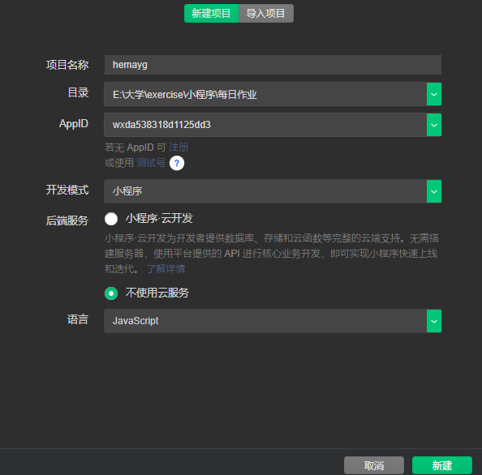
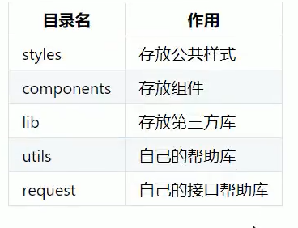
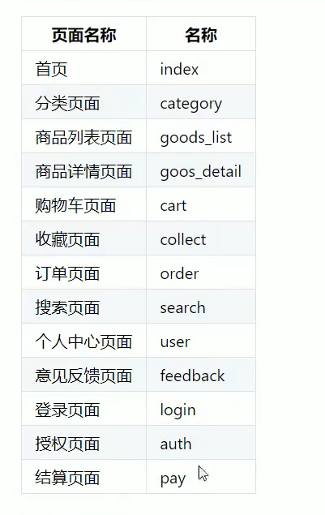
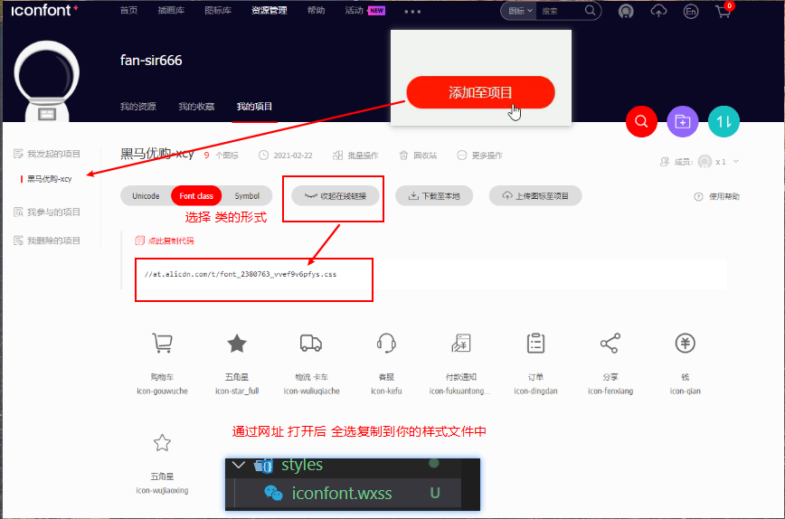
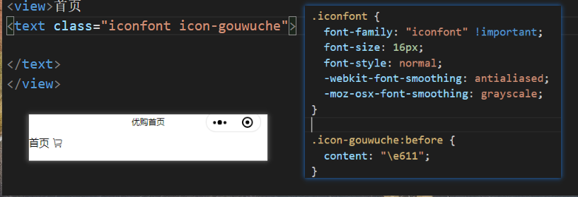

# 黑马优购知识点 （使用原生框架 MINA）

## 小程序第三方框架
```txt
0. 原生框架 MINA
1. 腾讯 wepy 类似 vue
2. 美团 mpvue 类似 vue
3. 京东 taro 类似 react
4. 滴滴 chameleon
5. uni-app 类似 vue
```
## 项目搭建

1. 创建项目


2. 搭建目录结构


3. 搭建页面


4. 引入字体图标
①  将自己使用的图标添加至购物车
②  


③ 导入样式 直接通过类名使用


5. 搭建tabbar结构
```js
// 全局配置 进行设置
 "tabBar": {
    "color": "未选中的字体颜色",
    "selectedColor": "",
    "backgroundColor": "背景颜色",
    "position": "位置",
    "borderStyle": "black",
    "list": [
      {
        "pagePath": "页面路径",
        "text": "标题文字",
        "iconPath": "未选中图标",
        "selectedIconPath": "选中图标"
      }
    ]
  },
```
## 样式初始化 (app.wxss)
```wxss
/* 导入的字体图标样式 */
@import "./styles/iconfont.wxss";

/* 不支持通配符 " * " */
page,
view,
text,
swiper,
swiper-item,
navigator {
    padding: 0;
    margin: 0;
    box-sizing: border-box;
}

page {
    /* 主题颜色 */
    --themeColor: #eb4450;
    /* 统一字体大小 375设计稿  1px=2rpx */
    font-size: 28rpx;
}
```
## 首页

