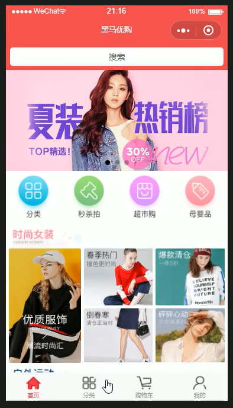
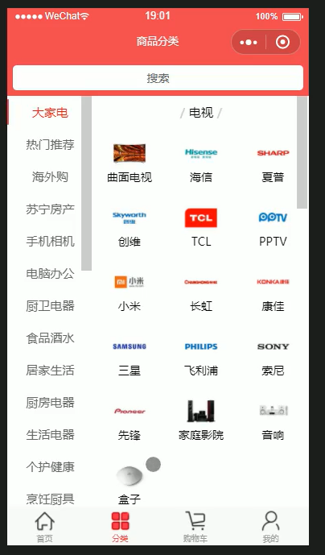
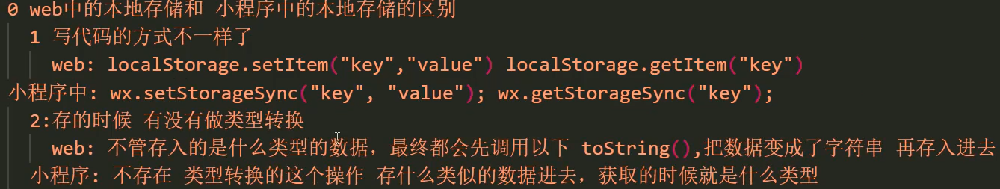
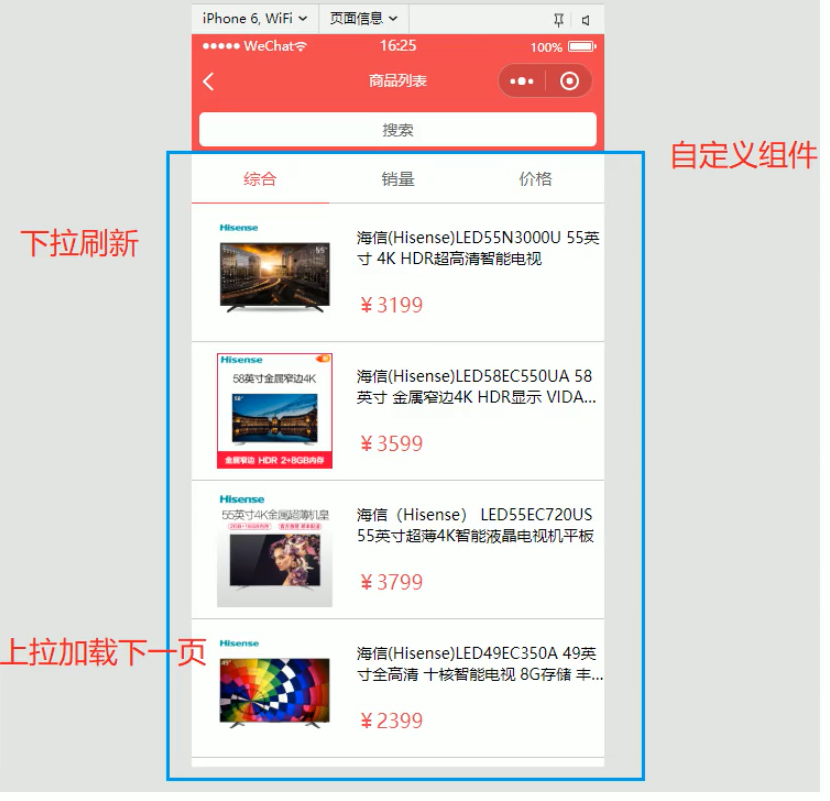
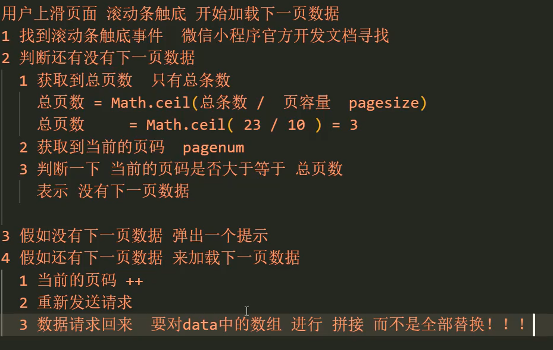
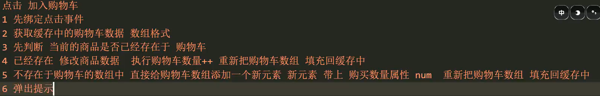

# 黑马优购知识点 （使用原生框架 MINA）

## 小程序第三方框架
```txt
0. 原生框架 MINA
1. 腾讯 wepy 类似 vue
2. 美团 mpvue 类似 vue
3. 京东 taro 类似 react
4. 滴滴 chameleon
5. uni-app 类似 vue
```
## 项目搭建

1. 创建项目


2. 搭建目录结构


3. 搭建页面


4. 引入字体图标
①  将自己使用的图标添加至购物车
②  


③ 导入样式 直接通过类名使用


5. 搭建tabbar结构
```js
// 全局配置 进行设置
 "tabBar": {
    "color": "未选中的字体颜色",
    "selectedColor": "",
    "backgroundColor": "背景颜色",
    "position": "位置",
    "borderStyle": "black",
    "list": [
      {
        "pagePath": "页面路径",
        "text": "标题文字",
        "iconPath": "未选中图标",
        "selectedIconPath": "选中图标"
      }
    ]
  },
```
## 样式初始化 (app.wxss)
```wxss
/* 导入的字体图标样式 */
@import "./styles/iconfont.wxss";

/* 不支持通配符 " * " */
page,
view,
text,
swiper,
swiper-item,
navigator {
    padding: 0;
    margin: 0;
    box-sizing: border-box;
}

page {
    /* 主题颜色 */
    --themeColor: #eb4450;
    /* 统一字体大小 375设计稿  1px=2rpx */
    font-size: 28rpx;
}
```
## 首页

### 效果图


### 搜索框（组件）
```txt
1. 创建组件 SearchInput
2. 在首页使用组件
"usingComponents": {
    "SearchInput":"../../components/SearchInput/SearchInput"
  },
3. 组件跳转到 搜索页面
```
### 轮播图
```txt
1. 定义轮播图数据
2. 异步请求 并赋值
3. 结构渲染
4. 样式 轮播图实现轮播
```
```js
Page({
    data: {
        // 轮播图数组
        swiperList: []
    },
    //页面开始加载触发
    onLoad: function(options) {
        // 获取轮播图数据
        wx.request({
            // 接口地址 
            url: 'https://www.uinav.com/api/public/v1/home/swiperdata',
            // 成功的回调
            success: (result) => {
              // console.log(result);
              this.setData({
                swiperList:result.data.message
              })
            },
        });

    },

});
```
```html
<!-- 轮播图 start -->
    <view class="swiper_index">
        <swiper autoplay indicator-dots circular>
            <swiper-item wx:for="{{swiperList}}" wx:key="goods_id">
                <navigator>
                    <image mode="widthFix" src="{{item.image_src}}"></image>
                </navigator>
            </swiper-item>
        </swiper>
    </view>
  <!-- 轮播图 end -->
```
```css
.swiper_index {
    swiper {
        width: 750rpx;
        height: 340rpx;
        image {
            width: 100%;
        }
    }
}
```
### 导航和楼层
```txt
1. 获取导航数据 并渲染
2. 样式设置
```

## 分类页面

### 效果图


```txt
1. 获取分类数据数据 并渲染
2. 样式设置
3. 左侧绑定事件 传index
4. 用index 设置  选中高亮  将初始 0 变为索引数据  即可 
```
### 缓存效果


## 商品列表


### 上拉加载


```js
// onReachBottom 触底事件  ①

// 请求成功后  ②

// 获取总条数
const total = result.data.message.total; // 2.1
this.totalPages = Math.ceil(total / this.QueryParams.pagesize); // 2.2
this.setData({
    // 拼接数据数组 4.3
    goodsList: [...this.data.goodsList, ...result.data.message.goods]
})

// 3和4 
onReachBottom() {
        if (this.QueryParams.pagenum >= this.totalPages) {
          // 3
            wx.showToast({
                title: '没有下一页数据了',
            })
        } else {
            // 当前页++
            this.QueryParams.pagenum++; // 4.1
            this.getGoodsList(); // 4.2
        }
    }
```
### 下拉刷新

```txt
1. 页面json 进行配置开启下拉刷新
"enablePullDownRefresh": true,
"backgroundTextStyle": "dark"

2. 在  onPullDownRefresh 生命函数下书写逻辑代码
    重置数据数组   重新设置当前页  再次发请求   关闭下拉窗口
```
```js
 /* 下拉刷新事件 */
    onPullDownRefresh() {
        // 1 重置数组
        this.setData({
            goodsList: []
        });
        // 2 重置页码
        this.QueryParams.pagenum = 1;
        // 3 发送请求
        this.getGoodsList();
}

// 在成功请求里关闭下拉窗口
wx.stopPullDownRefresh();
```

## 商品详情页面

### 轮播图预览大图效果
[链接] (https://developers.weixin.qq.com/miniprogram/dev/api/media/image/wx.saveImageToPhotosAlbum.html)

```txt
1. 在轮播图的swiper-item上绑定点击事件 且传递预览放大图片路径（自定义传参）
2. js 书写代码
```
```js
    //#region 点击轮播图放大预览
    handlePrevewImage(e) {
        // 构造预览图片的数组
        const urls = this.GoodsInfo.pics.map(v => v.pics_mid);
        // 接收传递过来的图片url
        const current = e.currentTarget.dataset.url;
        wx.previewImage({
            current: current,
            urls: urls,

        })
    }
    //#endregion
```
### 加入购物车

```js
//#region 点击加入购物车
    handleCartAdd() {
        // 1获取缓存中的购物车数组
        let cart = wx.getStorageSync("cart") || [];
        // 2判断 商品对象是否存在数组中
        let index = cart.findIndex(v => v.goods_id === this.GoodsInfo.goods_id);
        if (index == -1) {
            this.GoodsInfo.num = 1;
            cart.push(this.GoodsInfo);
        } else {
            cart[index].num++
        }
        // 3 把购物车重新添加到缓存中
        wx.setStorageSync("cart", cart);
        // 4 弹窗提示
        wx.showToast({
            title: '加入成功',
            icon: 'success',
            mask: true,
        });

    },
    //#endregion
```

## 购物车

### 获取收货地址

```txt
1. 需要注意  用户点击确定 或 从未调用过收货地址的api scope的值为 true 和  undefined 这样是可以直接调用收货地址的api的。但是 如果用户点击的取消  scope的值为false 我们需要让用户 进行授权设置
```
```js
handleChooseAddress() {
        // 1 获取权限状态
        wx.getSetting({
            success: (result) => {
                const scopeAddress = result.authSetting["scope.address"];
                if (scopeAddress === true || scopeAddress === undefined) {
                    wx.chooseAddress({
                        success: (result1) => {
                            console.log(result1);
                        }
                    });
                } else {
                    // 打开权限设置
                    wx.openSetting({
                        success: (result2) => {
                            wx.chooseAddress({
                                success: (result3) => {
                                    console.log(result3);
                                }
                            });
                        }
                    });
                }
            }
        });
    }
```


