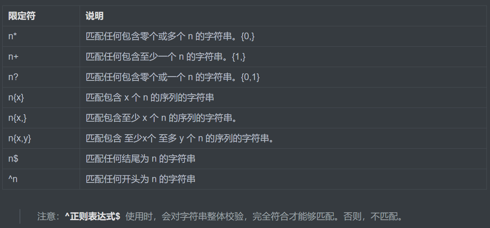
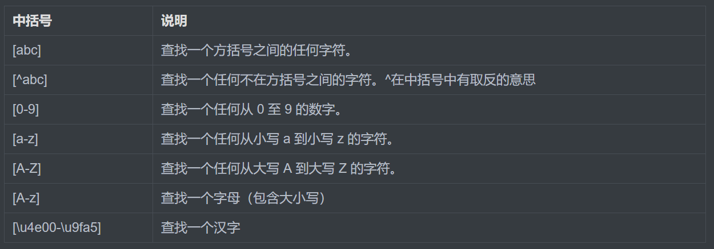
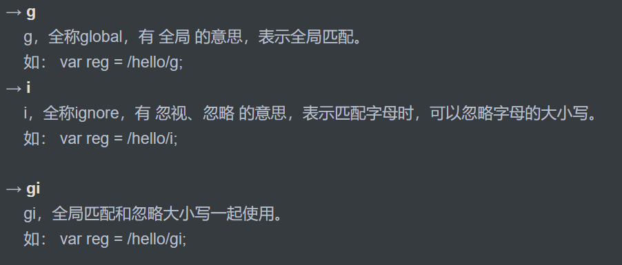

# 正则 RegExp

## 正则表达式 (普通字符、特殊字符) 组成

正则表达式：正则表达式是对**字符串操作**的一种逻辑公式，就是用事先定义好的一些特定字符、及这些特定字符的组合，组成一个“**规则字符串**”，这个“**规则字符串**”用来表达对字符串的一种过滤逻辑。

## 正则表达式的特点

1. 灵活性、逻辑性和功能性非常的强
2. 可以迅速地用极简单的方式达到字符串的复杂控制
3. 对于刚接触的人来说，比较晦涩难懂

## 创建方式

```js
// 方式1；
var regexp = new RegExp(/123/);
console.log(regexp);

// 方式2：
var regexp = /123/;
```
## 测试正则表达式 

```js
test() 正则对象方法，用于检测字符串是否符合该规则，该对象会返回 true 或 false，其参数是测试字符串。

var rg = /123/;
console.log(rg.test(123));//匹配字符中是否出现123  出现结果为true
console.log(rg.test('abc'));//匹配字符中是否出现123 未出现结果为false
```
## 特殊字符

### 元字符


### 限定符


### 中括号

一个中括号就代表一个字符，中括号的目的就是控制了一个字符的范围。



### 或模式

特殊符号：**正则1|正则2**, 或者。 符合或两边其中一个就可以匹配。

```js
let regexp = /小明|小红/
console.log(regexp.test(regexp));
```
### 分组模式

特殊符号：**(正则)**;组指的是一个小集体，分组就是将一个大集体可以分成几个小集体。

### 修饰符



## 字符串对象方法相关正则使用

1.**字符串.match(正则对象);** 获取匹配正则的子字符串，返回一个数组。

```js
  var str = '《唐山大兄》dsfsdfdsf 《精武门》afasdfsdfdsf 《猛龙过江》sdfdsf';
  //0. 用字符串对象中的方法来提取   字符串.match();
  var reg = /《.+?》/g; // 正则对象
  var names = str.match(reg);
  console.log(names);
```

2.**字符串.replace(正则对象,替换后的内容);替换所匹配正则的子字符串。返回替换后的字符串。

```js
 var str = '李小龙很霸气，李小龙很勇敢，李小龙的李三脚很拽，李小龙很帅';
 var reg = /李小龙/g;
 // 替换
 var newStr = str.replace(reg, 'Bruce.Lee');
 console.log(newStr);
```

