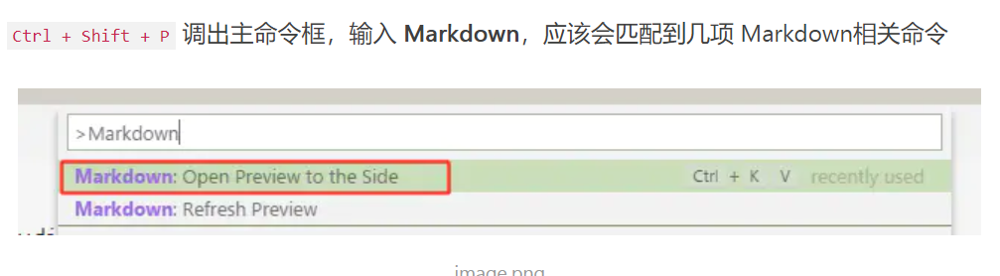

# Markdown 的语法总结

---

## 代码编辑器的预览方式



---

## 语法

1. 列表

    ```text
    *空格(无序列表)                     1.空格(有序列表) 
    ```

2. 引用

    > ## 标题
    >> * 小标题

    > "引用"

    > 其他引用
    >> 1. 小标题
    >> 2. 又一个

3. 链接

    [百度] (https://www.baidu.com) 不懂问度娘

4. 图片
    

5. 代码框

    ```js

    ```

6. 表格

    ##### 表格
    姓名 | 年龄 | 身份 | 性别
    ------|------|------|------
    范志伟 | 18 | 学生 | 男
    曹喜娟 | 18 | 学生 | 女

7. 字体的强调
    *我爱曹喜娟*
    **我真的很爱她**
    <font color=#FFD700 size=4 face="STCAIYUN">来了老弟</font>

8. 线

    1. 分隔线
    ---

    2. 删除线
    ~~删除内容~~

## 忘了就看看
 [链接] (https://blog.csdn.net/yga_airspace/article/details/79988451) 笔记的总结


