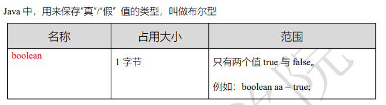
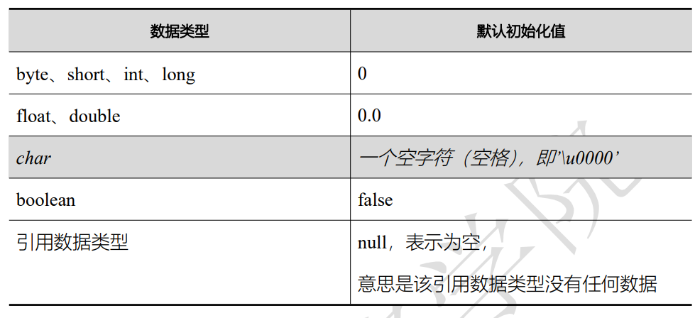
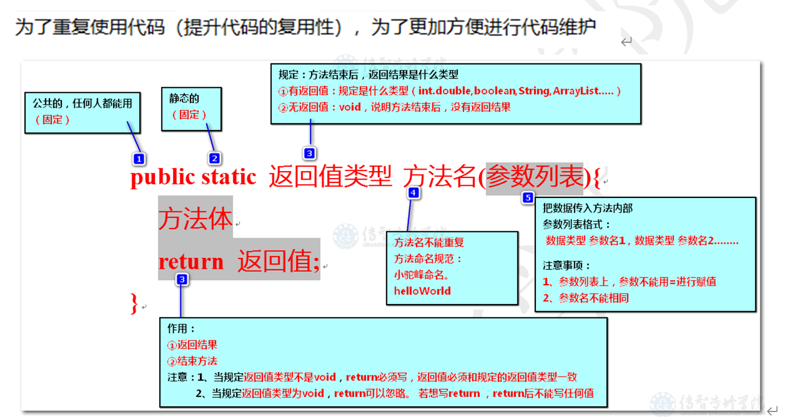
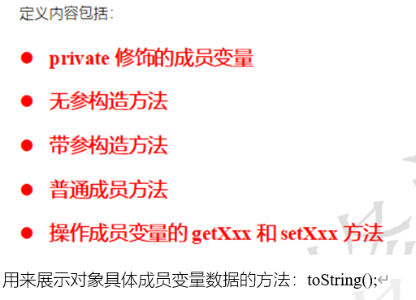
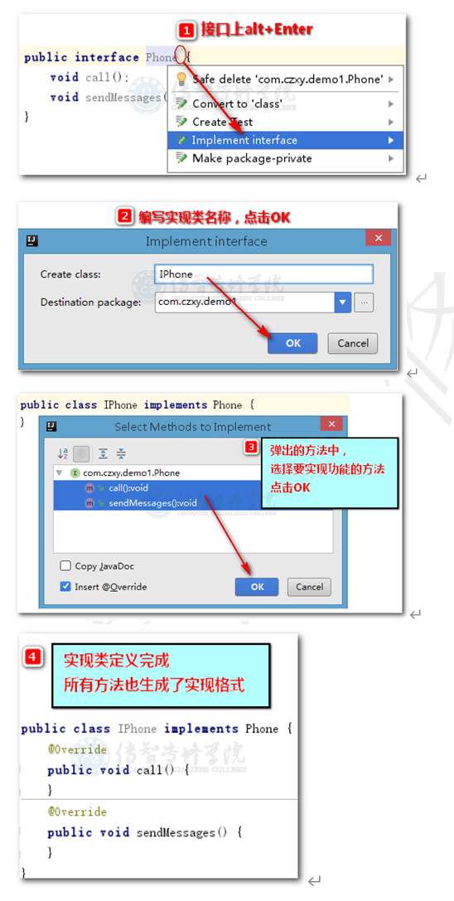

# 基础知识点总结

## java是什么
```txt
Java通过面向对象的编程语言。它不仅吸收了C++语言的优点，而且摒弃了C++中难于理解的多继承和指针的概念。具有简单性、功能强大、分布式、健壮性、安全性、平台独立与可移植性、多线程及动态性的特点。

Java语言作为静态面向对象的编程语言的代表，可以充分的实现面向对象的理论，并允许程序员以一种优雅的思维方式编程复杂的程序。可以编写桌面应用程序、Web应用程序、分布式系统和嵌入式系统应用程序。
```
## JDK、JRE(Java运行环境)、JVM(Java虚拟机)的关系
```txt
JDK:为Java应用程序提供了基本的开发和运行环境，是整个Java的核心，包括：
1.Java运行环境（JRE）
2.JDK类库，如：java.lang、java.io、java.awt、java.swing等类
3.Java开发工具，如：javac.exe（编译工具）、java.exe（运行工具）、javadoc.exe（生成JavaDoc文档的工具）和jar.exe（打包工具）等.

JRE:是Java程序的运行环境，包含：JVM和Java核心类库

JVM:JVM即Java虚拟机，是整个Java实现跨平台的最核心的部分，是编译后的Java程序（.class文件）和硬件系统的接口，不仅解释执行编译后的Java指令，而且还进行安全检查

三者关系: 包含关系  JDK  > JRE + 其他  >  JVM + 其他
```


## IDEA的快捷键使用

```txt
Ctrl+/ 或 Ctrl+Shift+/  注释

Ctrl+N   查找类

Ctrl+Alt+L  格式化代码

Ctrl+R 替换文本

Ctrl+F 查找文本

Ctrl+Shift+上下键   上下移动代码

Ctrl+X 删除行

Ctrl+D 复制行
```
## 命名规范

```txt
java类的命名(大驼峰):类的名字必须由大写字母开头而单词中的其他字母均为小写；如果类名称由多个单词组成，则每个单词的首字母均应为大写例如TestPage。

变量全部小写;常量名全大写用下划线分割

方法的命名(小驼峰):第一个单词应以小写字母作为开头，后面的单词则用大写字母开头 。例如： sendMessge
```

## 变量

### 定义
```java
//        声明变量并赋值  整数
       int num1 = 10;

//               输出
        System.out.println(num1);


//       先声明  再赋值
        int num2;
        num2 = 20;
        num2 = 30;

//       输出 30
        System.out.println(num2);


//         一次定义多个变量
        
//        方式一
        int num1,num2,num3;
        num1 = 10;
        num2 = 20;
        num3 = 30;

        System.out.println(num1);
        System.out.println(num2);
        System.out.println(num3);
//        方式二
        int num4 = 10,num5 = 20,num6 = 30;
        System.out.println(num4);
        System.out.println(num5);
        System.out.println(num6);
```
### 变量类型


#### 整数


#### 小数


#### 字符 和  字符串


#### 布尔



```java
//      单字符

        char z1 = '曾';
        int z2 = '曾';
        System.out.println(z1);
        System.out.println(z2);
//        注意  只能保存单字符   不能为空

//       字符串

        String s1 = "来了老弟,哈哈哈!!!";
        System.out.println(s1);

//        字符串拼接

        char c1 = '爱';
        String jg = "范志伟"+c1+"曹喜娟";
        System.out.println(jg);

//        布尔类型  boolean   1 真 true      0 假 false  (1字节)

        boolean f1 = false;
        System.out.println(f1);
        boolean f2 = true;
        System.out.println(f2);

```
### 变量的作用范围(理解为 声明好的变量 可以由内往外找 不可以由外往里找)
```java
//        1、以下代码能否正常执行？若能正常执行，效果是什么？  20
        int num = 10;
        {
            num = 20;
        }
        System.out.println(num);

//        2、以下代码能否正常执行？若能正常执行，效果是什么？10
        {
            int num = 10;
            System.out.println(num);
        }

//        3、以下代码能否正常执行？若能正常执行，效果是什么？ 报错
        int num1 = 10;
        {
            int num2 = 20;
            System.out.println(num1);
        }
        System.out.println(num2);


//        4、以下代码能否正常执行？若能正常执行，效果是什么？ 报错
        int num1 = 10;
        {
            int num2 = 20;
        }
        System.out.println(num1 + num2);


//        5、以下代码能否正常执行？若能正常执行，效果是什么？ 30
        int num1 = 10;
        {
            int num2 = 20;
            num1 = num2 + num1;
        }
        System.out.println(num1);

//        6、以下代码能否正常执行？若能正常执行，效果是什么？ 报错
        int num1 = 5;
        {
            int num2 = 8;
        }
        System.out.println("幸运数字：" + num1 + num2);
```
## 常量
```java
    /*
        *  常量 ：数据一旦存储  不可修改  可进行运算(从左向右  依次执行)
        *
        *  命名建议全部大写字母
        *
        *   final + 数据类型 + 变量名称
        *
        * */
    final int NUM = 999;
    System.out.println(NUM*2);

    //        int a,b,c=10;
    //        final String N = c+10+"";
    //        System.out.println(N+c); // 2010
```
## 运算符（算数运算符、赋值运算符、关系运算符、逻辑运算符、三元运算符）

### 算数运算符（四则运算 取模（必须是数字类型） 字符串的拼接）


```java
// 自增、自减算术运算符
// ++ 前置  先运算后赋值

// 解析:  a 的初始值为10 ++a = 11 此时a变为11 ，然后 a++ 先赋值 所以a++ = 11 相加 a = 22 
//        int a = 10;
//        a = ++a + a++; // 11 + 11
//        System.out.println(a); // 22

// 解析: a的初始值 10 ++a 先运算，所以 ++a = 11; 此时 a=11 然后a-- 先赋值 a-- = 11 所以 结果为0
//        int a = 10;
//        a = ++a - a--; // 11 - 11
//        System.out.println(a); // 0

// 解析: a的初始值 10 a++ 10 此时的a为11  --a先运算 --a = 10 所以 10-10 = 0
//        int a = 10;
//        a = a++ - --a; // 10 - 10
//        System.out.println(a); // 0


/*
* 解析: a 的初始值 10   11  21
*     a++ = 10  --a = 10 结果 a = 20 再次输出 a++ = 20
* */
//        int a = 10;
//        a = a++ + --a; // 10 + 10
//        System.out.println(a++); // 20
//        System.out.println(a); // 21

 /*
  * 解析: a的初始值: 10  11 10 11
  *       b的初始值: a++ = 10 所以b值为 10  11 12
  *  b++ 先赋值 a 由11 又变为类 10
  *  最后 a = 10 b = 10
  * 输出 a++ = 10 ++b = 12 结果 22 
  * a = 11 b = 12
  * */
//        int a = 10;
//        int b = a++; // 10
//        a = b++; // 10
//        System.out.println(a++ + ++b); // 10 + 12 22
//        System.out.println(a); // 11
//        System.out.println(b); // 12
```
### 赋值运算符（先将右侧进行运算，然后将式子  改写成  = 号的形式 , 最后将结果输出）


```java
//        int a = 10;
//        int b = 20;
//        a = 10 * 2;
//        b *= 1 + 1;


//        int a = 2;
//        int b = 3;
//        a *= a + b;
//        b *= b + 1;

//
//        byte b = 3;
//        b *= b + 2;


//        System.out.println(a); // 20   10
//        System.out.println(b); // 40   12   15
```
### 关系运算符


```java
/*        int a = 10;
        int b = 20;
        System.out.println(a == b);// false
        System.out.println(a >= b);// false
        System.out.println(a <= b);// true
        System.out.println(a != b);// true*/

        /*
         *   a  11 12 13
         *
         *   b   12 13 14
         * */
       /* int a = 10;
        int b = 11;
        System.out.println(a++ == ++b); // false
        System.out.println(++a >= b++); // true
        System.out.println(a++ != ++b); // true
        System.out.println(a); // 13
        System.out.println(b); // 14*/


       /* int a = 3;
        int b = 4;
        System.out.println( a=b ); // 4
        System.out.println( a==b );// true
*/


/*        int a = 10;
        int b = 20;
        boolean c = (a + 10) > b; // false
        boolean d = (a + b) > b; // true
        boolean e = (a + b) >= (b + a); // true
        System.out.println(c);
        System.out.println(d);
        System.out.println(e);*/


/*        int a = 2;
        int b = 3;
        boolean x = (a+2) == (b++); // false
        boolean y = (a+2) == b; // true
        System.out.println(x);
        System.out.println(y);
        System.out.println(b); // 4*/


/*        int a = 2;
        int b = 3;
        boolean x = (a+2) == (++b); // true
        boolean y = (a+2) == b; // true
        System.out.println(x);
        System.out.println(y);
        System.out.println(b); // 4*/
```
### 逻辑运算符


```java
        /*
         *   逻辑运算符      &       |        ！                ^（异或）                  &&  （短路与）         ||（短路或）
         *
         *             一假则假   一真则真    取反      两端值相同false,不相同true     式子出了结果：后面不执行
         *
         * */

        /*int a = 10;
        int b = 20;
        boolean c = (a > 10) && (b >= 20);
        System.out.println(c); // false*/


/*        int a = 10;
        int b = 20;
        a += 5; // 15
        b -= 10; // 10
        boolean c = (a > 10) && (b >= 20);
        System.out.println(a); // 15
        System.out.println(b);  // 10
        System.out.println(c);  // false*/


       /* int a = 10;
        int b = 20;
        a += 5;  // 15
        b -= 10;    // 10
        boolean c = (a > 10) || (b >= 20);
        System.out.println(a); // 15
        System.out.println(b);  // 10
        System.out.println(c);  // true*/


       /* int a = 10;  // 11 12   13
        int b = 11;  // 12  11  13
        System.out.println( a++==10 && ++b>=11); // true
        System.out.println( ++a==b-- || b++>=a-- || ++a>13 || b--<12 || (b=13)>(a=12)); // true
        System.out.println( a++==++b && (b=13)!=a && (a=13)!=b); // false
        System.out.println(a); // 13
        System.out.println(b); // 13*/


      /*  int a = 1;  // 2
        int b = 1;  // 2
        boolean c = (a++ + ++b > 5) && (b >= a) && (b++ == a);
        System.out.println(a);
        System.out.println(b);
        System.out.println(c); // false*/


/*        int a = 1;  // 2    3
        int b = 1;  // 2 3  4

//      先算 && 再算 ||
//                                       1      2 true   2      2 true
//                    2      3    false          true 这里决定结果
        boolean c = (a++ + ++b > 5) || (b++ <= ++a) && (b++ == a);
        System.out.println(a); // 3
        System.out.println(b); // 4
        System.out.println(c); // true*/
```
### 三元运算符


```java
//        int a = 10;
//        int b = 20;
//        int c = 30;
//        //定义一个临时的变量 用来保存两个数中的较大值
//        int tmp = a > b ? a : b;
//        //利用上一步的较大值跟第三个数比较，确定这三个数中的最大值
//        int max = c > tmp ? c : tmp;
//        //打印结果
//        int max = c > (a>b?a:b) ? c : (a>b?a:b);
//        System.out.println(max); // 30
```
## 流程控制语句


### 判断
```java
/*
        *  流程语句：if
        *    判断条件进行时，要先小范围再大范围
        *    格式:
        *      单条件： if(判断条件){代码块}
        *      二选一:  if(判断条件){代码块} else {代码块}
        *      多条件:  if(判断条件){代码块} else if(判断条件){代码块} else {代码块}
        * */

//        int age = 20;
//        if (age >= 18) {
//            System.out.println("成年人：今年"+age+"岁");
//        }


//        String name = "范志伟";
//        int sex = 1;
//        if (sex == 0) {
//            System.out.println("欢迎"+name+"女士");
//        }else {
//            System.out.println("欢迎"+name+"先生");
//        }

//        int num = 10;
//        switch (num){
//            case 1:
//            case 2:
//            case 3:
//            case 4:
//            case 5:
//                System.out.println("今天是工作日");
//                break;
//            case 6:
//            case 7:
//                System.out.println("今天是休息日");
//                break;
//                default:
//                    System.out.println("输入数字超出范围1~7");
//        }

//        int score = 59;
//        if (score >= 80) {
//            System.out.println("成绩优秀");
//        }else if (score >= 60 && score < 79) {
//            System.out.println("成绩及格");
//        }else {
//            System.out.println("需要再次补考");
//        }
```
### 循环
```java
/*
        * 循环语句 for
        *
        *      语法: for (初始值; 循环条件; 步进) { 循环体 }
        *      注意: 循环内定义的变量  每次都会重新赋值  变量不会发生改变
        *
        * 循环语句 while
        *
        *  语法:
        *       循环初始值
        *       while (循环条件){ 循环代码  步进}
        *
        *
        * */

       /* for (int i = 1; i <=100 ; i++) {
            if (i%3==0){
                System.out.println(i);
            }
        }*/


       /* int i = 1;
        while (i<=100){

            if (i %3 == 0) System.out.println(i);

            i++;
        }*/

/*//     倒叙打印
        for (int i = 100; i >= 1 ; i--) {
            System.out.println(i);
        }*/

/*//      无限循环  判断条件总是满足
//        for (;true;) {
//            System.out.println("无线循环");
//        }
//        while (true){
//            System.out.println("无线循环");
//        }*/


/*//      循环嵌套
        for (int i = 0; i < 3 ; i++) {
            for (int j = 0; j < 5; j++) {
                System.out.print("*");
            }
            System.out.println(" ");
        }*/


// 练习题
//        思考案例1：要求，每次展示一个*，用for展示如下效果 （不能用if）
//	*
//	**
//	***
//	****

//        for (int i = 0; i < 4; i++) {
//            for (int j = 0; j <= i ; j++) {
//                System.out.print("*");
//            }
//            System.out.println(" ");
//        }

//      思考案例2：要求，每次展示一个*，用for展示如下效果 （不能用if）
//	****
//	***
//	**
//	*

//        for (int i = 0; i < 4; i++) {
//            for (int j = 4; j > i ; j--) {
//                System.out.print("*");
//            }
//            System.out.println(" ");
//        }

// 九九乘法表

        for (int i = 1; i <= 9; i++) {
            for (int j = 1; j <= i; j++) {
                System.out.print( j + "*" + i + "=" + i * j+"\t");
            }
            System.out.println("\n");

        }
    }
```
### 关键字

```java
 /*
         *  关键字
         *       break: 结束当前循环  放在循环体内
         *
         *       continue: 跳出本次循环
         *
         * */
  /*      int c = 1;
        for (int i = 1; i <= 100; i++) {
            if (c>3){
                break;
            }
            if (i % 17 == 0) {
                System.out.println(i);
                c++;
            }
        }*/

        for (int i = 1; i <= 10; i++) {
            if (i % 2 == 0) {
                continue;
            }
            System.out.println(i);
        }

```
### 循环标识符
```java
/*
         *  循环标号: 就是给循环起标号，结合 break continue 关键字一起使用
         *
         * */

        outer:
        for (int i = 0; i < 3; i++) {
            for (int j = 0; j < 2; j++) {
                System.out.println("*");
                // 直接可以结束外层循环
                break outer;
            }
        }
```
## 数组

1. 概念:存储多个变量的容器 且 需存相同数据类型的数据(java 中 数组的长度是固定的)

2. 数组的定义**数据类型[] 数组名 = new 数据类型[元素个数或数组长度];**
```java
       // 定义数组的格式
        // 标准型
        int[] arr1 = new int[5];
        // 完整型
        int[] arr2 = new int[]{11,22,33};
        arr2 = new int[]{44,55,66}; // 再次赋值
        // 简化
        int[] arr3 = {11,22,33};
```
3. 元素的默认值


4. 数组的遍历
```java
        int[] arr = new int[] {11,22,33,44,55};

//        正序
        for (int i = 0; i < arr.length; i++) {
            System.out.println(arr[i]);
        }

        System.out.println("******************************");

//        倒序
        for (int i = arr.length - 1; i >= 0 ; i--) {
            System.out.println(arr[i]);
        }
```

5. 数组的基本操作
```java
int[] arr = { 1, 2, 3, 4, 5 };  
String arrString = Arrays.toString(arr);  
   
// 直接输出，为内存地址
System.out.println(arr);  
// [I@139a55
   
System.out.println(arrString );  
// [1, 2, 3, 4, 5]  

1. 检查一个数组是否包含某值
String[] arr= { "a", "b", "c", "d", "e" };  
boolean b = Arrays.asList(arr).contains("a");  
System.out.println(b);  
// true 

2. 逆向输出一个数组
int[] arr= { 1, 2, 3, 4, 5 };  
int[] newArr = ArrayUtils.reverse(arr);  
System.out.println(Arrays.toString(newArr));  
//[5, 4, 3, 2, 1]

int[] arr = { 1, 2, 3, 4, 5 };
int[] revArr = new int[arr.length];
for(int i = 0; i < arr.length; i++){
    revArr[i] = arr[arr.length - i -1];
}
System.out.println(Arrays.toString(revArr));
//[5, 4, 3, 2, 1]

//        优化代码  减少循环
int[] arr = { 1, 2, 3, 4, 5 };
        for (int i = 0; i < arr.length / 2; i++) {
            int temp = arr[i];
            arr[i] = arr[arr.length - 1 - i];
            arr[arr.length - 1 - i] = temp;
        }

3. 移除数组中的元素
int[] arr= { 1, 2, 3, 4, 5 };  
int[] removed = ArrayUtils.removeElement(arr, 3);//create a new array  
System.out.println(Arrays.toString(removed))


4. 数组排序
        /*
        *  冒泡排序  : 外层控制轮数  内层控制次数
        *       轮数     数组长度 - 1
        *
        *       比较次数  数组长度 - i
        * */

        int[] arr = {45,58,21,63,66};

//        for (int i = 1; i < arr.length; i++) {
//            for (int j = 0; j < arr.length - i; j++) {
//                if (arr[j] > arr[j+1]){
//                    int temp = arr[j];
//                    arr[j] = arr[j+1];
//                    arr[j+1] = temp;
//                }
//            }
//        }

        System.out.println(Arrays.toString(arr));

 /*
        *  选择排序:
        *       外层控制选择索引
        *       内层控制对比索引
        *
        * */
        int[] arr = {11,55,44,85,36,25};

        for (int i = 0; i < arr.length - 1; i++) {
            for (int j = i + 1; j < arr.length ; j++) {
                if (arr[i] > arr[j]){
                    int temp = arr[i];
                    arr[i] = arr[j];
                    arr[j] = temp;
                }
            }
        }
        System.out.println(Arrays.toString(arr));
```
## 集合

1. 定义
```java
/*
         *  ArrayList 集合:
         *
         *   格式: 类名<元素类型> 变量 = new 类名<元素类型>()
         *   注意: 类型不能用基本数据类型，使用基本数据类型对应的引用数据类型写法
         *          首字母大写: byte  short long float double boolean
         *          特殊类型:  int -> Integer   char ->  Character
         * */

//        定义 :

//        字符串型
        ArrayList<String> list1 = new ArrayList<>();
//        长整型
        ArrayList<Long> list2 = new ArrayList<>();
//        整型
        ArrayList<Integer> list3 = new ArrayList<>();
//        浮点型
        ArrayList<Double> list4 = new ArrayList<>();
//        字符型
        ArrayList<Character> list5 = new ArrayList<>();

```
2. 集合的操作
```java
        /*
         *  集合的操作:
         *       size: 获取集合的长度
         *       get(index):  获取集合中的某个元素
         *       add : 元素添加到集合的末尾，添加的元素要和定义集合的数据类型一致且符合该类型的范围
         *
         * */
        ArrayList<String> list1 = new ArrayList<>();

//        集合的元素添加

//        list1.add("张三");
//        System.out.println(list1);
//        System.out.println(list1.size());
//        list1.add("里斯");
//        System.out.println(list1.get(1);

//        集合的快速添加
        Collections.addAll(list1, "张三", "李四", "王五");
        System.out.println(list1);
```
3. 遍历
```java
 ArrayList<String> list1 = new ArrayList<>();
        for (int i = 1; i <= 5; i++) {
            list1.add("哈哈" + i);
        }
//        System.out.println(list1);
        
//        正向遍历
        for (int i = 0; i < list1.size(); i++) {
            System.out.println(list1.get(i));
        }

        System.out.println("----------------------");
        
//        倒叙遍历
        for (int i = list1.size() - 1; i >= 0; i--) {
            System.out.println(list1.get(i));
        }
```
```java
       /*
         * 练习题 ：求和  最值  元素的查找
         * */

        ArrayList<Integer> list = new ArrayList<>();
        Collections.addAll(list, 11, 22, 33, 44, 55, 66);

//        求和
//        int sum = 0;
//
//        for (int i = 0; i < list.size(); i++) {
//            sum += list.get(i);
//        }
//        System.out.println(sum);

//        求平均值(注意小数位丢失的问题)

//        double avg = 1.0 * sum / list.size();
//        System.out.println(avg);

//        求最值

//        int max = list.get(0), min = list.get(0);
//        for (int i = 1; i < list.size(); i++) {
////            最大值
//            if (max < list.get(i)) {
//                max = list.get(i);
//            }
////            最小值
//            if (min > list.get(i)) {
//                min = list.get(i);
//            }
//        }
//        System.out.println(max);
//        System.out.println(min);

//        元素查找
//        int findnum = 22, index = -1;
//        for (int i = 0; i < list.size(); i++) {
//            if (findnum == list.get(i)) {
//                index = i;
//                break;
//            }
//        }
//        System.out.println(index != -1 ? "元素:"+findnum+"索引:"+index:"未找到元素" + findnum);
```
## 方法

1. 定义

```java
 public static void main(String[] args) {
        /*
         *  函数：
         *     方法名采用小驼峰
         *     void 代表无返回值 放在函数名的前面  有返回值时需要指定 返回值类型 方法体末必须return返回值
         *     参数列表  定义在() 中 称为形参  不能用=号赋值
         *
         * */

//      普通调用
        int result = Demo01.getSum(10,20);
        System.out.println(result);
//      本类内部调用忽略类名

//        getSum(10,20);
    }

    public static int getSum(int num1, int num2) {
        int sum = num1 + num2;
        return sum;
    }
```
## 成员变量&局部变量
```java
//    public static void main(String[] args) {
    /*
     *  局部和成员变量 ：根据作用域范围区分
     * */

//    }
//    成员变量 （定义在方法外、类中的变量; 在改类的任意位置有效）
//    绕开就近原则的 直属调用： 类名.成员变量名
//    static int b = 20;

//    public static void run(){
//        // 局部变量 仅在方法内部可用，形参也是一种局部变量
//        int a = 10;
//        System.out.println(a);
//    }


//    练习题

    /*static int num = 0;

    public static void main(String[] args) {
        int num = 1;
        num++; // 局部 2

        run1(num);
        run1(BianLiang.num++); // ++ 之后成员变量 1

        System.out.println(num); // 2
        System.out.println(BianLiang.num); // 1
    }

    public static void run1(int num) {
        num++;// 改方法内部的形参 num 1
    }*/

   /* static int num = 0;

    public static void main(String[] args) {
        int num = 1;
        num++; // 局部 2
        num = run1(BianLiang.num++); // 成员变量 1 返回值 1 赋值给局部变量num

        System.out.println(num); // 1
        System.out.println(BianLiang.num); // 1
    }
    public static int run1(int num){
        return BianLiang.num+=num++;
    }*/
```
## 字符串String
```java
    public static void main(String[] args) {
        /*
         *  字符串：代表一个字符序列，其底层为字符数组。
         *
         * */

//        创建方式

//        String str1 = new String("java"); // 完整

//        String str2 = "java"; // 快捷

//        char数组形式创建字符串
        char[] arr = {'h', 'e', 'l', 'l', 'o'};

//        String str1 = new String(arr);
//        System.out.println(str1);

//        将char数组 截取指定长度变为字符串
        String str1 = new String(arr, 1, 3);
        System.out.println(str1);   //ell

//        小结：
//        1、若仅需要对字符串进行创建保存：  String 变量名="值";
//        2、若需要将字符数组转为字符串：  new String(char[] value);
//        3、若需要将字符数组指定长度变为字符串： new String(char[] value,int offset,int count);
//        4、创建新对象：new String("");

    }
```
### 相关方法
1. 判断方法
```java
        String str = "helloWorld";

//      startsWith 是否以 xx 开头
        System.out.println(str.startsWith("hello"));

//      endsWith 是否以 xx 结尾
        System.out.println(str.endsWith("world"));

//      contains 是否包含 xx 字符串
        System.out.println(str.contains("wo"));

//      equals 是否与指定内容相等
        System.out.println(str.equals("helloworld"));

//      equalsIgnoreCase 是否与指定内容相等 (忽略大小写)
        System.out.println(str.equalsIgnoreCase("helloworld"));

//      isEmpty 当前字符串是否为空 true表示空
        System.out.println(str.isEmpty());
```
2. 转换
```java
        String str1 = "  java,javaScript  ";
//        String str1 = "javaScript";

//        去除两端空格
        System.out.println(str1.trim());
//        转成大写
        System.out.println(str1.toUpperCase());
//        转成小写
        System.out.println(str1.toLowerCase());
//        截取 根据索引 空格也算  substring(start,end) 包含开始不包含结束
        System.out.println(str1.substring(4));
//        替换
        System.out.println(str1.replace(',', '.'));
//        变为字符串
        char[] arr = {'l', 'o', 'v', 'e'};
        System.out.println(Arrays.toString(arr)); // 返回字符串数组 [l, o, v, e]
        System.out.println(new String(arr)); // love
//        toCharArray变为字符数组
        char[] arr1 = str1.toCharArray();
        for (int i = 0; i < arr1.length; i++) {
            System.out.print(arr1[i] + ",");
        }
        System.out.println("\n");
//        切割split
        System.out.println(Arrays.toString(str1.trim().split(",")));
```
3. 查找&其他方法
```java

//        查找方法
        String str = "FanZhiWei";

//        charAt返回指定索引字符
        System.out.println(str.charAt(3));
//        寻找指定字符串 参数: ① 要找的字符串 ②寻找的起始位置 ③ 未找到返回-1
        System.out.println(str.indexOf("Zhi")); // 3


//        其他方法

//        获取字符串长度
        System.out.println(str.length());
//        比较两个字符串的大小 compareTo  返回:正数(str1大) 0 (一样大) 负数 (str2大)
        String str1 = "abc", str2 = "def";
        System.out.println(str1.compareTo(str2));
//        字符串拼接 concat
        System.out.println(str1.concat(str2));
```
## 类
1. 概念
```txt
类 : 一个java文件就是一个类,一个类就是一个引用数据类型(可称为 一个 class)

包含:   成员变量  和  成员方法
```

2. 基本创建
```java
//        基本创建
public class Person {
    String name;
    int age ;

//    私有成员变量
    private  String idCard = "1302584654215";

    public void talk(){
        System.out.println("交谈");
    }
    public void eat(){
        System.out.println("吃饭");
    }

// 注意: private 创建出来的私有成员变量 需要设置get/set方法 外界才可正常使用
    public String getIdCard() {
        return idCard;
    }

    public void setIdCard(String idCard) {
        this.idCard = idCard;
    }
}
```
3. 使用
```java
 public static void main(String[] args) {
        /*
        *  类的使用：
        *       类名 对象名 = new 类名();
        * */

//        对象的创建
        Person p1 = new Person();

//       成员变量的使用
        p1.name = "范志伟";
        p1.age = 20;
        System.out.println(p1.name);
        System.out.println(p1.getIdCard()); // 外界使用私有成员变量

//        成员方法的使用
        p1.talk();
    }
```
**注意:** private标记了的成员变量或方法只有本类内部使用；被public （公有）修饰的任何地方都可以使用。且每一个私有的成员变量都有get/set方法(快捷键 Alt+ins) 
**类和对象的关系**: 类是对象的抽象化；对象是类的实例化。一个类可以有多个对象。

4. this ：指向 new 关键字实例出的对象  ， 谁调用指向谁。
```java
public class Phone {
    private String pname;

    public void run1(){
        String pname = "aa";
        System.out.println(pname);
//        System.out.println(this.pname);
        /*
        *  当成员变量和局部变量相同时，直接使用变量名会遵循就近原则。
        *  static (静态)成员变量的使用 需要 类名.成员变量名
        *  成员变量的化 this.成员变量名
        * */
    }
    public void run2(){
//      本类中 使用成员变量成员方法都需要 this
        this.run1();
    }

    public String getPname() {
        return pname;
    }

    public void setPname(String pname) {
        this.pname = pname;
    }
}

public class Cslie {
    public static void main(String[] args) {

        Phone p1 = new Phone();
        p1.setPname("张三");
        p1.run2();


        Phone p2 = new Phone();
        p2.setPname("李四");
    }
}
```
5. 构造方法
```java
/*
*  构造方法 : 为了更好的为成员变量赋值，更好的创建对象。
*
*       定义在成员变量和成员方法同级下：public Phone(){} 无返回值和返回类型
*
* */

public class Phone {
    private String pname;

//    构造方法：方法名必须和类名一致
    public Phone(){
        System.out.println("我是构造方法");
    }

    public String getPname() {
        return pname;
    }

    public void setPname(String pname) {
        this.pname = pname;
    }
}
public class Cslei {
    public static void main(String[] args) {
//      调用构造方法创建对象
        Phone p1 = new Phone();
    }
}

public class Phone {
    private String pname;

    //    构造方法：带有参数 且 为成员变量赋值 使用this
    public Phone(String pname) {
        this.pname = pname;
        System.out.println("我是构造方法");
    }

    public String getPname() {
        return pname;
    }

    public void setPname(String pname) {
        this.pname = pname;
    }
}
public class Cslei {
    public static void main(String[] args) {
        Phone p1 = new Phone("张三");
        System.out.println(p1.getPname());
    }
}
```
**注意** 在一个正常的java文件中，构造方法是必须存在的
```java
// 快捷创建

1
  /*
    *  快捷创建无成员变量构造方法
    *  Alt+ins 选择 Constructor
    * */

    public A() {
    }
2
     /*
    *  有成员变量无参的构造方法创建
    *  Alt+ins 选择 Constructor --> 直接Select None
    *
    *  有参的化 选择相关参数点击ok
    * */
    private String name;
    private int age;

//    为了快捷创建对象
    public C() {
    }

//    满参： 为了成员变量赋值
    public C(String name, int age) {
        this.name = name;
        this.age = age;
    }
```
6. 标准类

```java
package biaozhunlei;

public class Person {
    private String pname;
    private int age;
    private String aihao;

    public Person() {
    }

    public Person(String pname, int age, String aihao) {
        this.pname = pname;
        this.age = age;
        this.aihao = aihao;
    }

    public String getPname() {
        return pname;
    }

    public void setPname(String pname) {
        this.pname = pname;
    }

    public int getAge() {
        return age;
    }

    public void setAge(int age) {
        this.age = age;
    }

    public String getAihao() {
        return aihao;
    }

    public void setAihao(String aihao) {
        this.aihao = aihao;
    }

    @Override
    public String toString() {
        return "Person{" +
                "pname='" + pname + '\'' +
                ", age=" + age +
                ", aihao='" + aihao + '\'' +
                '}';
    }
}

// 测试类
public static void main(String[] args) {
        Person p1 = new Person("张三", 18, "足球");

        // 该方法默认调用toString
        System.out.println(p1); //Person{pname='张三', age=18, aihao='足球'}
    }
```
## 容器存储自定义对象

### 数组存储
1. 定义标准类
```java
public class Person {
    private String pname;
    private int age;

    public Person() {
    }

    public Person(String pname, int age) {
        this.pname = pname;
        this.age = age;
    }

    public String getPname() {
        return pname;
    }

    public void setPname(String pname) {
        this.pname = pname;
    }

    public int getAge() {
        return age;
    }

    public void setAge(int age) {
        this.age = age;
    }

    @Override
    public String toString() {
        return "Person{" +
                "pname='" + pname + '\'' +
                ", age=" + age +
                '}';
    }
}
```
2. 自定义类型[] 数组名 = {对象1,对象2,对象3}
```java
public class Cs {
    public static void main(String[] args) {
//        Person zs = new Person("张三", 18);
//        Person ls = new Person("李四", 18);
//        Person ww = new Person("王五", 18);

//        数组存储 自定义数组类型
//        Person[] parr = {zs, ls, ww};
//
//        for (int i = 0; i < parr.length; i++) {
//            System.out.println(parr[i].getPname());
//        }

//        简化
        Person[] parr = {
                new Person("张三", 18),
                new Person("李四", 18),
                new Person("王五", 18)
        };
        for (int i = 0; i < parr.length; i++) {
            System.out.println(parr[i].getPname());
        }
    }
}
```
### ArrayList存储
1. 定义标准类
```java
public class Person {
    private String pname;
    private int age;

    public Person() {
    }

    public Person(String pname, int age) {
        this.pname = pname;
        this.age = age;
    }

    public String getPname() {
        return pname;
    }

    public void setPname(String pname) {
        this.pname = pname;
    }

    public int getAge() {
        return age;
    }

    public void setAge(int age) {
        this.age = age;
    }

    @Override
    public String toString() {
        return "Person{" +
                "pname='" + pname + '\'' +
                ", age=" + age +
                '}';
    }
}
```
2. 创建ArrayList<自定义类型> 集合名 = new ArrayList<自定义类型>();
```java
public class Cs {
    public static void main(String[] args) {
//        Person zs = new Person("张三", 18);
//        Person ls = new Person("李四", 18);
//        Person ww = new Person("王五", 18);

//        ArrayList存储 自定义ArrayList类型
//        ArrayList<Person> parr = new ArrayList<>();
//        Collections.addAll(parr,zs,ls,ww);
//
//        for (int i = 0; i < parr.size(); i++) {
//            System.out.println(parr.get(i).getPname());
//        }

//        简化
        ArrayList<Person> parr = new ArrayList<>();
        Collections.addAll(parr,
                new Person("张三", 18),
                new Person("李四", 18),
                new Person("王五", 18)
        );
        for (int i = 0; i < parr.size(); i++) {
            System.out.println(parr.get(i).getPname());
        }
    }
}
```
### 练习题
```java
/*已知要将现实生活中的员工(Employee)变成一个Java类
        员工的信息   姓名name
        薪水sal
        职位 position
        年终奖 award

        设计员工类时：
        1、薪水不能设置为负数
        2、职位只能设置如下的字符串：
        “员工”，“经理”
        3、年终奖是计算出来的
        只有经理有年终奖
        计算公式 = 薪水*12
        普通员工的年终奖为0
*/
//1. 定义标准类
public class Employee {
    private String name; // 姓名
    private double sal;  // 月工资
    private String position; // 职位
    private double award; // 年终奖

//  无参构造
    public Employee() {
    }
//  带参构造
    public Employee(String name, double sal, String position) {
        this.name = name;
        setSal(sal);
        setPosition(position);
    }

    //    姓名
    public String getName() {
        return name;
    }

    public void setName(String name) {
        this.name = name;
    }

    //    月工资
    public double getSal() {
        return sal;
    }

    public void setSal(double sal) {
//        非负数
        if (sal >= 0) {
            this.sal = sal;
        }
    }

//    职位

    public String getPosition() {
        return position;
    }

    public void setPosition(String position) {
        if (position.equals("员工") || position.equals("经理")) {
            this.position = position;
        }
    }

    //    年终奖
    public double getAward() {
        if (this.getPosition().equals("经理")) {
            return this.getSal() * 12;
        } else {
            return 0.0;
        }
    }
    
    @Override
    public String toString() {
        return "Employee{" +
                "name='" + name + '\'' +
                ", sal=" + sal +
                ", position='" + position + '\'' +
                ", award=" + award +
                '}';
    }
}
public class Cs {
    public static void main(String[] args) {
        /*已知一个公司是有5名员工，有2名经理  (自定义填充)
        1、求所有员工的月工资总和？
        2、求所有员工的年终奖 总和是多少？*/

        ArrayList<Employee> elist = new ArrayList<>();
        Collections.addAll(elist,
                new Employee("张一",1000.0,"员工"),
                new Employee("张二",2000.0,"员工"),
                new Employee("张三",3000.0,"员工"),
                new Employee("张四",4000.0,"员工"),
                new Employee("张五",5000.0,"员工"),
                new Employee("李四",10000.0,"经理"),
                new Employee("王五",10000.0,"经理")
                );
//        1. 月工资总和
        double salSum = 0.0;
        for (int i = 0; i < elist.size(); i++) {
            salSum += elist.get(i).getSal();
        }
        System.out.println(salSum);

//        2.年终奖总和
        double awardSum = 0.0;
        for (int i = 0; i < elist.size(); i++) {
            awardSum += elist.get(i).getAward();
        }
        System.out.println(awardSum);
    }
}
// 练习题心得
// 1. 有赋值要求修改对应的Set方法;获取、计算时修改Get方法
// 2. 无需外界赋值，删除相应的Set方法, 切记看看带参构造中是否存在不需外界传参的形参。
```
## 接口
1. 定义
```java
/*
*  接口:  定义通过 interface 关键字，用来定义规范、增强程序扩展性
*
*    注意:   ①接口 不能有构造函数 更不能直接new对象
*            ② 不可以 对变量再次赋值 java默认加了  public static final 实则都是常量
* */


//  手机接口

public interface Phone {
//    常量
    String NAME = "小张";
//    规范 该方法 需要 普通类中重写 通过实例对象调用
    void call(); // 无需方法体

//   静态方法
    static void run(){
        System.out.println("奔跑");
    }

//    默认方法 不能类名.方法名调用 必须实例对象调用
    default void moren(){
        System.out.println("默认方法");
    }
}

```
2. 实现接口
```java
/*
 *     实现接口 ：通过接口 定义普通java类
 *
 *          格式: public class 类名 implements 接口名{}
 *
 *          一个类支持实现多个接口 implements 关键字后面 用，号隔开
 * */
public class HwPhone implements Phone {

//    重写方法
    @Override
    public  void  call(){
        System.out.println("我是华为手机可以打电话");
    }
}
```
3. 实例对象
```java
public class Demo01 {
    public static void main(String[] args) {
        HwPhone hw = new HwPhone();
        hw.call();
//        System.out.println(Phone.name); // 可以直接获取接口常量
//        Phone.run(); // 调用静态方法
//        hw.moren();  // 调用默认方法
// 注意: 如果默认方法在 普通类中 进行了重写 会将 接口中方法体内的进行覆盖
    }
}
```
4. 快捷实现接口的定义


5. 练习题
```java
// 1. 接口
/*要求设计一个Computable接口，以及它的两个实现类：Square和Circle
        其中：
        1）Computable接口拥有一个抽象方法area，方法接收有一个double类型的参数，返回一个double类型的结果
        2）Square类和Circle类 分别实现了Computable接口的area()抽象方法，分别求正方形和圆形的面积并返回

        要求在测试类Demo1.java中分别创建Square类和Circle类的对象，
        计算边长为2的正方形面积 和 半径为3的圆形面积*/

public interface Computable {
    double area(double x);
}
// 2.普通类
public class Square implements Computable {
    @Override
    public double area(double x) {
        return x * x;
    }
}
public class Circle implements Computable {
    @Override
    public double area(double x) {
        return 3.14 * x * x;
    }
}
// 3.实例对象 允有接口规范的能力
public class Cs {
    public static void main(String[] args) {
        Square s = new Square();
        Circle c = new Circle();
        double x1 = s.area(2);
        double x2 = c.area(3);
        System.out.println("边长为2的正方形面积:" + x1);
        System.out.println("半径为2的园圆面积:" + x2);
    }
}

```
## 集合进阶

### ArrayList
1. 定义
```java
ArrayList<Integer> list = new ArrayList<>();
Collections.addAll(list,1,2,3);
System.out.println(list);
```
2. 方法
```java
获取长度: 集合.size()
获取元素: 集合.get(索引)
添加元素: 集合.add(目标位置,需要添加的元素)
删除元素: 集合.remove(索引) // 返回删除的元素

增强for循环: 快捷方式  集合.for
for (Integer integer : list) {
            System.out.println(integer);
    }
// 注意:只能正向遍历，不可以在遍历中进行元素增删操作。
```
### linkedList 
```java
        /*
        *   LinkedList: 链表 (没有索引)  操作元素的 头&尾
        *
        *       元素之间 ：双向链表
        *
        * */

//        定义
        LinkedList<String> list = new LinkedList<>();

//        添加  addFirst 头 addLast 尾
        list.addFirst("aa");
        list.addLast("bb");
        // Collections.addAll 添加多个
//        System.out.println(list);


//        获取
        System.out.println(list.getFirst()); // aa
        System.out.println(list.getLast());  // bb

//        删除

        String s1 = list.removeFirst();
        String s2 = list.removeLast();
//        System.out.println(s1);
//        System.out.println(s2);

//  注意:    没有元素的时候  获取和删除操作会报错

//      遍历 使用增强for循环
        for (String s : list) {
            System.out.println(s);
        }

//        LinkedList 支持 ArrayList的操作方法 ，但由于底层没有索引  模拟索引完成操作 效率低不建议使用。
```
### HashSet
```java
        /*
        *  HashSet (无索引) 存储元素不重复
        *
        * */

//        定义
        HashSet<String> list = new HashSet<>();

//        添加  保存元素的顺序 依照 ASCII码表 的顺序
//        list.add("官呈达");
//        list.add("袁旭东");
//        list.add("范志伟");
//        System.out.println(list);

        Collections.addAll(list,"aa","bb","cc");
//        System.out.println(list);
//        System.out.println(list.add("bb")); // false 添加重复元素失败 返回布尔值

//        元素个数
//        System.out.println(list.size());

//        判断集合是否为空
//        System.out.println(list.isEmpty());

//        移除
        System.out.println(list.remove("bb")); // true
//        清空
        list.clear();
        System.out.println(list);

//        遍历
//        for (String s : list) {
//            System.out.println(s);
//        }
```
### HashMap
```java
        /*
         *  Map : 双列集合 元素由 键值组成
         *       元素不能重复 新值会覆盖
         * */

//        定义    键       值
        HashMap<String, Integer> list = new HashMap<>();

//        添加
        list.put("aa", 11);
        list.put("bb", 22);
        list.put("cc", 33);
//        System.out.println(list);
        System.out.println(list.put("aa", 44)); // 添加重复元素 返回覆盖的值

//        获取
        System.out.println(list.get("bb")); // 如果获取的值不存在 返回 null

//        删除
        System.out.println(list.remove("cc")); // 33 返回删除的值   删除未存在的值返回 null表示删除失败

//        个数
        System.out.println(list.size());

//        清空
       System.out.println(list.clear());

//        是否为空
        System.out.println(list.isEmpty()); // false


//        遍历 key  快捷 map.keySet().for
        for (String key : list.keySet()) {
            System.out.println(key +":"+list.get(key));

        }

//        遍历键值对  map.entrySet().for     getKey 获取键  getValue 获取值
        for (Map.Entry<String, Integer> entry : list.entrySet()) {
            System.out.println(entry.getKey()+":"+entry.getValue());
        }
```
### 存储自定义类型
1. 定义一个标准类
```java
public class Person {
    private String name;
    private String sex;
    private  int age;

    public Person() {
    }

    public Person(String name, String sex, int age) {
        this.name = name;
        this.sex = sex;
        this.age = age;
    }

    public String getName() {
        return name;
    }

    public void setName(String name) {
        this.name = name;
    }

    public String getSex() {
        return sex;
    }

    public void setSex(String sex) {
        this.sex = sex;
    }

    public int getAge() {
        return age;
    }

    public void setAge(int age) {
        this.age = age;
    }

    @Override
    public String toString() {
        return "Person{" +
                "name='" + name + '\'' +
                ", sex='" + sex + '\'' +
                ", age=" + age +
                '}';
    }
```
```java
public class Cs {
    public static void main(String[] args) {
        // 自定义类型
        HashMap<String, Person> list = new HashMap<>();

        list.put("帅哥",new Person("张三","男",18));
        list.put("靓女",new Person("小红","女",16));
        System.out.println(list);

//      获取自定义类的值
        Person p = list.get("帅哥");
        System.out.println(p);
    }
}
```

