# 基础知识点总结

## java是什么
```txt
Java通过面向对象的编程语言。它不仅吸收了C++语言的优点，而且摒弃了C++中难于理解的多继承和指针的概念。具有简单性、功能强大、分布式、健壮性、安全性、平台独立与可移植性、多线程及动态性的特点。

Java语言作为静态面向对象的编程语言的代表，可以充分的实现面向对象的理论，并允许程序员以一种优雅的思维方式编程复杂的程序。可以编写桌面应用程序、Web应用程序、分布式系统和嵌入式系统应用程序。
```
## JDK、JRE(Java运行环境)、JVM(Java虚拟机)的关系
```txt
JDK:为Java应用程序提供了基本的开发和运行环境，是整个Java的核心，包括：
1.Java运行环境（JRE）
2.JDK类库，如：java.lang、java.io、java.awt、java.swing等类
3.Java开发工具，如：javac.exe（编译工具）、java.exe（运行工具）、javadoc.exe（生成JavaDoc文档的工具）和jar.exe（打包工具）等.

JRE:是Java程序的运行环境，包含：JVM和Java核心类库

JVM:JVM即Java虚拟机，是整个Java实现跨平台的最核心的部分，是编译后的Java程序（.class文件）和硬件系统的接口，不仅解释执行编译后的Java指令，而且还进行安全检查

三者关系: 包含关系  JDK  > JRE + 其他  >  JVM + 其他
```
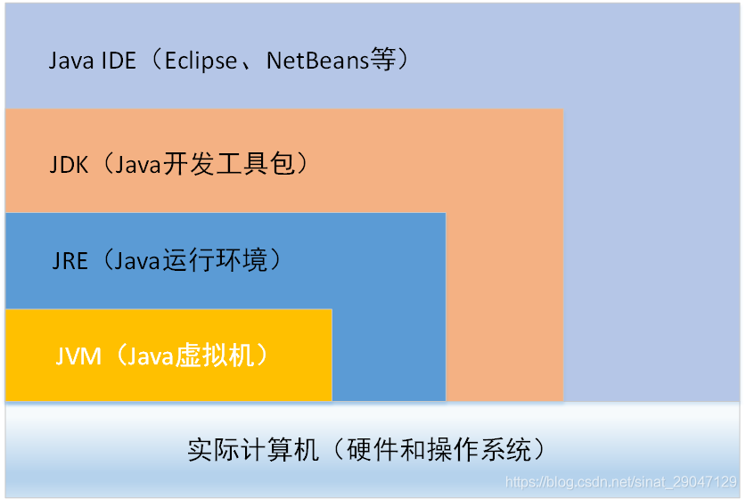

## IDEA的快捷键使用

```txt
Ctrl+/ 或 Ctrl+Shift+/  注释

Ctrl+N   查找类

Ctrl+Alt+L  格式化代码

Ctrl+R 替换文本

Ctrl+F 查找文本

Ctrl+Shift+上下键   上下移动代码

Ctrl+X 删除行

Ctrl+D 复制行
```
## 命名规范

```txt
java类的命名(大驼峰):类的名字必须由大写字母开头而单词中的其他字母均为小写；如果类名称由多个单词组成，则每个单词的首字母均应为大写例如TestPage。

变量全部小写;常量名全大写用下划线分割

方法的命名(小驼峰):第一个单词应以小写字母作为开头，后面的单词则用大写字母开头 。例如： sendMessge
```

## 变量

### 定义
```java
//        声明变量并赋值  整数
       int num1 = 10;

//               输出
        System.out.println(num1);


//       先声明  再赋值
        int num2;
        num2 = 20;
        num2 = 30;

//       输出 30
        System.out.println(num2);


//         一次定义多个变量
        
//        方式一
        int num1,num2,num3;
        num1 = 10;
        num2 = 20;
        num3 = 30;

        System.out.println(num1);
        System.out.println(num2);
        System.out.println(num3);
//        方式二
        int num4 = 10,num5 = 20,num6 = 30;
        System.out.println(num4);
        System.out.println(num5);
        System.out.println(num6);
```
### 变量类型

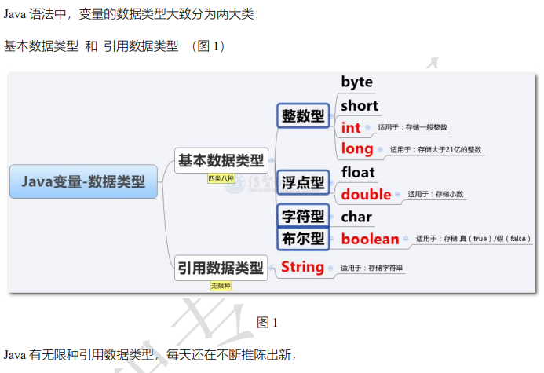

#### 整数

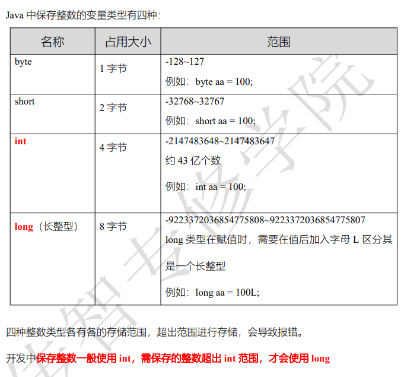

#### 小数
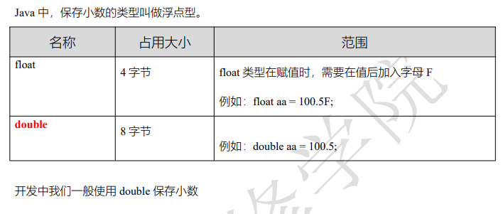

#### 字符 和  字符串
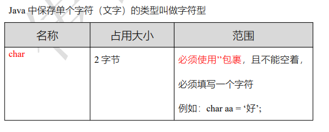

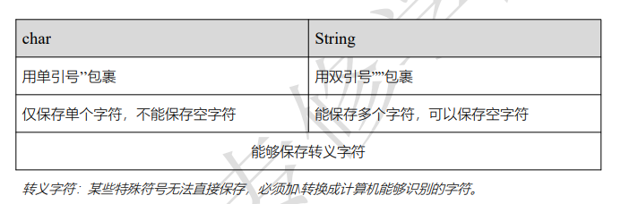

#### 布尔


```java
//      单字符

        char z1 = '曾';
        int z2 = '曾';
        System.out.println(z1);
        System.out.println(z2);
//        注意  只能保存单字符   不能为空

//       字符串

        String s1 = "来了老弟,哈哈哈!!!";
        System.out.println(s1);

//        字符串拼接

        char c1 = '爱';
        String jg = "范志伟"+c1+"曹喜娟";
        System.out.println(jg);

//        布尔类型  boolean   1 真 true      0 假 false  (1字节)

        boolean f1 = false;
        System.out.println(f1);
        boolean f2 = true;
        System.out.println(f2);

```
### 变量的作用范围(理解为 声明好的变量 可以由内往外找 不可以由外往里找)
```java
//        1、以下代码能否正常执行？若能正常执行，效果是什么？  20
        int num = 10;
        {
            num = 20;
        }
        System.out.println(num);

//        2、以下代码能否正常执行？若能正常执行，效果是什么？10
        {
            int num = 10;
            System.out.println(num);
        }

//        3、以下代码能否正常执行？若能正常执行，效果是什么？ 报错
        int num1 = 10;
        {
            int num2 = 20;
            System.out.println(num1);
        }
        System.out.println(num2);


//        4、以下代码能否正常执行？若能正常执行，效果是什么？ 报错
        int num1 = 10;
        {
            int num2 = 20;
        }
        System.out.println(num1 + num2);


//        5、以下代码能否正常执行？若能正常执行，效果是什么？ 30
        int num1 = 10;
        {
            int num2 = 20;
            num1 = num2 + num1;
        }
        System.out.println(num1);

//        6、以下代码能否正常执行？若能正常执行，效果是什么？ 报错
        int num1 = 5;
        {
            int num2 = 8;
        }
        System.out.println("幸运数字：" + num1 + num2);
```
## 常量
```java
    /*
        *  常量 ：数据一旦存储  不可修改  可进行运算(从左向右  依次执行)
        *
        *  命名建议全部大写字母
        *
        *   final + 数据类型 + 变量名称
        *
        * */
    final int NUM = 999;
    System.out.println(NUM*2);

    //        int a,b,c=10;
    //        final String N = c+10+"";
    //        System.out.println(N+c); // 2010
```
## 运算符（算数运算符、赋值运算符、关系运算符、逻辑运算符、三元运算符）

### 算数运算符（四则运算 取模（必须是数字类型） 字符串的拼接）


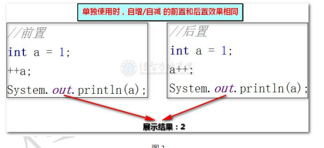

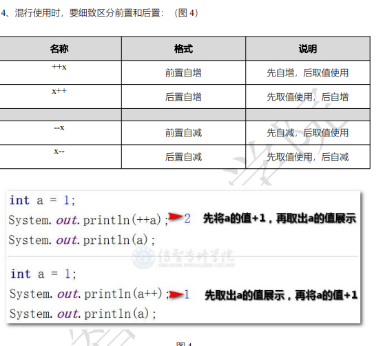

```java
// 自增、自减算术运算符
// ++ 前置  先运算后赋值

// 解析:  a 的初始值为10 ++a = 11 此时a变为11 ，然后 a++ 先赋值 所以a++ = 11 相加 a = 22 
//        int a = 10;
//        a = ++a + a++; // 11 + 11
//        System.out.println(a); // 22

// 解析: a的初始值 10 ++a 先运算，所以 ++a = 11; 此时 a=11 然后a-- 先赋值 a-- = 11 所以 结果为0
//        int a = 10;
//        a = ++a - a--; // 11 - 11
//        System.out.println(a); // 0

// 解析: a的初始值 10 a++ 10 此时的a为11  --a先运算 --a = 10 所以 10-10 = 0
//        int a = 10;
//        a = a++ - --a; // 10 - 10
//        System.out.println(a); // 0


/*
* 解析: a 的初始值 10   11  21
*     a++ = 10  --a = 10 结果 a = 20 再次输出 a++ = 20
* */
//        int a = 10;
//        a = a++ + --a; // 10 + 10
//        System.out.println(a++); // 20
//        System.out.println(a); // 21

 /*
  * 解析: a的初始值: 10  11 10 11
  *       b的初始值: a++ = 10 所以b值为 10  11 12
  *  b++ 先赋值 a 由11 又变为类 10
  *  最后 a = 10 b = 10
  * 输出 a++ = 10 ++b = 12 结果 22 
  * a = 11 b = 12
  * */
//        int a = 10;
//        int b = a++; // 10
//        a = b++; // 10
//        System.out.println(a++ + ++b); // 10 + 12 22
//        System.out.println(a); // 11
//        System.out.println(b); // 12
```
### 赋值运算符（先将右侧进行运算，然后将式子  改写成  = 号的形式 , 最后将结果输出）

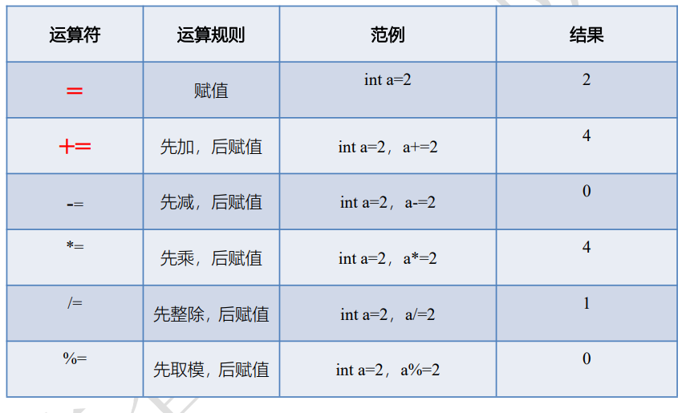

```java
//        int a = 10;
//        int b = 20;
//        a = 10 * 2;
//        b *= 1 + 1;


//        int a = 2;
//        int b = 3;
//        a *= a + b;
//        b *= b + 1;

//
//        byte b = 3;
//        b *= b + 2;


//        System.out.println(a); // 20   10
//        System.out.println(b); // 40   12   15
```
### 关系运算符

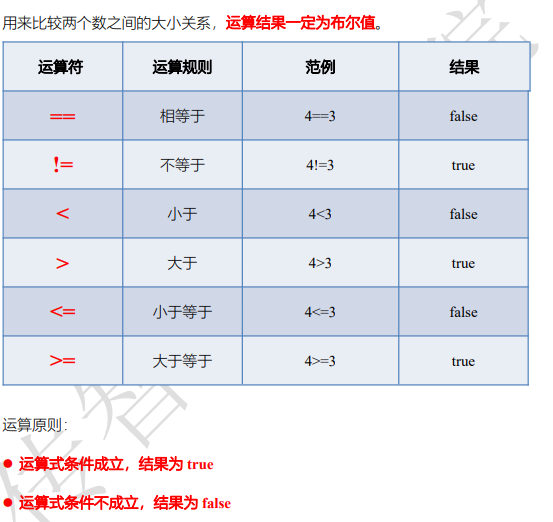

```java
/*        int a = 10;
        int b = 20;
        System.out.println(a == b);// false
        System.out.println(a >= b);// false
        System.out.println(a <= b);// true
        System.out.println(a != b);// true*/

        /*
         *   a  11 12 13
         *
         *   b   12 13 14
         * */
       /* int a = 10;
        int b = 11;
        System.out.println(a++ == ++b); // false
        System.out.println(++a >= b++); // true
        System.out.println(a++ != ++b); // true
        System.out.println(a); // 13
        System.out.println(b); // 14*/


       /* int a = 3;
        int b = 4;
        System.out.println( a=b ); // 4
        System.out.println( a==b );// true
*/


/*        int a = 10;
        int b = 20;
        boolean c = (a + 10) > b; // false
        boolean d = (a + b) > b; // true
        boolean e = (a + b) >= (b + a); // true
        System.out.println(c);
        System.out.println(d);
        System.out.println(e);*/


/*        int a = 2;
        int b = 3;
        boolean x = (a+2) == (b++); // false
        boolean y = (a+2) == b; // true
        System.out.println(x);
        System.out.println(y);
        System.out.println(b); // 4*/


/*        int a = 2;
        int b = 3;
        boolean x = (a+2) == (++b); // true
        boolean y = (a+2) == b; // true
        System.out.println(x);
        System.out.println(y);
        System.out.println(b); // 4*/
```
### 逻辑运算符

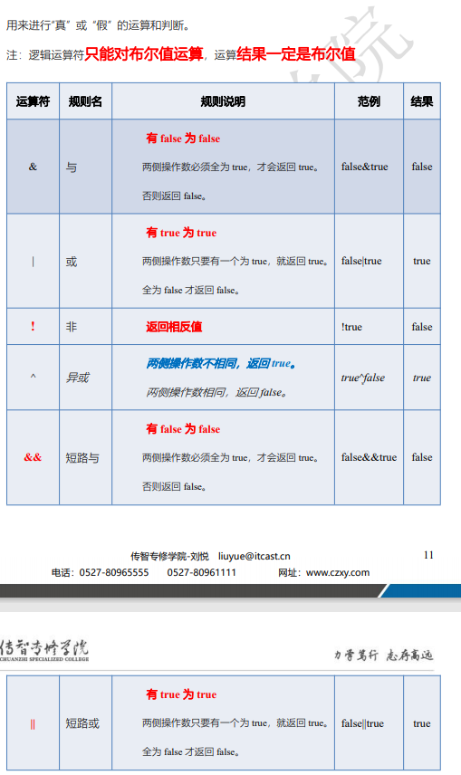

```java
        /*
         *   逻辑运算符      &       |        ！                ^（异或）                  &&  （短路与）         ||（短路或）
         *
         *             一假则假   一真则真    取反      两端值相同false,不相同true     式子出了结果：后面不执行
         *
         * */

        /*int a = 10;
        int b = 20;
        boolean c = (a > 10) && (b >= 20);
        System.out.println(c); // false*/


/*        int a = 10;
        int b = 20;
        a += 5; // 15
        b -= 10; // 10
        boolean c = (a > 10) && (b >= 20);
        System.out.println(a); // 15
        System.out.println(b);  // 10
        System.out.println(c);  // false*/


       /* int a = 10;
        int b = 20;
        a += 5;  // 15
        b -= 10;    // 10
        boolean c = (a > 10) || (b >= 20);
        System.out.println(a); // 15
        System.out.println(b);  // 10
        System.out.println(c);  // true*/


       /* int a = 10;  // 11 12   13
        int b = 11;  // 12  11  13
        System.out.println( a++==10 && ++b>=11); // true
        System.out.println( ++a==b-- || b++>=a-- || ++a>13 || b--<12 || (b=13)>(a=12)); // true
        System.out.println( a++==++b && (b=13)!=a && (a=13)!=b); // false
        System.out.println(a); // 13
        System.out.println(b); // 13*/


      /*  int a = 1;  // 2
        int b = 1;  // 2
        boolean c = (a++ + ++b > 5) && (b >= a) && (b++ == a);
        System.out.println(a);
        System.out.println(b);
        System.out.println(c); // false*/


/*        int a = 1;  // 2    3
        int b = 1;  // 2 3  4

//      先算 && 再算 ||
//                                       1      2 true   2      2 true
//                    2      3    false          true 这里决定结果
        boolean c = (a++ + ++b > 5) || (b++ <= ++a) && (b++ == a);
        System.out.println(a); // 3
        System.out.println(b); // 4
        System.out.println(c); // true*/
```
### 三元运算符

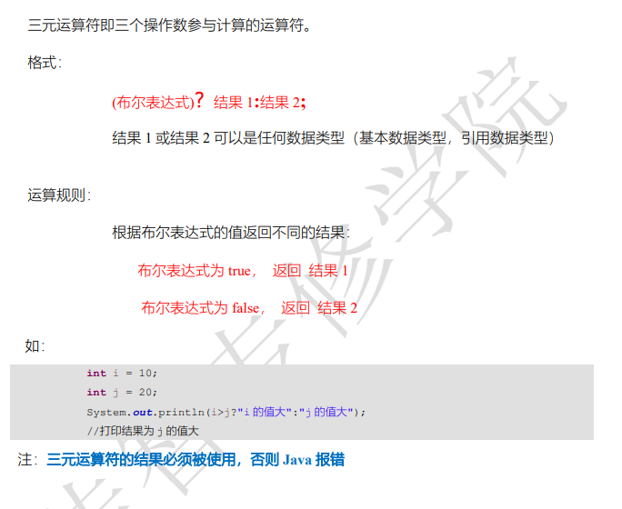

```java
//        int a = 10;
//        int b = 20;
//        int c = 30;
//        //定义一个临时的变量 用来保存两个数中的较大值
//        int tmp = a > b ? a : b;
//        //利用上一步的较大值跟第三个数比较，确定这三个数中的最大值
//        int max = c > tmp ? c : tmp;
//        //打印结果
//        int max = c > (a>b?a:b) ? c : (a>b?a:b);
//        System.out.println(max); // 30
```
## 流程控制语句

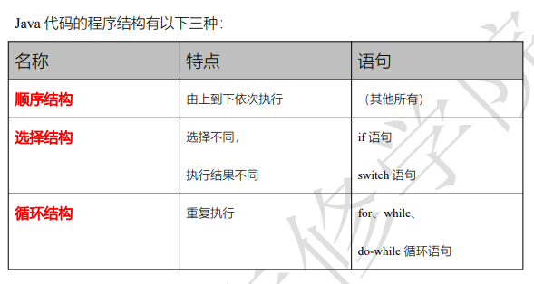

### 判断
```java
/*
        *  流程语句：if
        *    判断条件进行时，要先小范围再大范围
        *    格式:
        *      单条件： if(判断条件){代码块}
        *      二选一:  if(判断条件){代码块} else {代码块}
        *      多条件:  if(判断条件){代码块} else if(判断条件){代码块} else {代码块}
        * */

//        int age = 20;
//        if (age >= 18) {
//            System.out.println("成年人：今年"+age+"岁");
//        }


//        String name = "范志伟";
//        int sex = 1;
//        if (sex == 0) {
//            System.out.println("欢迎"+name+"女士");
//        }else {
//            System.out.println("欢迎"+name+"先生");
//        }

//        int num = 10;
//        switch (num){
//            case 1:
//            case 2:
//            case 3:
//            case 4:
//            case 5:
//                System.out.println("今天是工作日");
//                break;
//            case 6:
//            case 7:
//                System.out.println("今天是休息日");
//                break;
//                default:
//                    System.out.println("输入数字超出范围1~7");
//        }

//        int score = 59;
//        if (score >= 80) {
//            System.out.println("成绩优秀");
//        }else if (score >= 60 && score < 79) {
//            System.out.println("成绩及格");
//        }else {
//            System.out.println("需要再次补考");
//        }
```
### 循环
```java
/*
        * 循环语句 for
        *
        *      语法: for (初始值; 循环条件; 步进) { 循环体 }
        *      注意: 循环内定义的变量  每次都会重新赋值  变量不会发生改变
        *
        * 循环语句 while
        *
        *  语法:
        *       循环初始值
        *       while (循环条件){ 循环代码  步进}
        *
        *
        * */

       /* for (int i = 1; i <=100 ; i++) {
            if (i%3==0){
                System.out.println(i);
            }
        }*/


       /* int i = 1;
        while (i<=100){

            if (i %3 == 0) System.out.println(i);

            i++;
        }*/

/*//     倒叙打印
        for (int i = 100; i >= 1 ; i--) {
            System.out.println(i);
        }*/

/*//      无限循环  判断条件总是满足
//        for (;true;) {
//            System.out.println("无线循环");
//        }
//        while (true){
//            System.out.println("无线循环");
//        }*/


/*//      循环嵌套
        for (int i = 0; i < 3 ; i++) {
            for (int j = 0; j < 5; j++) {
                System.out.print("*");
            }
            System.out.println(" ");
        }*/


// 练习题
//        思考案例1：要求，每次展示一个*，用for展示如下效果 （不能用if）
//	*
//	**
//	***
//	****

//        for (int i = 0; i < 4; i++) {
//            for (int j = 0; j <= i ; j++) {
//                System.out.print("*");
//            }
//            System.out.println(" ");
//        }

//      思考案例2：要求，每次展示一个*，用for展示如下效果 （不能用if）
//	****
//	***
//	**
//	*

//        for (int i = 0; i < 4; i++) {
//            for (int j = 4; j > i ; j--) {
//                System.out.print("*");
//            }
//            System.out.println(" ");
//        }
```

