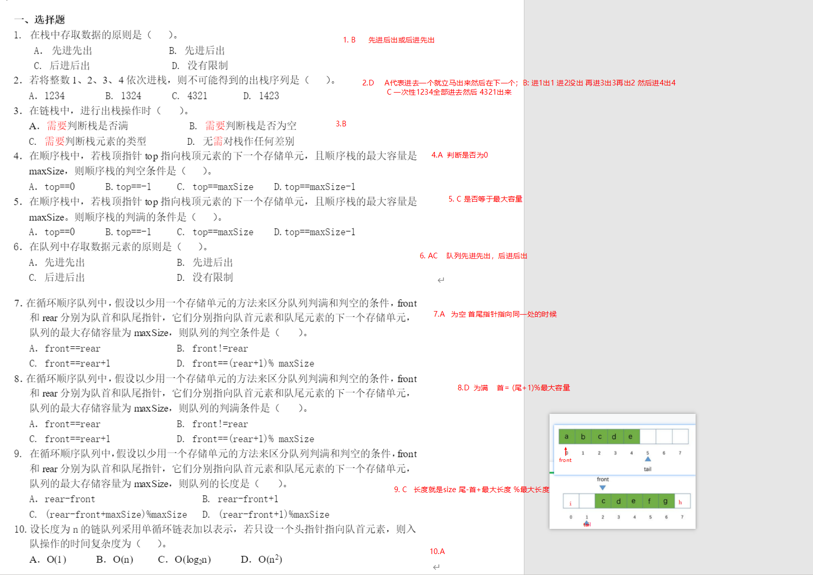

## 练习题一(线性表)

### 选择

### 填空


### 规律&结论
```txt
1. 顺序表适合随机存取,链表适合插入和删除操作;且顺序表存储密度为1,链表存储密度小于1.
2. 在顺序表中的第i(0<=i<=n-1>)个位置之前插入元素，引起n-i元素需要往后挪，删除第i个位置的元素，引起n-i-1个元素向前挪。
```
## 练习题二(栈和队列)
### 选择

### 填空


### 规律&结论
```txt
1.循环顺序队列:
    front == tail  判断是否为空
    front == (tail+1) % data.length   是否为满
    tail指向入队时的变化： tail = (tail+1) % data.length
    front指向出队时的变化： front = (front+1) % data.length
    size  ：(tail-front+ data.length)% data.length
    扩容: newData[i] = oldData[(i+front)% data.length]
2. 顺序栈和顺序队列:插入元素时必须进行为满判断，删除进行为空判断,链表的形式只需要删除判断为空即可。
```
## 练习题三(串和数组)
### 选择

### 填空


## 考试刷题心得
### 第一套试题
1. 

```md
如上图,表中每一行(相当于结点中每一个结点)就是一个**数据元素**；数据元素中的每一项，比如张三的数学分析是90分就是一个**数据项**；整个表格是一个**数据对象**，它代表的都是学生的信息(具有相同性质的数据元素的集合)。
```
2. 
```md
根据数据元素间关系的不同特性，通常可分为**集合**、**线性**、**树形**、**图状**四类基本结构。
```

3. 
```md
算法的5个特征包括:**有穷性**、**确定性**、**有效性**、**输入**和**输出**。
算法的时间复杂度与**算法本身**有关
```
4. 顺序表和链表的比较
```md
顺序表的查找比较方便，直接给出下标i就可找到；但链表的查找必须要从头开始逐个比对。
顺序表的插入要把第i到第n-1个结点移动到后一个，空出位置后插入，顺序表的删除要把第i+1个到第n个移动到前一个位置；而链表的插入和删除不需要移动结点的数据，修改指针就可以了。
```
