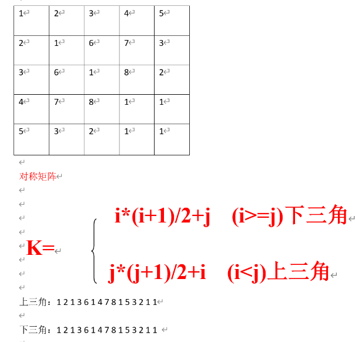

# 知识点

## 数据结构
1. 概述:
```txt
    数据结构是相互之间存在一种或多种关系的数据元素的集合
```


## 线性表
1. 概述:
```txt
    将数据排成像一条长线的结构, 数组、链表、栈、队列都是线性表结构,线性表上的数据最多只有前后两个方向.
```


2. 特点:
```txt
1. 它由n个同类型的元素组成；
2. 每个元素除第一个元素和最后一个元素之外,有且仅有一个前驱和一个后继；
3. 其长度可以动态的增长或减少
4. 可以对线性表中任何数据元素进行访问
5. 数据元素的插入和删除操作可以在线性表中的任何位置进行
6. 可以求线性表中指定元素的前驱和后继。
```
3. 实现
```txt
1. 顺序存储结构表示的线性表称为顺序表           (数组)
2. 链式存储结构表示的线性表称为链表，链表又分为单链表、双向链表、循环链表、双向循环列表。                               (链表)

```
4. 基本操作
```txt
1. 线性表的置空操作：clear()
2. 线性表判空操作：isEmpty()
3. 求线性表元素的个数：length()、getSize()
4. 求线性表的容量：getCapacity()
5. 取元素操作：get(i)
6. 插入操作：insert(i,x)
7. 删除操作：remove(i)
8. 查找操作：indexOf(i)
9. 输出操作：toString()

```
### 顺序表
1. 代码相关知识点
```txt
1.1 数组容量：就是定义数组的长度
1.2 元素个数：类中定义的size
1.3 是否为空: size是否为零
1.4 在java中 == 比较的是指针地址  equals 比较的是值的相等
1.5 添加：倒着遍历数组 size-1开始  赋值i给i+1  size++ ; 首|尾添加：直接调用添加方法 操作索引直接给死 0|size
1.6 获取：直接数组方式取值
1.7 查找: 遍历数组元素进行值对比 返回索引
1.8 修改：直接数组方式赋值修改
1.9 包含: 遍历数组元素进行值对比 返回布尔值
1.10 删除: 保存删除元素 正向遍历 index+1开始 赋值i给i-1 末尾设置初始值 size-- 返回删除元素 ; 首|尾删除: 直接调用删除方法 操作索引直接给死 0|size-1
1.11 泛型: 将类型由原来的具体的类型参数化,只在编译阶段有效。E(集合中使用)、T(Java 类)、K(键)、V(值)
1.12 泛型使用后数组的声明：E[] newData = (E[]) new Object[newCapacity];
1.13 扩容: 遍历旧数组 将其元素放大新数组中 新数组覆盖旧数组

```
2. 代码实现
```java
/*
 *  使用数组实现线性表(顺序结构)
 * 
 *  存储元素物理空间一定是连续的,数组一旦创建成功，大小(开辟的内存空间)不能改变
 * */


public class Array<E> {
    //    数组容器存放元素
    private E[] data;
    //    元素个数
    private int size;

    //   构造方法

    public Array() {
//        初始化
        this(10);
    }

    public Array(int capacity) {
//        注意: java 中 Object 支持接收任何类型
        data = (E[]) new Object[capacity];
        size = 0;
    }

    //    1 获取容量
    public int getCapacity() {
        return data.length;
    }

    //    2 元素个数
    public int getSize() {
        return size;
    }

    //    3 判断是否为空
    public boolean isEmpty() {
        return size == 0;
    }

    //    4 添加    注意:只能在零到size的位置添加元素
    public void add(int index, E e) {
//        存在极端情况 数组满 索引越界
        if (size == data.length) {
            // 需要扩容
//            throw new RuntimeException("数组已满,请扩容");
            resize(data.length * 2);
        }
        if (index < 0 || index > size) {
            throw new RuntimeException("索引非法");
        }


//        1 挪
        for (int i = size - 1; i >= index; i--) {
            data[i + 1] = data[i];
        }
//        赋值
        data[index] = e;
//        元素个数++
        size++;

    }

    //    添加元素到 首||尾
    public void addFirst(E e) {
        add(0, e);
    }

    public void addLast(E e) {
        add(size, e);
    }


    //   5  获取: 索引找元素
    public E get(int index) {
//        判断索引的范围是否在0~size之间
        if (index < 0 || index >= size) {
            throw new RuntimeException("索引非法");
        }
//        返回索引对应的值
        return data[index];
    }

    public E getFirst() {
        return get(0);
    }

    public E getLast() {
        return get(size - 1);
    }

    //   6 查找: 元素找索引
    public int find(E e) {
//        遍历每一个元素 对比
        for (int i = 0; i < size; i++) {
//      注意: 在java中 == 比较地址 equals 比较值
            if (data[i].equals(e)) {
                return i;
            }
        }
        return -1;
    }

    //    7 修改
    public void set(int index, E e) {
        //        判断索引的范围是否在0~size之间
        if (index < 0 || index >= size) {
            throw new RuntimeException("索引非法");
        }
        data[index] = e;
    }

    //    8 包含
    public boolean contains(E e) {
        //        遍历每一个元素 对比
        for (int i = 0; i < size; i++) {
            if (data[i].equals(e)) {
                return true;
            }
        }
        return false;
    }

    //    9 删除
    public E remove(int index) {
        if (index < 0 || index >= size) {
            throw new RuntimeException("非法索引");
        }

//        保存删除元素
        E oldValue = data[index];
//        遍历 向前挪 赋值
        for (int i = index + 1; i < size; i++) {
            data[i - 1] = data[i];
        }
//        最后一个元素设置初始值
        data[size - 1] = null;
        size--;
//        缩容 (data.length/2 改为: data.length/4 && data.length/2 >= 10 解决复杂度震荡的问题)
        if (size == data.length / 4 && data.length / 2 >= 10) {
            resize(data.length / 2);
        }
//        返回删除元素
        return oldValue;
    }

    //    删除 首||尾 元素
    public E removeFirst() {
        return remove(0);
    }

    public E removeLast() {
        return remove(size - 1);
    }

    //    根据元素删除
    public E removeElement(E e) {
        int index = find(e);
        if (index != -1) {
            return remove(index);
        } else {
            throw new RuntimeException("不存在要删除的元素");
        }
    }

    //    扩容方法
    public void resize(int newCapacity) {
        E[] newData = (E[]) new Object[newCapacity];
//       遍历将旧数组的元素存到新数组里
        for (int i = 0; i < size; i++) {
            newData[i] = data[i];
        }
//        覆盖老数组
        data = newData;
    }

    //    重写toString方法
    @Override
    public String toString() {
        String str = "[";
        for (int i = 0; i < data.length; i++) {
//            拼接元素
            str += data[i];
            if (i != data.length - 1) {
//            拼接，号
                str += ",";
            }
        }
        str += "]";
        return str;
    }
}

```
## 复杂度分析
1. 作用:评判一个算法的优劣
2. 时间复杂度 、空间复杂度
### 时间复杂度(执行时间)


* ArrayList复杂度分析
1. 添加操作

2. 删除操作

3. 获取get 修改set 查找find 包含contains等操作

4. resize 扩容|缩容时间复杂度

### 空间复杂度(执行消耗资源)


## 顺序表和链表的比较


## 链表
1. 概述
```txt
线性表的链式存储结构：物理空间上可以不采用连续的区域存储，通过指针的指向，连接前后元素。
```
2. 特点
```txt
1 第一个节点叫做头结点，头结点用来记录链表的基地址,有了它，我们就可以遍历得到整条链表。
2 最后一个节点叫做尾节点，尾结点特殊的地方是：指针不是指向下一个结点，而是指向一个空地址 NULL，表示这是链表上最后一个结点。 
```
3. 实现

* 知识点
1. 内部类创建结点 包含: 元素 e 、结点next 、 无参构造 带参(e)构造 满参构造
2. 获取元素个数：  直接return 属性 size
3. 是否为空：size == 0 
4. 添加： 头插-> 创建新节点 指向head头结点 新节点变为新的head结点 维护size  ;   任意-> 索引为0 直接调用头插法  否则   将头结点 赋给 cur结点变量 遍历 cur最总为索引的前一个元素 之后 创建新结点 指向 找到的cur.next 前一个元素指向 新节点 维护size; 尾插-> 直接调用任意add方法 索引为size即可
5. 获取：判断索引非法 遍历查找元素 获取第一个 0 最后一个size-1 索引直接给死
6. 包含：遍历 值判断 返回布尔值
7. 遍历找到删除元素的前一个结点 当前 后一个结点 顺序改变指向 size-- 
* 代码
```java
/*
 *  使用链表实现线性表: 手写LinkedList
 *       1. 创建结点Node
 *           a: 元素E
 *           b: next 下一个节点
 *       2. 创建链表
 *           a: 头结点
 *           b：size 元素个数
 * */
public class LinkedList<E> {

    //    使用内部类创建结点
    private class Node {
        public E e;

        public Node next;

        public Node() {
        }

        public Node(E e) {
            this.e = e;
        }

        public Node(E e, Node next) {
            this.e = e;
            this.next = next;
        }
        @Override
        public String toString() {
            return e.toString();
        }
    }

    //    头结点
    private Node head;
    //    size 链表元素的个数
    private int size;


    //    1. 获取元素个数
    public int getSize() {
        return size;
    }

    //    2. 是否为空 isEmpty
    public boolean isEmpty() {
        return size == 0;
    }

    //    3. 添加

    public void addFirst(E e){
//        1.创
        Node newNode = new Node(e);
//        2.连
        newNode.next = head;
//        3.变
        head = newNode;
        size++;
    }


    public void add(int index,E e){
//        判断索引是否合法
        if (index < 0 || index >size){
            throw new RuntimeException("索引非法");
        }


        if (index == 0){
            addFirst(e);
        }else {
            Node cur = head;
            for (int i = 1; i < index; i++) {
                cur = cur.next;
            }
            Node newNode = new Node(e);
            newNode.next = cur.next;
            cur.next = newNode;

            size ++;
        }
    }

    public void addLast(E e){
        add(size,e);
    }

    @Override
    public String toString(){
        String str = "";
        Node cur = head;
        while (cur != null){
            str += cur.e + "->";
            cur = cur.next;
        }
        str += "null";
        return str;
    }

}
```
### 虚拟结点
```java
/*
 *  使用链表实现线性表: 手写LinkedList
 *       1. 创建结点Node
 *           a: 元素E
 *           b: next 下一个节点
 *       2. 创建链表
 *           a: 头结点
 *           b：size 元素个数
 * */
public class LinkedList<E> {

    //    使用内部类创建结点
    private class Node {
        public E e;
        public Node next;

        public Node() {
        }

        public Node(E e) {
            this.e = e;
        }

        public Node(E e, Node next) {
            this.e = e;
            this.next = next;
        }

        @Override
        public String toString() {
            return e.toString();
        }
    }

    //    头结点
    private Node dummyHead;
    //    size 链表元素的个数
    private int size;

    //    初始化
    public LinkedList() {
        this.dummyHead = new Node();
        this.size = 0;
    }

    //    1. 获取元素个数
    public int getSize() {
        return size;
    }

    //    2. 是否为空 isEmpty
    public boolean isEmpty() {
        return size == 0;
    }

    //    3. 添加

    public void add(int index, E e) {
//        判断索引是否合法
        if (index < 0 || index > size) {
            throw new RuntimeException("索引非法");
        }

        Node cur = dummyHead;
        for (int i = 0; i < index; i++) {
            cur = cur.next;
        }
        Node newNode = new Node(e);
        newNode.next = cur.next;
        cur.next = newNode;

        size++;
    }

    public void addFirst(E e) {
        add(0, e);
    }

    public void addLast(E e) {
        add(size, e);
    }

    //    4. 获取 通过索引
    public E get(int index) {
//      判断索引合法
        if (index < 0 || index > size) {
            throw new RuntimeException("索引非法");
        }
//      遍历查找元素
        Node cur = dummyHead;
        for (int i = 0; i <= index; i++) {
            cur = cur.next;
        }
//      返回元素
        return cur.e;
    }
    public E getFrist(){
        return get(0);
    }
    public E getLast(){
        return get(size-1);
    }

    //    5. 查找 通过元素 返回索引
    public int find(E e) {

        int index = -1;
        Node cur = dummyHead;
        for (int i = 0; i < size; i++) {
            cur = cur.next;
            if (cur.e != null && cur.e.equals(e)) {
                return index = i;
            }
        }
        return index;
    }

    //    6. 包含 返回布尔值
    public boolean contains(E e) {
//        遍历比较
        Node cur = dummyHead;
//        for (int i = 0; i < size; i++) {
//            cur = cur.next;
//            if (cur.e != null && cur.e.equals(e)) return true;
//        }

//        cur.next.e 代表虚拟头结点的下一个元素
        while (cur.next != null) {
            if (cur.next.e.equals(e)) return true;
            cur = cur.next;
        }
//        返回结果
        return false;
    }

    //    7. 删除 返回数据
    public E remove(int index) {
//        判断索引合法
        if (index < 0 || index >= size) {
            throw new RuntimeException("索引非法");
        }

//        前一个结点
        Node prev = dummyHead;
        for (int i = 0; i < index; i++) {
            prev = prev.next;
        }

//        当前结点
        Node cur = prev.next;
//        后一个结点
        Node next = cur.next;
//        改变指向
        prev.next = next;
        size--;
        return cur.e;
    }

    public E removeFirst() {
        return remove(0);
    }

    public E removeLast() {
        return remove(size - 1);
    }

    public E removeElement(E e){
        Node prev = dummyHead;
        while (prev.next != null){
            if (prev.next.e.equals(e)){
                break;
            }
            prev = prev.next;
        }
        Node cur = prev.next;
        Node next = cur.next;
        prev.next = next;
        size--;
        return cur.e;
    }

    @Override
    public String toString() {
        String str = "";
        Node cur = dummyHead.next;
        while (cur != null) {
            str += cur.e + "->";
            cur = cur.next;
        }
        str += "null";
        return str;
    }

}
```
## 栈
1. 概述及特点
```txt
栈是一种线性结构，仅限制在一端进行插入和删除操作的特殊线性表，限制操作的表尾端称为“栈顶”,另一 端称为“栈底”。栈是“后进先出”的线性表（LIFO）或  “先进后出”的线性表（FILO）
```
2. 应用场景
```txt
1.无处不在的Undo操作(撤销)
2.浏览器的前进后退
3.程序调用的系统栈
```
3. 栈的接口及实现方式
```txt
// 接口
isEmpty() // 是否为空
getSize() // 长度
peek() // 取栈顶元素
push() // 压栈
pop() // 出栈

实现方式:
    1.顺序栈---依赖顺序表实现     
    2.链栈---依赖链表实现
```
### 顺序栈
1. 接口
```java
public interface IStack<E> {
//    判断是否为空
    boolean isEmpty();
//    获取长度
    int getSize();
//    压栈
    void push(E e);
//    出栈
    E pop();
//    取栈顶元素
    E peek();
}
```
2. 基于ArrayList实现
```java
public class ArrayListStack<E> implements IStack<E> {
    //    1.引入顺序表
    private Array<E> array;

//    2.初始化栈

    public ArrayListStack() {
        array = new Array<>();
    }
//    3. 设置数组容量
    public ArrayListStack(int capacity) {
        this.array = new Array<>(capacity);
    }

    @Override
    public boolean isEmpty() {
        return array.isEmpty();
    }

    @Override
    public int getSize() {
        return array.getSize();
    }

    @Override
    public void push(E e) {
        array.addLast(e);
    }

    @Override
    public E pop() {
        return array.removeLast();
    }

    @Override
    public E peek() {
        return array.getLast();
    }

    @Override
    public String toString() {
        return array.toString();
    }
}

```
3. 实例测试
```java
 public static void main(String[] args) {
//        创建实例
        ArrayListStack<Integer> list = new ArrayListStack<>();

//        压栈
        list.push(11);
        list.push(22);
        list.push(33);
        list.push(44);
        System.out.println(list);

//        取
        System.out.println(list.peek());
//        出
        System.out.println(list.pop());
    }
```
### 链栈
1. 接口
```java
public interface IStack<E> {
//    判断是否为空
    boolean isEmpty();
//    获取长度
    int getSize();
//    压栈
    void push(E e);
//    出栈
    E pop();
//    取栈顶元素
    E peek();
}
```
2. 基于LinkedList实现
```java
public class LinkedListStack<E> implements IStack<E> {


    private LinkedList<E> linkedList;

    public LinkedListStack() {
        this.linkedList = new LinkedList<>();
    }

    //    快捷方式  在接口IStack<E>后面 alt+回车
    @Override
    public boolean isEmpty() {
        return linkedList.isEmpty();
    }

    @Override
    public int getSize() {
        return linkedList.getSize();
    }

    @Override
    public void push(E e) {
//        选取链表的虚拟头结点这一端作为栈顶  时间复杂度为 O(1) 效率更高
        linkedList.addFirst(e);
    }

    @Override
    public E pop() {
        return linkedList.removeFirst();
    }

    @Override
    public E peek() {
        return linkedList.getFrist();
    }

    @Override
    public String toString() {
        return linkedList.toString();
    }
}

```
3. 实例测试
```java
    public static void main(String[] args) {
        LinkedListStack<Integer> listStack = new LinkedListStack<>();
//        压栈
        listStack.push(11);
        listStack.push(12);
        listStack.push(13);
        System.out.println(listStack);

//        出栈
        System.out.println(listStack.pop());
//        取
        System.out.println(listStack.peek());
    }
```
## 队列
1. 概述及特点
```txt
队列是一种线性结构，队列是只允许在表的一端进行插入，而在表的另一端进行删除操作的一种特殊线性表。允许插入的一端称为“队尾”，允许删除的一端称为“队首”。
队列是“先进先出”的线性表（FIFO）或  “后进后出”的线性表（LILO）
```
2. 队列的接口及实现方式
```txt
// 接口
isEmpty() // 是否为空
getSize() // 长度
peek() // 取队首元素
enqueue() // 入队
dequeue() // 出队

实现方式:
    1.顺序队列---依赖顺序表实现     
    2.链表队列---依赖链表实现
```
### 顺序队列
1. 接口
```java
public interface IQueue<E> {
//    判断是否为空
    boolean isEmpty();
//    获取长度
    int getSize();
//    入队
    void enqueue(E e);
//    出队
    E dequeue();
//    取队首
    E peek();
}

```
2. 基于ArrayList实现
```java
public class ArrayListQueue<E> implements IQueue<E>{
    private Array<E> array;

    public ArrayListQueue() {
        this.array = new Array<>();
    }

    public ArrayListQueue(int capacity) {
        this.array = new Array<>(capacity);
    }

    @Override
    public boolean isEmpty() {
        return array.isEmpty();
    }

    @Override
    public int getSize() {
        return array.getSize();
    }

    @Override
    public void enqueue(E e) {
        array.addFirst(e);
    }

    @Override
    public E dequeue() {
        return array.removeLast();
    }

    @Override
    public E peek() {
        return array.getLast();
    }

    @Override
    public String toString() {
        return array.toString();
    }
}

```
3. 实例实现
```java
    public static void main(String[] args) {
        ArrayListQueue<Integer> listQueue = new ArrayListQueue<>();
//        入队
        listQueue.enqueue(10);
        listQueue.enqueue(20);
        listQueue.enqueue(30);
        System.out.println(listQueue);
//        出队
        System.out.println(listQueue.dequeue());

//        取首
        System.out.println(listQueue.peek());
    }
```
### 链表队列
1. 接口
```java
public interface IQueue<E> {
//    判断是否为空
    boolean isEmpty();
//    获取长度
    int getSize();
//    入队
    void enqueue(E e);
//    出队
    E dequeue();
//    取队首
    E peek();
}

```
2. 基于LinkedList实现
```java
public class LinkedListQueue<E> implements IQueue<E>{
    private LinkedList<E> linkedList;

    public LinkedListQueue() {
        this.linkedList = new LinkedList<>();
    }

    @Override
    public boolean isEmpty() {
        return linkedList.isEmpty();
    }

    @Override
    public int getSize() {
        return linkedList.getSize();
    }

    @Override
    public void enqueue(E e) {
        linkedList.addFirst(e);
    }

    @Override
    public E dequeue() {
        return linkedList.removeLast();
    }

    @Override
    public E peek() {
        return linkedList.getLast();
    }

    @Override
    public String toString() {
        return linkedList.toString();
    }
}

```
3. 实例实现
```java
    public static void main(String[] args) {
        LinkedListQueue<Integer> listQueue = new LinkedListQueue<>();
//        入队
        listQueue.enqueue(10);
        listQueue.enqueue(20);
        listQueue.enqueue(30);
        System.out.println(listQueue);
//        出队
        System.out.println(listQueue.dequeue());
//        取首
        System.out.println(listQueue.peek());
    }
```
### 循环队列
#### 顺序循环队列
1. 定义接口
```java
public interface ILoopQueue<E> {
//    判断是否为空
    boolean isEmpty();
//    获取长度
    int getSize();
//    入队
    void enqueue(E e);
//    出队
    E dequeue();
//    取队首
    E peek();
}

```
2. 实现
```java
public class ArrayListLoopQueue<E> implements ILoopQueue<E> {

    private E[] data;
    private int front, tail;
    private int size;

    public ArrayListLoopQueue() {
        this(10);
    }

    public ArrayListLoopQueue(int capacity) {
        this.data = (E[]) new Object[capacity];
        front = 0;
        tail = 0;
        size = 0;
    }

    public void resize(int newCapacity) {
//        创建新数组
        E[] newData = (E[]) new Object[newCapacity];
//       挪  newData[i] = oldData[(i+front)%data.length]
        for (int i = 0; i < size; i++) {
            newData[i] = data[(i + front) % data.length];
        }
//       出队front 改变位置 也从新数组的0开始
        front = 0;
//       入队tail 位置变为size的位置
        tail = size;
//        新覆盖旧的数组
        data = newData;
    }

    @Override
    public boolean isEmpty() {
        return front == tail;
    }

    @Override
    public int getSize() {
        return size;
    }

    @Override
    public void enqueue(E e) {
//        判断是否需要扩容
        if ((tail + 1) % data.length == front) {
            resize(data.length * 2);
        }
//        向数组中添加元素
        data[tail] = e;
//        维护 tall
        tail = (tail + 1) % data.length;
//        维护size
        size++;
    }

    @Override
    public E dequeue() {
//        判断是否为空
        if (size == 0) {
            throw new RuntimeException("队列为空,无元素出队");
        }
//        保存出队元素
        E del = data[front];
//        维护front
        front = (front+1)%data.length;
//        维护size
        size--;
//        是否需要缩容
        if (size==data.length/4 && data.length/2>=10){
            resize(data.length/2);
        }
        return del;
    }

    @Override
    public E peek() {
        return data[front];
    }

    @Override
    public String toString() {
        String str = "";
        str += "[";
        for (int i = 0; i < data.length; i++) {
            str += data[i];
            if (i != data.length - 1) {
                str += ",";
            }
        }
        str += "]";
        return str;
    }
}

```
3. 实例测试
```js
public class Cs {
    public static void main(String[] args) {
        ArrayListLoopQueue<Integer> loopQueuelist = new ArrayListLoopQueue<>(5);
//        入队
        loopQueuelist.enqueue(10);
        loopQueuelist.enqueue(20);
        loopQueuelist.enqueue(30);
        loopQueuelist.enqueue(40);
        System.out.println(loopQueuelist);
        loopQueuelist.enqueue(50);
        System.out.println(loopQueuelist);
//        出队
        System.out.println(loopQueuelist.dequeue());
//        取
        System.out.println(loopQueuelist.peek());
    }
}

```
#### 链式循环队列
1. 接口定义
```java
public interface ILoopQueue<E> {
//    判断是否为空
    boolean isEmpty();
//    获取长度
    int getSize();
//    入队
    void enqueue(E e);
//    出队
    E dequeue();
//    取队首
    E peek();
}

```
2. 实现
```java
public class LinkedListLoopQueue<E> implements ILoopQueue<E> {
    //    使用内部类创建结点
    private class Node {
        public E e;
        public Node next;

        public Node() {
        }

        public Node(E e) {
            this.e = e;
        }

        public Node(E e, Node next) {
            this.e = e;
            this.next = next;
        }

        @Override
        public String toString() {
            return e.toString();
        }
    }

    //    头结点
    private Node dummyHead;
    //    size 链表元素的个数
    private int size;

    //    初始化
    public LinkedListLoopQueue() {
        this.dummyHead = new Node();
        this.size = 0;
    }

    @Override
    public boolean isEmpty() {
        return size == 0;
    }

    @Override
    public int getSize() {
        return size;
    }

    @Override
    public void enqueue(E e) {
//        判断是否为空
        if (size == 0) {
            dummyHead.next = new Node(e, dummyHead);
            size++;
        } else {
            Node tailNode = dummyHead;
            for (int i = 0; i < size; i++) {
                tailNode = tailNode.next;
            }
            tailNode.next = new Node(e, dummyHead);
            size++;
        }
    }

    @Override
    public E dequeue() {
        if (size == 0) {
            throw new RuntimeException("无元素出队");
        }
//        出队元素
        Node delNode = dummyHead.next;
//        元素出队后改变指向
        dummyHead.next = delNode.next;
//        维护size
        size--;
//        返回元素
        return delNode.e;
    }

    @Override
    public E peek() {
        return dummyHead.next.e;
    }

    @Override
    public String toString() {
        String str = "";
        Node cur = dummyHead.next;
        for (int i = 0;i<size;i++){
            str += cur.e + "->";
            cur = cur.next;
        }
        return str;
    }


}

```
3. 实例测试
```java
public class Cs {
    public static void main(String[] args) {
        LinkedListLoopQueue<Integer> list = new LinkedListLoopQueue<>();
        list.enqueue(10);
        list.enqueue(20);
        list.enqueue(30);
        list.enqueue(40);
        System.out.println(list);
//        出队
        System.out.println(list.dequeue());
//        取
        System.out.println(list.peek());
    }
}

```
## 串
1. 基本概念
```txt
    1.串是由零个或多个字符组成的有限序列。    一般记为s= "a1a2…an", 其中s为串名，引号括起来的字符序列是串值。串也是一种特殊的线性表。

    2.串的长度：串中字符的个数。

    3.空串：长度为0的串，即不包含任何字符的串，表示为""。

    4.空白串：由一个或多个空白字符组成的串，如： "          "。

    5. 子串: 串中任意个连续字符组成的子序列称为该串的子串。
       主串: 包含子串的串相应地称为主串。
    注意：空串是任意串的子串,任意串是其自身的子串。

    6.字符在串中的位置：字符在串中的序号值。
      子串在主串中的位置：子串在主串中出现时第一个字符在主串中的序号值。
```
2. 基本操作


3. 串的存储结构
### 顺序存储结构(顺序串)
### 链式存储结构

4. 模式匹配
### BF算法(暴力循环时间复杂度O(m*n))
[百度] (http://interview.wzcu.com/%E7%AE%97%E6%B3%95/BF%E7%AE%97%E6%B3%95%E5%92%8CKMP%E7%AE%97%E6%B3%95.html
) 不懂问度娘
### KMP算法(时间复杂度O(m+n))

## 矩阵
1. 概念
```txt
    数组是n(n≥1)个具有相同类型的数据元素a0,a1,…,an-1构成的有限序列，并且这些数据元素占用一片地址连续的内存单元。其中：n称为数组的长度。一维数组可以看成一个顺序存储结构的线性表 。

   数组元素是一维数组的数组称为二维数组，也称为矩阵。 
```
2. 数组的顺序存储结构：
**作用:如何用一维的存储地址来表示多维的关系**
### 行为主序

### 列为主序


3. 特殊矩阵的压缩存储：
**所谓压缩存储是指：为多个值相同的元素只分配一个存储空间；对零元不分配空间。**

### 对称矩阵

### 稀疏矩阵
1. 三元组顺序表

2. 十字链表


## 递归
1. 概念
```txt
递归(Recursion),又名递回，在数学与计算机科学中，是指在函数的定义中使用函数自身的方法。英文 Recursion 也就是重复发生，再次重现的意思。 而对应的中文翻译 ”递归“ 却表达了两个意思：”递“＋”归“。 这两个意思，正是递归思想的精华所在，去的过程叫做递，回来的过程叫做归。在编程语言中对递归可以简单理解为：方法自己调用自己，只不过每次调用时参数不同而已。
```
2. 应用
### 阶乘
```java
/*递归:自己调用自己，一定要有结束*/
public class Factorial01 {
    public static  String str = "";

    /*阶乘静态方法*/
    public  static  int f(int n) {
        if (n==1){
            str += n;
            return 1;
        }else {
            str += n + "*";
            return  n*f(n-1);
        }
    }

    public static void main(String[] args) {
        int result = f(5);
        System.out.println(str +"="+ result);
    }
}
```
### 斐波那契数列
```java
/*递归实现斐波那契额*/
public class Factorial02 {
    public static int f(int n){
        if (n==1){
            return 1;
        }else if (n==2){
            return 1;
        }else {
            return f(n-1) +f(n-2);
        }
    }

    public static void main(String[] args) {
        int f = f(12);
        System.out.println(f);
    }
}
```
## 树
1. 定义
```txt
树是由n（n≥0）个结点所构成的有限集合，当n=0时，称为空树；当n>0时，n个结点满足以下条件：

⑴ 有且仅有一个称为根的结点。

⑵ 其余结点可分为m（m≥0）个互不相交的有限集合，且每一个集合又构成一棵树，这棵树称为是根结点的子树。

```


2. 特点
```txt
1. 每个结点都只有有限个子结点或无子结点；
2. 没有父结点的结点称为根结点；
3. 每一个非根结点有且只有一个父结点；
4. 除了根结点外，每个子结点可以分为多个不相交的子树
5. 树里面没有环路(cycle)
```
3. 结点的度:结点所拥有子树的数目
4. 树的度:树中所有结点的度的最大值
5. 结点的层次: 规定根结点的层次为0，则其它结点的层次是其双亲结点的层次数加1。
6. 树的深度：树中所有结点层次数的最大值加1。


## 二叉树

### 满二叉树(每个子节点都有两个叶子节点)

### 完全二叉树(叶子节点之间不能出现间隔)

### 二叉树性质
1. 性质1:

2. 性质2:

3. 性质3:

4. 性质4:

5. 性质5:


### 完全二叉树的顺序存储结构：

### 二叉树的链式存储结构：二叉链表


### 二叉树的遍历方法：
0. 层次遍历

1. 先根遍历

2. 中根遍历

3. 后跟遍历


### 根据先根和中根造树

### 根据中根和后根造数


### 哈夫曼树


## 图
1. 基本概念
```txt
图中的每一个元素我们称之为顶点（Vertex），并且图中的一个顶点可以与其他任意顶点建立连接关系，我们把这种建立的关系叫做边(Edge).由顶点（Vertex）集和边( Edge）集组成的叫做图,记为 G＝（V，E）,其中V 是有穷非空集合，称为顶点集，v ∈ V 称为顶点。E 是有穷集合，称为边集， e∈ E 称为边.
```


### 网

### 完全图
```txt
完全无向图中的每两个顶点之间都存在着一条边；完全有向图中的每两个顶点之间都存在着方向相反的两条边.
```


### 子图

### 顶点的度

### 初等路径

### 连通图
```txt
 若无向图G中任意两个顶点之间都有路径相通，则称此图为连通图；若有向图中任意两个顶点之间都存在一条有向路径，则称此有向图为强连通图。
```


### 图的存储结构
#### 邻接矩阵

#### 邻接表
1. 有向图

2. 无向图


 


